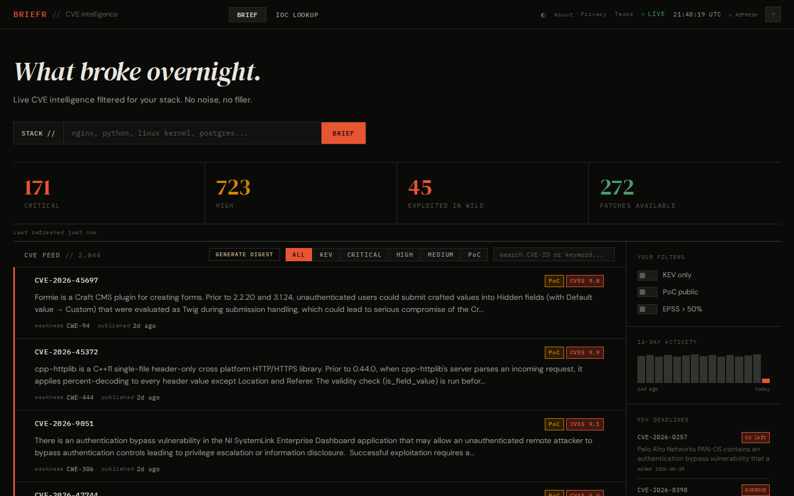

# BRIEFR
### Free CVE Intelligence for Security Analysts




---

## What is BRIEFR?

BRIEFR is a free CVE intelligence dashboard that aggregates NVD, CISA KEV, EPSS, and OSV data into one searchable feed. It is built for security analysts and defenders who need a fast morning brief without enterprise tooling or sign-up friction.

## Why I built this

Every morning, security analysts manually check NVD, CISA KEV, VirusTotal, and Exploit-DB just to answer one question — what broke overnight and does it affect us? Enterprise tools like Vulncheck solve this but cost thousands of dollars per year. BRIEFR does the same thing, free, with no account, no tracking, and no noise.

## Features

- Daily CVE feed from NVD with CVSS and EPSS scoring
- CISA KEV integration with remediation deadline tracking
- IOC enrichment — IP, hash, and domain lookup via VirusTotal and AbuseIPDB
- Stack-based relevance filtering for your technology stack
- Bulk select and copy CVEs as a Markdown report
- CVE digest export for the current filtered view
- Dark and light mode
- Timezone selector with local timestamps on reports
- Keyboard shortcuts for search, filters, and card navigation
- No account required. No cookies. No tracking.

## Tech Stack

| Backend | Frontend |
|---------|----------|
| FastAPI | React 18 |
| Uvicorn | React Router |
| httpx | Vite |
| APScheduler | |
| aiosqlite | |
| Pydantic | |
| python-dotenv | |

## Data Sources

| Source | Data | Refresh |
|--------|------|---------|
| NVD/NIST | CVE details + CVSS | Daily 06:00 IST |
| CISA KEV | Known exploited vulns | Daily |
| EPSS (FIRST.org) | Exploit probability | Daily |
| OSV.dev | Open source package vulns | On CVE detail view |
| VirusTotal | IOC enrichment | On demand |
| AbuseIPDB | IP reputation | On demand |

## Getting Started

### Prerequisites

- Python 3.11+
- Node.js 18+
- Free API keys: [NVD](https://nvd.nist.gov/developers/request-an-api-key), [VirusTotal](https://www.virustotal.com/gui/join-us), [AbuseIPDB](https://www.abuseipdb.com/register)

### Installation

```bash
git clone https://github.com/Soldier0x0/briefr.git /opt/briefr
cd /opt/briefr/backend
python3.11 -m venv ../venv
../venv/bin/pip install -r requirements.txt
cp .env.example .env   # add your API keys

../venv/bin/uvicorn main:app --host 0.0.0.0 --port 8000
```

```bash
cd /opt/briefr/frontend
npm install
npm run dev    # http://localhost:5173 — proxies /api to :8000
```

Production deploy: `npm run build`, then serve `frontend/dist` behind nginx. See `deploy/setup.sh` for systemd install on Debian.

### Environment Variables

| Variable | Description | Where to get it |
|----------|-------------|-----------------|
| `NVD_API_KEY` | NVD API rate-limit key | [NVD API key request](https://nvd.nist.gov/developers/request-an-api-key) |
| `VIRUSTOTAL_API_KEY` | IOC hash/domain lookups | [VirusTotal](https://www.virustotal.com/gui/join-us) |
| `ABUSEIPDB_API_KEY` | IP reputation for IOC lookup | [AbuseIPDB](https://www.abuseipdb.com/register) |
| `ALLOWED_ORIGINS` | CORS origins (comma-separated) | Your frontend URL(s) |
| `CACHE_REFRESH_HOUR` | Daily feed hour (IST) | Default `6` |
| `CACHE_REFRESH_MINUTE` | Daily feed minute (IST) | Default `0` |
| `MAX_CVES_PER_FETCH` | Cap per NVD refresh | Default `2000` |
| `DEFAULT_TIMEZONE` | Server display timezone | Default `Asia/Kolkata` |
| `DB_PATH` | SQLite database file | Default `briefr.db` in backend dir |

## API

| Endpoint | Description |
|----------|-------------|
| `GET /api/health` | Service health, CVE count, last refresh time |
| `GET /api/time` | Server UTC and local time |
| `GET /api/stats` | Severity and KEV summary counts |
| `GET /api/cves` | Paginated, filterable CVE list |
| `GET /api/cves/{cve_id}` | Single CVE detail with OSV packages |
| `POST /api/ioc/lookup` | IOC enrichment (ip, hash, domain) |
| `POST /api/refresh` | Operator-only (`curl`); daily cron via `CACHE_REFRESH_*` — no UI button |
| `GET /api/kev/deadlines` | CISA KEV entries with due dates |
| `GET /api/usage` | External API usage counters |

Interactive docs: `/api/docs` (Swagger).

## Keyboard Shortcuts

| Key | Action |
|-----|--------|
| `/` | Focus search |
| `F` | Cycle filters (KEV → Critical → PoC → all) |
| `Esc` | Close drawer, digest, or About modal |
| `↑` `↓` | Navigate CVE cards |
| `Enter` | Open highlighted CVE |

## Privacy

BRIEFR collects no personal data, uses no cookies, and runs no analytics. IOC lookups are sent to VirusTotal and AbuseIPDB — results cached locally for 6 hours. See the full Privacy Policy at [projectjupiter.in/privacy](https://projectjupiter.in/privacy).

## License

MIT License — free to self-host, fork, and modify. Attribution appreciated.

---

<p align="left">
  <strong>Built by</strong> Sai Harsha Vardhan<br/>
  <a href="https://www.linkedin.com/in/sai-harsha-vardhan/">LinkedIn</a>
</p>
