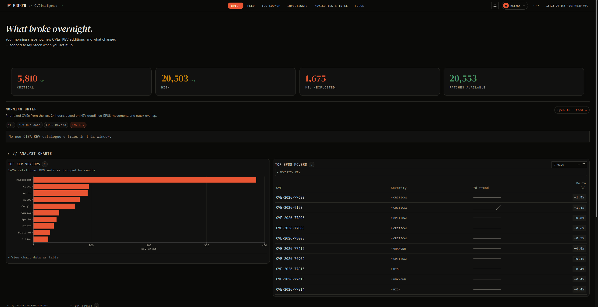
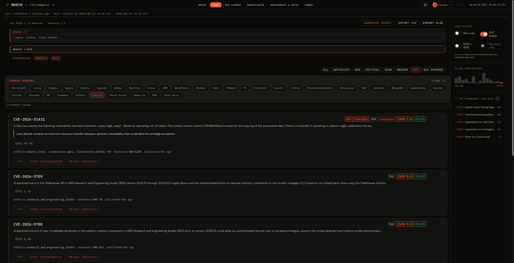
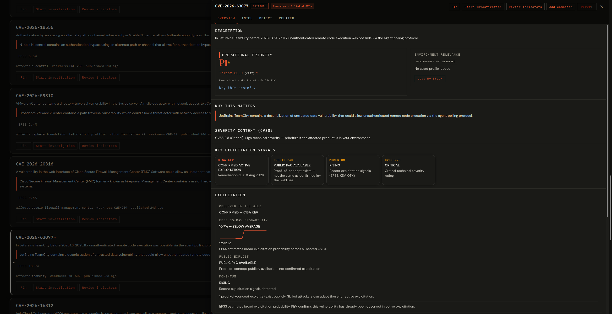
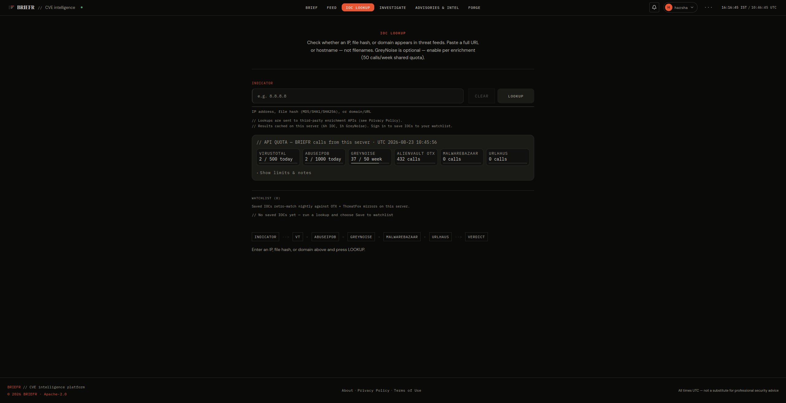
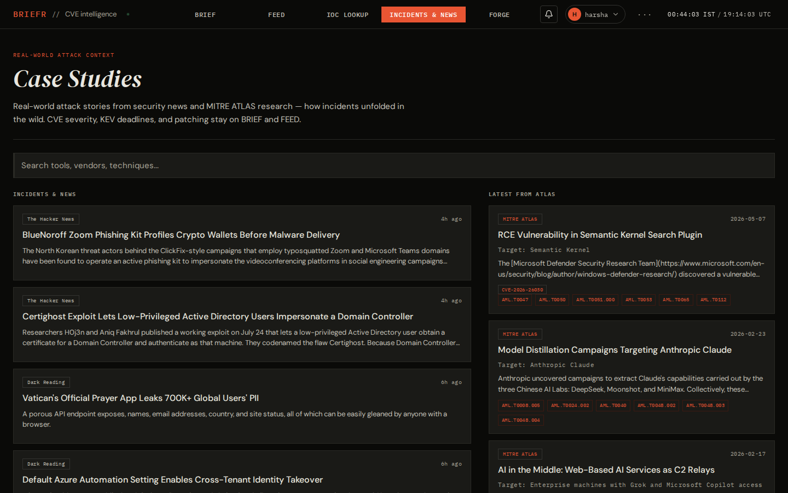
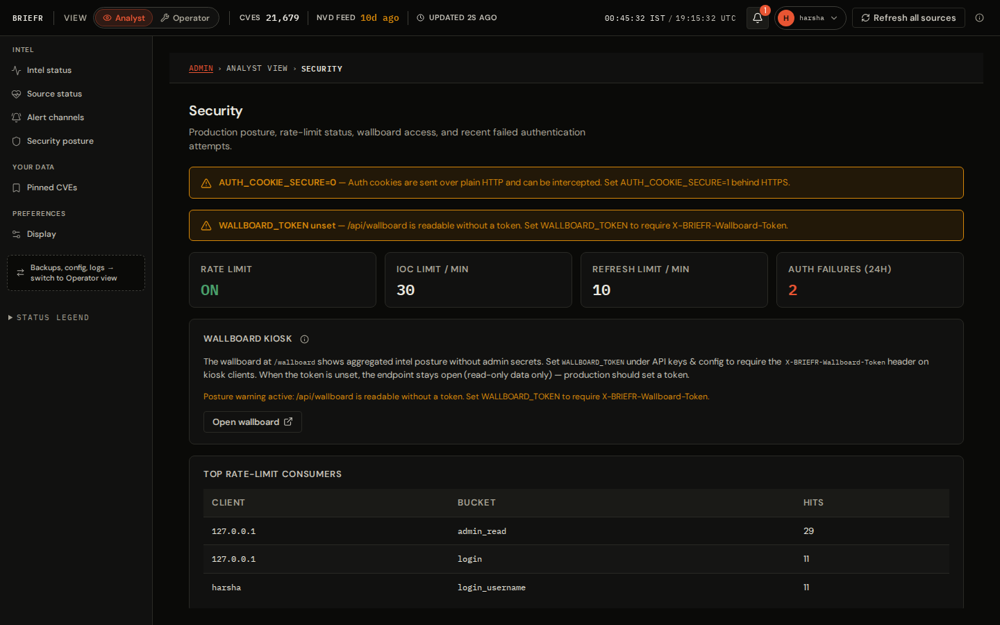

<p align="center">
  
</p>

<h1 align="center">BRIEFR</h1>
<p align="center"><strong>Self-hosted CVE intelligence and detection engineering</strong></p>

<p align="center">
  
  
  
  
  
  
</p>

<p align="center">
  <a href="#what-is-briefr">What is BRIEFR?</a> ·
  <a href="#screenshots">Screenshots</a> ·
  <a href="#getting-started">Getting started</a> ·
  <a href="#documentation">Docs</a> ·
  <a href="#license">License</a>
</p>

---

## What is BRIEFR?

BRIEFR is a self-hosted CVE intelligence platform. It pulls vulnerability data
from public and community sources — NVD, CISA KEV, EPSS, MITRE ATT&CK/ATLAS, OTX,
abuse.ch, exploit indexes, RSS news — into a local PostgreSQL database and gives
you a single UI to work through it: a daily brief, a searchable feed, IOC lookup,
and detection rule generation.

### Why BRIEFR?

The public feeds are just the input; they're not really the point. BRIEFR's value
is what it does with them: rule-based prioritization (Operational Priority P1–P4,
threat score, environment relevance, SSVC), correlation that shows *why* CVEs are
related (campaigns, shared infrastructure, actor/sector, timing), and Sigma /
YARA / SIEM rule generation from a local SigmaHQ mirror. Everything is
deterministic and documented — no black-box model. LLMs are optional and only
narrate at the edges.

The five tabs cover the workflow: **BRIEF** (morning queue), **FEED** (CVE list
and search), **IOC LOOKUP**, **INCIDENTS & NEWS**, and **FORGE** (ATT&CK
navigator, hunt packs).

Some boundaries, so you know what you're getting: BRIEFR is not a scanner or ASM
tool — it prioritizes known CVEs, it doesn't find your assets. Stack matching is
term-based, not SBOM-precise. Community attribution is labeled as such. Data is
as fresh as each upstream feed allows, and BRIEFR syncs on a schedule that
respects that feed's rate limits; nothing is real-time. One instance, self-hosted:
your hardware, your data.

**Stack:** FastAPI · React 19 · PostgreSQL 16 (+ pgvector for embeddings) ·
APScheduler. Bring your own API keys for upstream feeds.

Apache 2.0: clone, self-host, modify, and use commercially with attribution
([`LICENSE`](LICENSE), [`NOTICE`](NOTICE)).

---

## Try it

- **Live demo** — [briefrdemo.projectjupiter.in](https://briefrdemo.projectjupiter.in),
  1:1 analyst UI with fixture data, no install and no backend.
- **Self-host** — [docs/SELF_HOST.md](docs/SELF_HOST.md), install your own
  PostgreSQL-backed deployment.
- **Documentation** — [docs.projectjupiter.in](https://docs.projectjupiter.in).

The demo is a static showroom ([`briefr-demo`](https://github.com/Soldier0x0/briefr-demo)):
the same shell as production over frozen JSON instead of a database. Forge,
hunt-pack generation, and IOC enrichment are visual-only there.

---

## Screenshots

Screenshots from a self-hosted PostgreSQL deployment.

<table>
<tr>
<td align="center"><br><sub>BRIEF</sub></td>
<td align="center"><br><sub>FEED</sub></td>
<td align="center"><br><sub>CVE detail</sub></td>
</tr>
<tr>
<td align="center"><br><sub>IOC LOOKUP</sub></td>
<td align="center"><br><sub>Incidents &amp; News</sub></td>
<td align="center"><br><sub>Admin</sub></td>
</tr>
</table>

---

## Getting started

Install guide: [`docs/SELF_HOST.md`](docs/SELF_HOST.md)

### Try BRIEFR locally

```bash
git clone https://github.com/Soldier0x0/briefr.git
cd briefr/backend
python3 -m venv .venv && source .venv/bin/activate
pip install -r requirements-dev.txt
cp .env.example .env
uvicorn main:app --host 0.0.0.0 --port 8000
```

```bash
cd ../frontend && npm install && npm run dev   # http://localhost:5173
```

Open http://localhost:5173 — first-run setup creates the admin user.

### Production install (PostgreSQL + nginx)

For a permanent system, use [SELF_HOST §3](docs/SELF_HOST.md#3-production-debian--systemd--nginx):
provision **`pgvector/pgvector:pg16`**, then `bash deploy/briefr-install.sh`
(or `deploy/setup.sh`). That runs `npm run build`, configures **systemd + nginx**,
and serves the built SPA.

```bash
curl -s http://127.0.0.1:8000/api/health | python3 -m json.tool
```

| Path | When |
|------|------|
| [SELF_HOST §2](docs/SELF_HOST.md#2-local-development-with-postgresql--pgvector) | Postgres + pgvector dev |
| [SELF_HOST §3](docs/SELF_HOST.md#3-production-debian--systemd--nginx) | Production Debian deploy |
| [POSTGRES.md](docs/POSTGRES.md) | Backups, restore, pgvector |

---

## Documentation

| I want to… | Doc |
|------------|-----|
| Install | [`docs/SELF_HOST.md`](docs/SELF_HOST.md) |
| Use the UI | [`docs/USE.md`](docs/USE.md) |
| Fix a problem | [`docs/TROUBLESHOOTING.md`](docs/TROUBLESHOOTING.md) |
| Understand internals | [`docs/HOW_IT_WORKS.md`](docs/HOW_IT_WORKS.md) · [`docs/SYSTEM_DESIGN.md`](docs/SYSTEM_DESIGN.md) |
| Try the UI (no install) | https://briefrdemo.projectjupiter.in |
| Browse online | https://docs.projectjupiter.in |
| Ask for help | [GitHub Discussions → Q&A](https://github.com/Soldier0x0/briefr/discussions/new?category=q-a) |
| API contract | [`docs/API_REFERENCE.md`](docs/API_REFERENCE.md) |
| What's shipped | [`docs/PRODUCT_STATUS.md`](docs/PRODUCT_STATUS.md) |
| Contribute | [`CONTRIBUTING.md`](CONTRIBUTING.md) · [`docs/ONBOARDING.md`](docs/ONBOARDING.md) |

Index: [`docs/index.md`](docs/index.md)

---

## API

Full catalog: [`docs/API_REFERENCE.md`](docs/API_REFERENCE.md). Interactive Swagger
at `http://localhost:8000/api/docs` (disable in production via `BRIEFR_ENV=production`).

Environment variables: `backend/.env.example`

---

## License

Apache License 2.0 — see [`LICENSE`](LICENSE). Contributions: [`CONTRIBUTING.md`](CONTRIBUTING.md).
Security reports: [`SECURITY.md`](SECURITY.md) (no public issues for vulnerabilities).

Copyright © 2026 Sai Harsha Vardhan.
