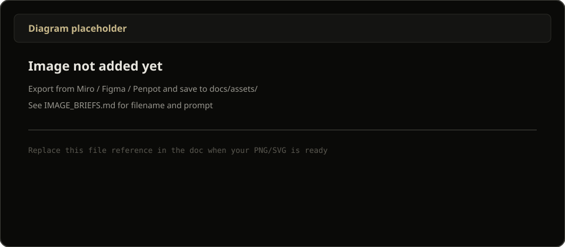

# BRIEFR product status

**Last updated:** 2026-07-08  
**Purpose:** Single page for “what’s true in production today.” When README or beta docs disagree, this wins.

---

## Release snapshot

| Area | Status |
|------|--------|
| **Database** | **PostgreSQL required** (`DATABASE_URL`, `BRIEFR_REQUIRE_POSTGRES=1`). SQLite removed from production path. |
| **Auth** | Built-in app login + sessions (first-run `/api/auth/setup`); admin/refresh routes require the **admin role** (Sprint A0). Legacy `BRIEFR_ADMIN_API_KEY` removed. Wallboard token is **header-only** (`X-BRIEFR-Wallboard-Token`; `?token=` removed, Sprint A7). Optional Cloudflare Zero Trust at **edge** (operator policy, not in app code). |
| **Rate limits** | Token buckets on IOC, refresh, admin, auth; set `RATE_LIMIT_ENABLED=1` in production. |
| **API queue** | Outbound API serialization (#221) for NVD/OTX/etc. |
| **Correlation** | Engine v2 — DB-backed campaigns, nightly OTX, drawer Intel tab. |
| **Data utilization (C2)** | Drawer **CAPEC** chips (CIRCL), **CISA SSVC** section (Vulnrichment), **KEV ransomware** badge on feed cards + drawer; OTX targeted countries; OSV drawer table; EPSS percentile. |
| **Detection (D1)** | Generated Sigma rules use **CWE class templates** when no ATT&CK technique is mapped (`briefr_basis`: `attack_technique` \| `cwe` \| `generic`). |
| **Detection (D2)** | **`DetectionContext`** scaffold: `feed_cache` keys `detection_ctx:{cve_id}` hold `{cwe_ids, product, class, artifacts, model, provider, generated_at}`; read on detection/forge paths; written by scheduler job (`DETECTION_CONTEXT_SYNC_ENABLED=0` default). Generated rules add `briefr_class` when context is present. |
| **Detection (D4)** | Deterministic **Nuclei YAML parser** enriches `detection_ctx` artifacts on `exploit_sync` (Nuclei-touched CVEs); generated Sigma rules merge artifact keywords/paths (`briefr_artifacts`, `briefr_note`). `DETECTION_CONTEXT_NUCLEI_ENABLED=1` default. LLM extract (K4) remains optional overlay. |
| **Detection (D3)** | **Unified class router** (`class_router.py`): `_resolve_detection_class(cve)` drives Sigma `briefr_class`, SIEM query selection, and `log_patterns` so all three agree on class when no ATT&CK technique is mapped. |
| **Detection (D5)** | Detect tab frames outputs as **class-aware hunt starters**; generated Sigma shown as supplement even when community rules exist; `briefr_basis` / experimental status tooltips. |
| **LLM router (K1–K3)** | Scheduler-side multi-provider router: Groq (`openai/gpt-oss-20b` / `120b` for PDF) → Gemini Flash-Lite → Cerebras → OpenRouter `:free`; product extraction + PDF executive summary wired through router; Anthropic removed from chain; `feed_cache` provenance `{provider, model}`. |
| **LLM detection context (K4)** | Scheduler job `detection_context_llm` extracts `{paths, params, keywords, method}` artifacts from CVE/exploit text into `detection_ctx:{cve_id}` via LLM router (`DETECTION_CONTEXT_LLM_ENABLED=0` default). Vision (Cerebras `gemma-4-31b`) deferred until image inputs exist. |
| **Cache retention (C3)** | Daily `cache_retention_cleanup` job sweeps stale `ioc_cache` / `feed_cache` rows and ages out `epss_history`, `cve_change_history`, and OTX mirror tables; read-path TTLs unchanged. Admin `change_history_old` purge fixed (`detected_at`). |
| **Admin** | Security, backups, job status, config (V1.4 operator features largely shipped). **Config editor:** per-field Save on Admin → API keys & config — immediate save for API keys/toggles; rows tagged `restart` use Save & restart (Wave 1). **Notifications:** shared toast tray pauses auto-dismiss on hover/focus; errors/warnings persist until dismissed; success/info auto-dismiss in 8s; max 4 visible; copy-ref shows “Copied” feedback; backend restart shows a top banner (health poll) instead of a transient restart toast (Wave 1 PR 2 / H1a). **User stack:** Feed stack input persists via `GET/PUT /api/me/stack` (Wave 2 PR 3–4); legacy `briefr_stack` localStorage migrates on login. KEV-on-stack webhooks and wallboard use `BRIEFR_STACK_TERMS` when set, otherwise the newest saved user stack. **Display prefs:** Admin → Display settings and header timezone persist via `GET/PATCH /api/me/preferences` (Wave 2 PR 5); legacy `briefr_*` display/timezone localStorage migrates on login. Production posture self-check (Sprint A6): startup logs one warning per unsafe flag (`RATE_LIMIT_ENABLED=0`, `AUTH_COOKIE_SECURE=0`, tokenless wallboard) when `BRIEFR_ENV=production`; the Security panel shows the same warnings. |
| **Snooze** | Removed from UI (#137); future **Monitor** alerts not built. |
| **Theme** | Dark only. |
| **Docker compose** | Postgres compose exists; full V2.0 platform compose not shipped. |

---

## Auth layers (two independent)

> **Asset:** [`assets/auth-layers.png`](assets/auth-layers.png) — see [IMAGE_BRIEFS §8](IMAGE_BRIEFS.md#8-auth-layers)

| Layer | What | Notes |
|-------|------|-------|
| **Edge (optional)** | Cloudflare Tunnel + Zero Trust email OTP | Protects public hostname; not embedded in FastAPI |
| **Application** | Username/password + server sessions; admin routes check the `admin` role | Portable self-host; CF JWT middleware **dropped** (#93); legacy admin key **removed** (Sprint A0 — it failed open when unset) |

---

## Deployment reference

> **Asset:** [`assets/production-architecture.png`](assets/production-architecture.png) — see [IMAGE_BRIEFS §1](IMAGE_BRIEFS.md#1-production-architecture)

| Item | Value |
|------|--------|
| Code | `/opt/briefr` |
| DB | PostgreSQL 16 (often Docker at `/opt/infra/postgres`) |
| Backups | `/var/lib/briefr/backups` (age-encrypted) |
| Backend | `briefr-backend.service` → uvicorn :8000 |
| Frontend | `frontend/dist` via nginx |

---

## Shipped vs planned (high level)

| Shipped | Planned / open |
|---------|----------------|
| Postgres, auth, rate limits, API queue | Full `docker-compose.yml` (V2.0) |
| Correlation v2 core, OTX continuous ingest | Correlation v2 phases 3–5 (see `CORRELATION_V2_PLAN.md`) |
| Admin ops, webhooks, wallboard | V1.5 threat-model UI depth, STIX |
| Embeddings optional (fastembed) | Monitor/watchlist **alerts** (product idea) |
| Chart.js admin dashboard partial | Logrotate deploy artifacts (V1.4 theme) |

Details: [`ROADMAP.md`](ROADMAP.md). Historical beta specs → `docs/archive/` (phase 2).

---

## Documentation rollout

| Phase | Status |
|-------|--------|
| Doc structure + image briefs | In progress |
| Archive beta root `.md` files | Pending |
| MkDocs site | Pending |
| Stale README / API_REFERENCE auth claims | Pending |

Plan: [`DOCUMENTATION_PLAN.md`](DOCUMENTATION_PLAN.md).
