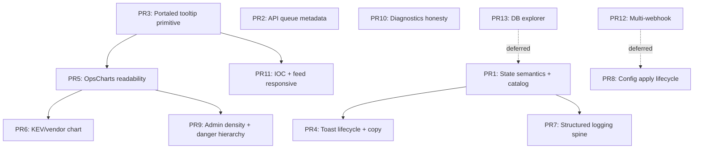

# BRIEFR Visual and Operational UX Audit

**Date:** 2026-07-09  
**Repository:** Soldier0x0/briefr (`main` at audit time)  
**Mode:** Planning and architecture validation only — **no production fixes in this task**  
**Validation method:** Static code trace on latest `main`, cross-checked against manual product review screenshots and `docs/PRODUCT_STATUS.md`. Graphify CLI unavailable in audit environment; used `graphify-out/GRAPH_REPORT.md` hints plus direct reads of frontend, backend, scheduler, config, logging, and queue subsystems.

---

## Executive Summary

The 36 observed issues are **real product-quality gaps**, not documentation drift. Most trace to **seven shared architectural themes** rather than 36 independent bugs:

1. **State semantics are computed independently** in backend (`_build_job_info`), table actions (`JobTable`), queue labels (`apiQueuePresentation`), and posture UI — producing contradictions like `DISABLED` + **Pause**, green checks beside warnings, and `QUEUED` summary vs `WAITING` rows.
2. **Operational event context is fragmented** — scheduler `run_history` stores `error_message`, ring-buffer logs store plain `message`, API queue has rich metadata only when callers pass `operation`/`context_id`, and toasts drop action context on SchedulerPage.
3. **Display metadata is not centralized** — `catalog.js` covers ~60% of scheduler job IDs; config UI shows raw env keys; queue defaults to `"Outbound API request"`.
4. **Tooltip infrastructure is duplicated and non-portaled** (`HelpTip`, `ControlTooltip`, `ExplainTip`, Chart.js canvas) — causing filter overlap, HelpTip clipping, and chart-title truncation (`…ON THE RIGHT).`).
5. **Charts lack responsive display semantics** — raw operator job names on X-axis, `fmtDur`/`fmtBytes` ambiguity, no empty-state collapse, fixed 200px chart wells.
6. **Configuration lifecycle is partially modeled** (`config_schema.py`) but **apply strategies are implicit** — scheduler intervals update `os.environ` without rescheduling; `ALLOWED_ORIGINS` marks `restart_required=false` while CORS middleware is bound at app startup.
7. **Admin design system diverges from analyst shell** — 13px admin root, full-height empty cards, destructive panels above operational content.

**Critical runtime bugs (code-confirmed, need prod repro):**

- KEV Due Dates chart can render **empty buckets with 0–1 Y-axis** when `filterKevByTimeWindow` drops all rows (null/unparseable `due_date`) even though `kev_deadlines` has rows — **REQUIRES RUNTIME VALIDATION** on the reviewer’s DB.
- Postgres **integrity/smoke checks are stubbed** (`PRAGMA` → always OK) — operators may believe DB is healthy when checks are no-ops.
- Toast hover **should** resume dismissal (`Toast.jsx` `onMouseLeave` → `resume()`), but **focus-within** on filter buttons and **error toasts with `duration: null`** explain reported “stuck” behavior — **PARTIALLY CONFIRMED**.

**Recommended delivery:** **11 PRs** in the [approved execution order](#recommended-execution-order) below. Screenshots surfaced **examples** of systemic gaps — each PR fixes the **shared rule** everywhere that pattern appears (frontend, backend, diagnostics), not only the one row or panel photographed. PR12/PR13 are explicitly **out of scope** for this correction pass.

---

## Audit Scope

| In scope | Out of scope |
|----------|----------------|
| Issues 1–36 from manual product review | Implementation / migrations / API contract changes in this task |
| Scheduler, API queue, charts, toasts, config, logs, admin UX | ADR-002 scoring, correlation semantics, Product Voice rewrite |
| Frontend responsive behavior (code + CSS audit) | Full Playwright visual suite (recommended post-fix) |
| Backend data paths for KEV, webhooks, diagnostics | STIX export, V2.0 platform |

---

## Validation Method

1. Trace frontend component → API client → router → DB/logging for each issue.
2. Classify: **CONFIRMED**, **PARTIALLY CONFIRMED**, **ALREADY FIXED**, **INTENTIONAL**, **FALSE OBSERVATION**, **REQUIRES RUNTIME VALIDATION**.
3. Map cross-surface impact and smallest architectural correction.
4. Group fixes by shared root cause; define PR boundaries and regression tests.

---

## Issue Validation Matrix

### Issue 1 — Scheduler state, action, and job identity

| Field | Value |
|-------|-------|
| **Observed** | `detection_context_sync` shows `DISABLED`, action **Pause**, raw snake_case ID |
| **Status** | **CONFIRMED** (disable intentional; UI bugs confirmed) |
| **Frontend** | `JobTable.jsx`, `SchedulerPage.jsx`, `catalog.js`, `intelStatus.js` |
| **Backend** | `scheduler.py`, `routers/admin.py` (`_build_job_info`, `_OPT_IN_DISABLED_JOBS`, `_job_is_disabled`), `detection/context_sync.py` |
| **API/data** | `GET /api/admin/system` → `scheduler_jobs[]` with `status`, `paused`, `lock_held` |
| **Root cause** | (a) Job **intentionally env-gated** (`DETECTION_CONTEXT_SYNC_ENABLED=0` default). (b) `DISABLED` overrides `PAUSED` in status priority but Pause button keys off `status === 'PAUSED'` only. (c) `JOB_CATALOG` missing entry → `jobLabel()` returns raw id. (d) HelpTip claims DISABLED = “not registered” — **false**. |
| **Cross-surface** | All opt-in jobs (`embeddings_backfill`, `detection_context_llm`, `exploit_sources_sync`); Overview retry toasts |
| **Correction** | Shared `jobActions(status, paused, disabled)` matrix; complete `JOB_CATALOG`; DISABLED → hide Pause or show **Enable** linking to config; fix HelpTip copy |
| **Tests** | Unit: action matrix per status; catalog coverage CI grep vs `scheduler.add_job` ids |

---

### Issue 2 — Background sync / API queue

| Field | Value |
|-------|-------|
| **Observed** | 10–12 rows, mostly “Outbound API request”; summary “10 QUEUED” vs row “WAITING”; panel grows tall |
| **Status** | **CONFIRMED** |
| **Frontend** | `ApiQueueIndicator.jsx`, `apiQueuePresentation.js`, `Header.jsx`, `AdminPage/StatusBar.jsx` |
| **Backend** | `api_queue.py`, `api_queue_operations.py`, `resilient_client.py`, feeds passing `operation` |
| **API** | `GET /api/health` → `api_queue.requests[]`, `sources{}` |
| **Root cause** | Default operation `outbound_request` when callers omit metadata; GitHub PoC path passes `exploit_search` + CVE context. Summary counts `queued` aggregate; rows use finer `waiting` state — **both correct, vocabulary inconsistent**. No `max-height` on `.api-queue-requests`. |
| **Cross-surface** | Admin status bar + analyst header |
| **Correction** | Require/propagate `operation`+`context` at all `await_api_slot` sites; provider grouping UI; cap panel height + scroll; align summary labels |
| **Tests** | `apiQueuePresentation.test.js` extend; backend test that queue rows include labels for known operations |

---

### Issue 3 — KEV Due Dates pipeline

| Field | Value |
|-------|-------|
| **Observed** | Chart empty across 1–90d windows; Y-axis 0–1; empty buckets |
| **Status** | **PARTIALLY CONFIRMED** — **REQUIRES RUNTIME VALIDATION** on production DB |
| **Frontend** | `BriefCharts.jsx` (`filterKevByTimeWindow`, `buildKevHistogram`, `daysUntilDue` duplicate), `kevDeadline.js` |
| **Backend** | `feeds/kev.py`, `db/enrichment.py` (`upsert_kev`), `routers/cves.py` (`GET /api/kev/deadlines`) |
| **API** | `fetchKEVDeadlines('urgent')` → `{ data: [...] }` cached 45s |
| **Root cause** | Chart **always renders** when not collapsed even if histogram all zeros. `filterKevByTimeWindow` drops rows with null `due_date`. Duplicate day-math vs `kevDeadline.js` may bucket differently than cards. 500-row cap may truncate. **If `kev_deadlines` populated but `due_date` empty/malformed, chart correctly empty — data bug.** |
| **Cross-surface** | Morning Brief due queue, feed `kev_overdue` filter, KEV chips |
| **Correction** | Fix ingestion if `due_date` bad; unify day math; empty-state message; server-side bucket endpoint optional |
| **Tests** | `test_kev_due_date_list.py`; frontend test: filter drops null due_date; E2E with seeded deadlines |

---

### Issue 4 — Analyst chart replacement (vendors / industries)

| Field | Value |
|-------|-------|
| **Observed** | KEV due chart low signal; propose vendor/product + industry charts |
| **Status** | **PARTIALLY CONFIRMED** (replacement direction valid; sector data weak) |
| **Frontend** | `BriefCharts.jsx` |
| **Backend** | CPE/vendor in `cve_record_v5.py`, `cves` enrichment; `mitre_groups.sectors` heuristic (`correlation/engine.py` `extract_sectors_from_text`) |
| **Root cause** | Vendor/product: **reliable enough** from CPE/cvelistV5 affected products. Industry/sector: **not authoritative per-CVE** — only user-declared `environment.industry` + NLP on group descriptions |
| **Correction** | Replace KEV chart with **Top affected vendors/products** (horizontal bar). Second widget: **stack-matched products** or **KEV overdue count** — not naive industry from CVE text |
| **Tests** | API aggregate endpoint tests; chart renders with long labels |

---

### Issue 5 — Controlled chart configurability

| Field | Value |
|-------|-------|
| **Observed** | Admin-controlled visualization preferences |
| **Status** | **CONFIRMED** gap — not implemented |
| **Frontend** | `BriefCharts.jsx`, `OpsCharts.jsx`, `chartLoader.js` (duplicate `baseOptions`) |
| **Backend** | None; could extend `user_preferences` or `app_settings` |
| **Root cause** | No widget metadata model or preference storage |
| **Correction** | Widget registry with allowed chart types; store in `user_preferences` (per-user) or `app_settings` (admin default) — **decision required** |
| **Tests** | Preference round-trip; invalid chart type rejected |

---

### Issue 6 — Feed filter tooltip state collision

| Field | Value |
|-------|-------|
| **Observed** | Critical explanation sticks; Medium hover overlaps |
| **Status** | **CONFIRMED** |
| **Frontend** | `FilterBar.jsx`, `ControlTooltip.jsx`, `ControlTooltip.css` |
| **Root cause** | CSS `:focus-within` keeps bubble open after click; adjacent hovers mount **simultaneous** tooltips; no single-tooltip coordinator |
| **Cross-surface** | `StatsRow.jsx` ControlTooltip |
| **Correction** | Portaled single-tooltip primitive; hover-only for filters (no focus-within persist) or dismiss on selection |
| **Tests** | RTL: one tooltip in DOM; click filter clears prior |

---

### Issue 7 — Toast lifecycle (hover pause)

| Field | Value |
|-------|-------|
| **Observed** | Hover pauses; after mouse leave toast stays forever |
| **Status** | **PARTIALLY CONFIRMED** |
| **Frontend** | `Toast.jsx`, `useToast`, dual stacks in `App.jsx` + `AdminPage.jsx` |
| **Root cause** | Code implements pause/resume correctly for **timed** toasts. Stuck cases: (1) **error/warning `duration: null`** — intentional persist; (2) focus remains on toast child after interaction; (3) user may hover error toast thinking it will expire |
| **Correction** | Grace period on resume; document severity durations; single toast provider |
| **Tests** | Timer mock: hover 2s, leave, assert dismiss within grace |

---

### Issue 8 — Toast volume and notification center

| Field | Value |
|-------|-------|
| **Observed** | Many simultaneous toasts; want notification center |
| **Status** | **PARTIALLY CONFIRMED** |
| **Frontend** | `useToast` caps at **4** visible |
| **Backend** | `audit_log` durable; ring buffer **not** durable; no `notifications` table |
| **Root cause** | Ephemeral toasts only; no dedupe across events; no history UI |
| **Correction** | Notification center backed by `audit_log` + scheduler `run_history` + optional new `operator_events` table — **decision required** |
| **Tests** | Dedupe key; max visible; center lists persisted errors |

---

### Issue 9 — Context-aware notification copy

| Field | Value |
|-------|-------|
| **Observed** | Retry → “Job started” without job name context |
| **Status** | **CONFIRMED** on SchedulerPage; Overview **fixed** |
| **Frontend** | `SchedulerPage.jsx` (`successMessage: Started: ${jobId}`), `OverviewPage.jsx` uses `jobLabel` |
| **Backend** | `POST /api/admin/scheduler/run` returns `{ ok, detail }` only |
| **Correction** | Use `jobLabel` / Product Voice templates for run/retry/pause/resume lifecycle |
| **Tests** | Assert toast strings use catalog labels |

---

### Issue 10 — IOC Lookup input resize

| Field | Value |
|-------|-------|
| **Observed** | Vertically resizable textarea for single IOC |
| **Status** | **CONFIRMED** |
| **Frontend** | `IOCLookup.jsx` (`textarea`, `rows={3}`), `IOCLookup.css` (`resize: vertical`) |
| **Root cause** | Batch paste supported (`handlePaste`) but not primary workflow |
| **Correction** | Fixed-height single-line input **or** explicit “batch mode” toggle |
| **Tests** | Visual regression; paste multi-line behavior documented |

---

### Issue 11 — System health chart units

| Field | Value |
|-------|-------|
| **Observed** | Hover shows `46.7 M` — ambiguous |
| **Status** | **PARTIALLY CONFIRMED** — `m` = **minutes** in `fmtDur`, not millions |
| **Frontend** | `formatters.js` (`fmtDur`), `OpsCharts.jsx`; backup Y-axis **raw bytes** |
| **Backend** | `last_run_duration_seconds` float in `sync_state` job history |
| **Correction** | `fmtDur` → `12.4 s` / `2.8 min` / `1.2 h`; Chart.js ticks `fmtBytes`; axis titles |
| **Tests** | Formatter unit tests |

---

### Issue 12 — System health tooltip clipping

| Field | Value |
|-------|-------|
| **Observed** | HelpTip text clipped (“…ON THE RIGHT).”) |
| **Status** | **CONFIRMED** |
| **Frontend** | `HelpTip.jsx`, `AdminPage.css` (`.help-tip-bubble`, `overflow: hidden` on cards/main) |
| **Root cause** | No portal; `z-index: 50`; parent `overflow-y: auto` clips |
| **Correction** | Portaled tooltip (shared primitive) |
| **Tests** | Visual: tooltip fully visible at card edge |

---

### Issue 13 — System health chart readability

| Field | Value |
|-------|-------|
| **Observed** | Overlapping labels; OTX bar dominates; backup bars identical |
| **Status** | **CONFIRMED** |
| **Frontend** | `OpsCharts.jsx` — vertical bar, truncated filenames, 45° rotation |
| **Correction** | Horizontal bars for ingest; short labels + full tooltip; backup → sparkline or “last size + delta”; exclude outlier jobs from shared scale |
| **Tests** | Narrow viewport snapshot |

---

### Issue 14 — Project-wide responsive design

| Field | Value |
|-------|-------|
| **Observed** | Half-screen → chart label overlap |
| **Status** | **CONFIRMED** (code audit); full matrix **REQUIRES RUNTIME VALIDATION** |
| **Frontend** | `AdminPage.css` (grid collapses at 900px); `OpsCharts` 3-col → 1-col; `FilterBar.css` 640px; `DetailDrawer` fixed widths; tables `overflow-x: auto` |
| **Correction** | Breakpoint QA matrix; horizontal bars; drawer min-width rules; tooltip flip |
| **Tests** | Playwright at 1280, 960, 720, 640 widths |

---

### Issue 15 — Admin typography and contrast

| Field | Value |
|-------|-------|
| **Observed** | Admin smaller/lower contrast than analyst |
| **Status** | **CONFIRMED** |
| **Frontend** | `AdminPage.css` (`--admin-*`, 13px root); `App.css` (`--type-*`, 16px) |
| **Correction** | Map admin to shared type scale (Primary/Secondary/Muted); raise minimum secondary to 12px effective |
| **Tests** | Contrast audit on checklist + table metadata |

---

### Issue 16 — Admin empty-state density

| Field | Value |
|-------|-------|
| **Observed** | Active Locks / Recent Errors / empty charts consume full height |
| **Status** | **CONFIRMED** |
| **Frontend** | `OverviewPage.jsx`, `OpsCharts.jsx` (`admin-ops-chart-wrap` 200px always) |
| **Correction** | Compact empty rows; collapse chart wells when no series |
| **Tests** | Empty system fixture screenshots |

---

### Issue 17 — Quick diagnostics functional audit

| Field | Value |
|-------|-------|
| **Observed** | Need end-to-end behavior of smoke / integrity / support pack |
| **Status** | **CONFIRMED** (documented below) |
| **Frontend** | `OverviewPage.jsx` |
| **Backend** | `routers/admin.py`, `diagnostics/support_pack.py` |
| **Smoke** | In-process: `cves>0`, `kev_deadlines>0`, `PRAGMA integrity_check`, ≥1 feed not circuit-open, backup dir writable |
| **Integrity** | `PRAGMA integrity_check` + `foreign_key_check` — **stubbed OK on Postgres** |
| **Support pack** | Health, DB meta (redacted URL), posture, correlation status, smoke+integrity, locks, ring-buffer logs (secret redaction in `extra`) — **no API keys, webhook URLs** |
| **Correction** | Honest Postgres checks; expand UI descriptions; link to log/job detail |
| **Tests** | `test_support_pack.py`; Postgres integrity not fake-pass |

---

### Issue 18 — Read-only PostgreSQL explorer

| Field | Value |
|-------|-------|
| **Observed** | Evaluate secure read-only DB browser |
| **Status** | **CONFIRMED** feasibility study — not shipped |
| **Auth** | `require_admin` today; no super-admin tier |
| **Correction** | Allowlisted tables, parameterized filters, column mask list, audit every browse — **HIGH risk** |
| **Tests** | Security: no arbitrary SQL; masked columns |

---

### Issue 19 — Destructive action hierarchy

| Field | Value |
|-------|-------|
| **Observed** | Red destructive panels dominate Watchlist/Storage |
| **Status** | **CONFIRMED** |
| **Frontend** | `WatchlistPage.jsx`, `StoragePage.jsx`, `GuardedPurgePanel.jsx`, `destructive_actions.py` |
| **Correction** | Danger Zone section at bottom / overflow menu; keep typed confirm |
| **Tests** | Operator mode layout order |

---

### Issue 20 — API Keys and config page structure

| Field | Value |
|-------|-------|
| **Observed** | Extremely long; cramped; wide margins |
| **Status** | **CONFIRMED** |
| **Frontend** | `ApiKeysPage.jsx`, `AdminPage.css` (`--admin-content-max: 1200px`) |
| **Correction** | Collapsible sections; full-width settings layout; sticky actions (Issue 26) |
| **Tests** | Section expand state persistence |

---

### Issue 21 — API key presentation

| Field | Value |
|-------|-------|
| **Observed** | Need suffix, health, test |
| **Status** | **PARTIALLY CONFIRMED** |
| **Frontend** | Masked secrets; `restart` badge; no provider health |
| **Backend** | Keys in `.env`/env only; no last-success timestamp |
| **Correction** | Suffix display; optional test ping job; separate configured vs healthy |
| **Tests** | Never return full secret after save |

---

### Issue 22 — Webhook endpoint management

| Field | Value |
|-------|-------|
| **Observed** | Single Discord/Telegram; want multiple named endpoints |
| **Status** | **CONFIRMED** gap |
| **Backend** | `webhook_destinations` table but fixed ids `discord`/`telegram`/`generic`; env seeds |
| **Correction** | CRUD destinations, multiple per kind, migration — **LARGE** |
| **Tests** | Multi-endpoint delivery; SSRF still enforced |

---

### Issue 23 — Configuration lifecycle audit

| Field | Value |
|-------|-------|
| **Observed** | Which settings hot-reload vs restart vs reschedule |
| **Status** | **CONFIRMED** inconsistency |
| **Backend** | `config_schema.py`, `routers/admin.py` (`_propagate_to_settings`, `apply-all`), `operator_settings.py` |
| **Findings** | See [Configuration Lifecycle Findings](#configuration-lifecycle-findings) |
| **Correction** | Explicit `apply_strategy` per key; scheduler reschedule endpoint |
| **Tests** | Matrix test per key category |

---

### Issue 24 — Backend-driven config metadata

| Field | Value |
|-------|-------|
| **Observed** | Frontend guesses restart requirements |
| **Status** | **PARTIALLY CONFIRMED** — schema has `restart_required` but not `apply_strategy` |
| **Backend** | `GET /api/admin/config/schema` |
| **Correction** | Extend `ConfigField` with `apply_strategy`, `display_label`, `unit` |
| **Tests** | Schema snapshot test |

---

### Issue 25 — Save vs Apply changes

| Field | Value |
|-------|-------|
| **Observed** | “Restart required” text not actionable |
| **Status** | **CONFIRMED** |
| **Frontend** | `ApiKeysPage.jsx` per-field Save / Save & restart |
| **Backend** | `POST /api/admin/config/apply-all` SIGTERM restart |
| **Correction** | Two-phase Save → Apply batch; progress + health poll (existing `RestartBanner`) |
| **Tests** | Integration: reschedule without full restart when possible |

---

### Issue 26 — Sticky pending changes bar

| Field | Value |
|-------|-------|
| **Observed** | Long page; actions at bottom |
| **Status** | **CONFIRMED** gap |
| **Correction** | Contextual bottom bar when dirty or pending-apply |
| **Tests** | Bar appears/hides with form state |

---

### Issue 27 — Configuration display names

| Field | Value |
|-------|-------|
| **Observed** | `NVD_SYNC_INTERVAL_HOURS` shown as label |
| **Status** | **CONFIRMED** |
| **Frontend** | `ApiKeysPage.jsx` uses `field.key` as title |
| **Backend** | `help_text` only; no `display_label` |
| **Correction** | `display_label` + unit in schema; key in advanced panel |
| **Tests** | No raw env key in primary label |

---

### Issue 28 — Application logs

| Field | Value |
|-------|-------|
| **Observed** | “CVE List V5 sync failed” without cause / request id |
| **Status** | **CONFIRMED** |
| **Backend** | `structured_logging.py` ring buffer; scheduler `logger.error("...%s", exc)` without `extra` job_id |
| **Frontend** | `IngestLogPage.jsx` — message column; expandable row **not implemented** |
| **Correction** | Structured `extra`: `job_id`, `run_id`, `error_type`, `request_id`; expandable JSON panel |
| **Tests** | Scheduler failure produces structured log line |

---

### Issue 29 — Audit logs

| Field | Value |
|-------|-------|
| **Observed** | Need expandable actor/action context |
| **Status** | **PARTIALLY CONFIRMED** |
| **Backend** | `audit_log(actor, action, target)` — no before/after JSON |
| **Frontend** | `AuditLogPage.jsx`, `catalog.js` action labels |
| **Correction** | Expandable target detail; optional `metadata_json` column — migration decision |
| **Tests** | Immutability preserved |

---

### Issue 30 — Flexible log search and filtering

| Field | Value |
|-------|-------|
| **Observed** | Limited to level/category/export |
| **Status** | **CONFIRMED** gap |
| **Backend** | `GET /api/admin/logs` supports `search`, `request_id`, `logger`; **no time range**; ring buffer only 500 lines |
| **Correction** | Server-side time range + job_id filter; clarify export scope (page vs filter) |
| **Tests** | Filter combinations; export boundary |

---

### Issue 31 — Failure observability (CVE List V5 E2E)

| Field | Value |
|-------|-------|
| **Observed** | Toast + job status + logs disconnected |
| **Status** | **CONFIRMED** |
| **Path** | `run_cvelistv5_sync` → `logger.error` + `_write_job_last_run(error_message)` → toast generic → log line without exception detail in UI |
| **Correction** | Shared `run_id`; link toast → scheduler row → log filter |
| **Tests** | E2E failure inject |

---

### Issue 32 — Scheduler manual trigger duplication

| Field | Value |
|-------|-------|
| **Observed** | Manual Triggers + All Jobs Run |
| **Status** | **CONFIRMED** duplicate |
| **Frontend** | `SchedulerPage.jsx` `MANUAL_PIPELINES` + `JobTable` |
| **Backend** | Same `POST /api/admin/scheduler/run` |
| **Correction** | Remove Manual Triggers section OR make it pinned favorites only |
| **Tests** | Single run path |

---

### Issue 33 — Scheduler table scalability

| Field | Value |
|-------|-------|
| **Observed** | ~3 pages of jobs; no search/filters |
| **Status** | **CONFIRMED** |
| **Frontend** | `SchedulerPage.jsx` pagination only |
| **Correction** | Filter chips (Failed/Running/Disabled); search; “Needs attention” view |
| **Tests** | Filter reduces visible rows |

---

### Issue 34 — Security page

| Field | Value |
|-------|-------|
| **Observed** | Sparse; `WALLBOARD_TOKEN` unexplained |
| **Status** | **CONFIRMED** |
| **Frontend** | `SecurityPage.jsx` |
| **Backend** | `production_posture_warnings()`, `GET /api/admin/security` |
| **Correction** | Wallboard explainer card; denser posture grid; link to `/wallboard` docs |
| **Tests** | Copy documents optional vs required |

---

### Issue 35 — Global state semantics

| Field | Value |
|-------|-------|
| **Observed** | Green + warning; DISABLED+Pause; QUEUED vs WAITING; Retry→Job started |
| **Status** | **CONFIRMED** systemic |
| **Correction** | Domain-specific state machines with shared presentation helper — not one global enum |
| **Tests** | Property tests: invalid action/state pairs impossible in UI |

---

### Issue 36 — Global user-facing terminology

| Field | Value |
|-------|-------|
| **Observed** | Internal IDs as default labels |
| **Status** | **CONFIRMED** |
| **Surfaces** | Scheduler catalog gaps, config keys, queue default label, loggers as categories |
| **Correction** | Central display registry + “Show technical ID” disclosure pattern |
| **Tests** | Grep CI: no raw `detection_context_sync` in operator UI strings |

---

## Shared Root Causes

| ID | Theme | Validated? | Evidence |
|----|-------|------------|----------|
| **A** | State semantics independent | **Yes** | `JobTable` vs `_build_job_info`; queue summary vs row state |
| **B** | Operational event context fragmented | **Yes** | `run_history`, ring buffer, queue metadata, toasts |
| **C** | Config lifecycle manual/implicit | **Yes** | `restart_required` partial; scheduler not rescheduled |
| **D** | User-facing labels not centralized | **Yes** | `catalog.js` gaps; `config_schema` keys as labels |
| **E** | Tooltip infrastructure inconsistent | **Yes** | 3 CSS tooltip implementations, no portal |
| **F** | Responsive visualization missing | **Yes** | Vertical bars + long labels; fixed chart height |
| **G** | Admin design system divergence | **Yes** | 13px admin root; empty state height |
| **H** | Toast used for persistent ops events | **Yes** | Errors never expire; no notification center |
| **I** | Observability data model thin | **Yes** | No `job_id` in log `extra`; 500-line volatile buffer |

---

## Existing Infrastructure We Should Reuse

| Area | Reuse (do not duplicate) |
|------|---------------------------|
| Job labels | `frontend/src/pages/admin/catalog.js` — extend, don’t fork |
| Config schema | `backend/config_schema.py` + `GET /api/admin/config/schema` |
| Operator settings DB | `app_settings` + `persist_operator_setting()` (#368) |
| Destructive confirm | `destructive_actions.py` + `ConfirmModal` + `GuardedPurgePanel` |
| API queue metadata | `api_queue_operations.py` `OPERATION_LABELS` |
| Chart loading | `chartLoader.js` + `readChartTheme()` |
| Toast policy | `PROGRAM_PRODUCT_OPEN_CORE.md` + `Toast.jsx` variants |
| Restart UX | `RestartBanner.jsx` + `notifyBackendRestarting` |
| Product Voice | `docs/BRIEFR_PRODUCT_VOICE.md` — scheduler toast templates only |
| Scheduler history | `sync_state` `scheduler.last_run.{job_id}` |
| Audit trail | `audit_log` table + `AuditLogPage` prefixes |
| Webhook engine | `webhooks/engine.py` + `webhook_destinations` |

---

## Architecture Decisions Required

1. **Notification persistence** — ring buffer only vs `audit_log` vs new `operator_events` table.
2. **Chart preference ownership** — per-user (`user_preferences`) vs global (`app_settings`).
3. **DB explorer** — ship allowlisted browser vs defer V2.0.
4. **Config apply strategies** — enum on schema; scheduler reschedule API vs always restart.
5. **Webhook multi-endpoint schema** — new destination CRUD vs more env vars.
6. **KEV chart fate** — fix pipeline + keep vs replace with vendor/product aggregates.
7. **Postgres integrity** — real `pg_catalog` checks vs document as dev-only.
8. **Super-admin role** — needed for DB explorer? (currently admin-only)

---

## Implementation Risk

| PR theme | Risk |
|----------|------|
| State semantics + labels | **LOW** |
| Tooltip portal + filter fix | **LOW** |
| Toast lifecycle + copy | **LOW** |
| OpsCharts readability | **LOW** |
| API queue UX | **MEDIUM** |
| KEV pipeline / chart replacement | **MEDIUM** |
| Log observability spine | **MEDIUM** |
| Config apply lifecycle | **HIGH** |
| Multi-webhook schema | **HIGH** |
| DB explorer | **HIGH** |

---

## Dependency Graph

Solid arrows = hard dependency. PR10 and PR2 have **no** upstream deps; execution order places PR10 and PR7 **before** chart PRs for ops-trust reasons (see below), not because PR5 blocks them.

---

## Recommended PR Plan

### PR1 — Scheduler state semantics and display catalog

| Field | Value |
|-------|-------|
| **Objective** | Valid actions per state; human names for all jobs |
| **Issues** | 1, 9, 32, 33, 35, 36 |
| **Root cause** | A, D |
| **Files** | `JobTable.jsx`, `SchedulerPage.jsx`, `catalog.js`, `admin.py` (optional: reject run on disabled) |
| **DB migration** | NO |
| **Backend API** | Optional: 400 when running env-disabled job |
| **Frontend** | YES |
| **Tests** | Catalog coverage test; JobTable action matrix |
| **Runtime validation** | Disabled job row; retry toast text |
| **Dependencies** | None |
| **Risk** | LOW |
| **Scope** | SMALL |

### PR2 — API queue panel density and metadata propagation

| Field | Value |
|-------|-------|
| **Objective** | Richer rows, scroll cap, vocabulary alignment |
| **Issues** | 2, 35 |
| **Root cause** | B, D |
| **Files** | `ApiQueueIndicator.css`, `apiQueuePresentation.js`, `resilient_client.py`, feeds missing `operation` |
| **DB migration** | NO |
| **Backend API** | NO (queue shape exists) |
| **Frontend** | YES |
| **Tests** | Queue presentation tests; audit `await_api_slot` call sites |
| **Runtime validation** | 12+ queued GitHub rows grouped |
| **Dependencies** | None |
| **Risk** | MEDIUM |
| **Scope** | MEDIUM |

### PR3 — Portaled tooltip primitive

| Field | Value |
|-------|-------|
| **Objective** | One tooltip with viewport flip + portal |
| **Issues** | 6, 12, 14, 27 (tooltips) |
| **Root cause** | E |
| **Files** | New `Tooltip.jsx`; migrate `HelpTip`, `ControlTooltip`, `ExplainTip` |
| **DB migration** | NO |
| **Backend API** | NO |
| **Frontend** | YES |
| **Tests** | RTL portal attachment; filter bar edge cases |
| **Runtime validation** | Critical+Medium filter hover |
| **Dependencies** | None |
| **Risk** | LOW |
| **Scope** | MEDIUM |

### PR4 — Toast lifecycle and scheduler copy

| Field | Value |
|-------|-------|
| **Objective** | Resume after hover grace; unified provider; lifecycle copy |
| **Issues** | 7, 8, 9, 35 |
| **Root cause** | H, B |
| **Files** | `Toast.jsx`, `App.jsx`, `AdminPage.jsx`, `SchedulerPage.jsx` |
| **DB migration** | NO |
| **Backend API** | NO |
| **Frontend** | YES |
| **Tests** | Timer tests; toast max 4 |
| **Runtime validation** | Hover leave on success toast |
| **Dependencies** | PR1 (copy) |
| **Risk** | LOW |
| **Scope** | SMALL |

### PR5 — OpsCharts operational readability

| Field | Value |
|-------|-------|
| **Objective** | Units, horizontal bars, compact empty, backup sparkline |
| **Issues** | 11, 12, 13, 14, 16 |
| **Root cause** | F, G |
| **Files** | `OpsCharts.jsx`, `formatters.js`, `AdminPage.css`; extract shared `chartOptions.js` |
| **DB migration** | NO |
| **Backend API** | NO |
| **Frontend** | YES |
| **Tests** | `fmtDur`/`fmtBytes`; narrow width |
| **Runtime validation** | Half-screen admin overview |
| **Dependencies** | PR3 (HelpTip clipping) |
| **Risk** | LOW |
| **Scope** | MEDIUM |

### PR6 — KEV pipeline validation and analyst chart replacement

| Field | Value |
|-------|-------|
| **Objective** | Fix due_date path; replace low-signal KEV bar |
| **Issues** | 3, 4, 5 (defer prefs) |
| **Root cause** | F, data path |
| **Files** | `BriefCharts.jsx`, `kevDeadline.js`, optional `GET /api/stats/top-vendors` |
| **DB migration** | NO |
| **Backend API** | Optional aggregate endpoint |
| **Frontend** | YES |
| **Tests** | `test_kev_due_date_list`; chart empty state |
| **Runtime validation** | Populated + empty KEV datasets |
| **Dependencies** | PR5 chart helpers |
| **Risk** | MEDIUM |
| **Scope** | MEDIUM |

### PR7 — Structured logging and log UI expand

| Field | Value |
|-------|-------|
| **Objective** | job_id/run_id in scheduler logs; expandable rows |
| **Issues** | 28, 30, 31 |
| **Root cause** | I, B |
| **Files** | `scheduler.py`, `structured_logging.py`, `IngestLogPage.jsx`, `admin.py` logs endpoint |
| **DB migration** | NO |
| **Backend API** | Extend log entry shape (additive) |
| **Frontend** | YES |
| **Tests** | cvelistv5 failure produces job_id extra |
| **Runtime validation** | CVE List V5 failure drill-down |
| **Dependencies** | PR1 |
| **Risk** | MEDIUM |
| **Scope** | MEDIUM |

### PR8 — Config schema v2 and apply strategies

| Field | Value |
|-------|-------|
| **Objective** | `display_label`, `unit`, `apply_strategy`; honest ALLOWED_ORIGINS |
| **Issues** | 23, 24, 25, 26, 27 |
| **Root cause** | C |
| **Files** | `config_schema.py`, `ApiKeysPage.jsx`, `admin.py` |
| **DB migration** | NO |
| **Backend API** | YES (schema fields); scheduler reschedule endpoint |
| **Frontend** | YES |
| **Tests** | Per-key strategy matrix |
| **Runtime validation** | Pending reschedule + restart |
| **Dependencies** | None |
| **Risk** | HIGH |
| **Scope** | LARGE |

### PR9 — Admin density, security copy, destructive hierarchy

| Field | Value |
|-------|-------|
| **Objective** | Compact empties; wallboard explainer; danger zone placement |
| **Issues** | 15, 16, 19, 34 |
| **Root cause** | G |
| **Files** | `OverviewPage.jsx`, `SecurityPage.jsx`, `WatchlistPage.jsx`, `StoragePage.jsx`, `AdminPage.css` |
| **DB migration** | NO |
| **Backend API** | NO |
| **Frontend** | YES |
| **Tests** | Visual snapshots |
| **Runtime validation** | Empty cards; security page |
| **Dependencies** | PR5 |
| **Risk** | LOW |
| **Scope** | MEDIUM |

### PR10 — Diagnostics honesty (Postgres integrity)

| Field | Value |
|-------|-------|
| **Objective** | Real PG integrity checks; UI labels |
| **Issues** | 17, 31 |
| **Root cause** | I |
| **Files** | `db/pg_adapt.py`, `support_pack.py`, `admin.py` diagnostics |
| **DB migration** | NO |
| **Backend API** | YES (check behavior on Postgres) |
| **Frontend** | Minor copy |
| **Tests** | Postgres integrity fails on corrupt fixture |
| **Runtime validation** | Check DB integrity button |
| **Dependencies** | None |
| **Risk** | MEDIUM |
| **Scope** | SMALL |

### PR11 — IOC input and feed responsive pass

| Field | Value |
|-------|-------|
| **Objective** | Fixed IOC input; feed/toolbar breakpoints |
| **Issues** | 10, 14 (analyst surfaces) |
| **Root cause** | F |
| **Files** | `IOCLookup.jsx`, `FilterBar.css`, `DetailDrawer` widths |
| **DB migration** | NO |
| **Backend API** | NO |
| **Frontend** | YES |
| **Tests** | IOC paste; 640px feed |
| **Runtime validation** | Half-screen feed |
| **Dependencies** | PR3 |
| **Risk** | LOW |
| **Scope** | SMALL |

### PR12 (optional / later) — Multi-webhook endpoints

| Field | Value |
|-------|-------|
| **Objective** | Named endpoints per provider |
| **Issues** | 22 |
| **Root cause** | C |
| **Files** | `webhooks/*`, `ApiKeysPage`, migration new destination model |
| **DB migration** | **YES** |
| **Backend API** | **YES** |
| **Frontend** | YES |
| **Risk** | HIGH |
| **Scope** | LARGE |

### PR13 (optional / later) — Read-only DB explorer

| Field | Value |
|-------|-------|
| **Objective** | Allowlisted table browser |
| **Issues** | 18 |
| **Risk** | HIGH |
| **Scope** | LARGE |

**Recommended PR count:** **11 required** + **2 optional** = **13 total** (user asked for ordered plan; implement 11 first).

---

## Visual QA Matrix

| Scenario | Surfaces |
|----------|----------|
| 12+ API queue items | Header dropdown scroll, grouping |
| 20 repeated errors | Toast cap 4; error persistence |
| Multiple simultaneous toasts | App + admin stacks |
| Toast hover then mouse leave | Success 8s resume |
| Critical persistent toast | Error no auto-dismiss |
| Empty KEV dataset | BriefCharts message |
| Populated KEV dataset | Buckets match feed chips |
| Half-screen browser (~960px) | OpsCharts, FilterBar, drawer |
| Long scheduler job names | Horizontal bar or truncated |
| Disabled scheduler job | Enable/Pause semantics |
| Failed scheduler job | Error row + log link |
| Retry action | “Retry started — CVE List V5…” |
| Multiple Discord endpoints | PR12 only |
| Pending restart config | Save & restart banner |
| Pending scheduler reschedule | PR8 apply |
| Failed Apply Changes | Error toast + audit |
| Successful restart reconnect | `RestartBanner` |
| CVE List V5 failure context | Toast → job → log |
| Empty admin cards | Compact layout |
| Large backup history | Backup chart readability |
| Long chart labels | No overlap |

---

## Recommended Execution Order

**Approved sequence (2026-07-09):**

| Step | PR | Rationale |
|------|-----|-----------|
| 1 | **PR1** | Scheduler state semantics + full job catalog — unblocks correct copy everywhere |
| 2 | **PR3** | Portaled tooltip primitive — parallel-safe with PR1; feed + admin clipping |
| 3 | **PR4** | Toast lifecycle + copy (depends PR1 labels) |
| 4 | **PR2** | API queue metadata + panel density (independent) |
| 5 | **PR10** | **Diagnostics honesty** — false-green Postgres integrity is a trust bug; before chart polish |
| 6 | **PR7** | **Observability spine** — `job_id`/run context + log drill-down before more ops UI churn |
| 7 | **PR5** | OpsCharts readability (depends PR3 HelpTip) |
| 8 | **PR6** | KEV pipeline + vendor chart (depends PR5 chart helpers) |
| 9 | **PR9** | Admin density + danger-zone hierarchy (depends PR5 empty states) |
| 10 | **PR11** | IOC + feed responsive (depends PR3) |
| 11 | **PR8** | Config apply lifecycle (largest; last — needs honest diagnostics + stable admin shell) |

**Explicitly deferred (do not interrupt this pass):** PR12 multi-webhook endpoints, PR13 DB explorer — both HIGH risk / LARGE scope.

**Why this order:** Screenshots showed **symptoms**; the first four PRs remove contradictions users see on every visit (DISABLED+Pause, raw ids, sticky tooltips, bad toasts, opaque queue rows). PR10 fixes **misleading health signals** before investing in chart readability. PR7 gives operators a failure drill-down path before PR5–PR9 touch more surfaces. PR8 stays last because restart/reschedule/CORS blast radius is highest and benefits from PR1 labels, PR10 honest checks, and PR7 structured logs.

---

## Cross-Surface Correction Methodology

The 36 screenshot issues are **samples**, not an exhaustive bug list. The same broken **rules** recur in code the reviewer has not opened yet (backend jobs, support pack, analyst `title=` tooltips, bulk feed syncs). Each PR must fix the **invariant**, not patch the one component in the screenshot.

### Per-PR rule (mandatory for implementers)

1. **Name the invariant** — one sentence: what must always be true after the PR (e.g. “every scheduler job id has a catalog entry”; “every `await_api_slot` call passes a non-default `operation`”).
2. **Sweep before merge** — `grep`/graphify for the anti-pattern across `frontend/`, `backend/`, `deploy/`; list all hits in the PR description.
3. **Prefer one shared primitive** — new logic lives in the existing SSOT (`catalog.js`, `config_schema.py`, `api_queue_operations.py`, shared `jobActions()`, portaled `Tooltip.jsx`, `chartOptions.js`) so the next surface imports it instead of re-deriving.
4. **Add a guardrail test** — CI check or pytest that fails when the invariant regresses (catalog ⊆ scheduler ids; no raw `jobId` in toast strings; Postgres integrity not stubbed; etc.).
5. **Update runtime docs** — `PRODUCT_STATUS.md` / `API_REFERENCE.md` when behavior visible to operators changes.

### Sweep map by PR (non-exhaustive — run fresh grep each PR)

| PR | Invariant to enforce | Sweep beyond screenshot surfaces |
|----|----------------------|----------------------------------|
| **PR1** | Valid actions per `ACTIVE`/`PAUSED`/`LOCKED`/`DISABLED`; every `add_job(id=…)` in `scheduler.py` has `JOB_CATALOG` entry | `JobTable.jsx`, `SchedulerPage.jsx`, `OverviewPage.jsx`, `RunningJobsPanel.jsx`, `JobErrorsPanel.jsx`, `intelStatus.js` (raw `err.job_id`), `OpsCharts.jsx` `INGEST_JOB_IDS`, `MANUAL_PIPELINES`, HelpTip copy; optional `admin.py` 400 on run-disabled |
| **PR2** | Queue rows always carry `operation` + safe `context_id`; panel scroll-capped; summary vocabulary matches row states | All `resilient_get`/`resilient_request`/`await_api_slot` in `backend/feeds/*`, `enrichment/`, `detection/`, `ai/`; `apiQueuePresentation.js` `formatSourceLabel` vs feed catalog; `ApiQueueIndicator` in **analyst header + admin StatusBar** |
| **PR3** | Single portaled tooltip; filter controls do not stick open via `:focus-within` | `HelpTip`, `ControlTooltip`, `ExplainTip`, `ui-tooltip`; `FilterBar`, `StatsRow`, admin HelpTips; follow-up backlog: analyst `title=` on `CVECard` / `DetailDrawer` (migrate incrementally) |
| **PR4** | Lifecycle-aware toast copy; single toast provider; timed resume after hover | `App.jsx` + `AdminPage.jsx` dual stacks; `SchedulerPage`, `OverviewPage`, `OperationTracker`, `FeedHealthPage`, `WatchlistPage`, all `toast(\`Job ${action}d\`)` sites |
| **PR10** | Postgres integrity/smoke checks are **real or honestly labeled unsupported** — never silent `ok` | `db/pg_adapt.py`, `routers/admin.py` (`/system`, `/diagnostics/*`), `diagnostics/support_pack.py`, `onboarding/checklist.py`; UI copy on Overview, StatusBar, Backups |
| **PR7** | Scheduler/feed failures log structured `job_id` (+ optional `run_id`); log UI surfaces them | `scheduler.py` job wrappers, `feeds/cvelistv5.py` and other sync `logger.error` sites, `structured_logging.py`, `IngestLogPage.jsx`, `/api/admin/logs`; link from `JobTable` error expand → filtered log view |
| **PR5** | Chart axes show units; empty wells collapse; long labels don’t overlap | `OpsCharts.jsx`, extract shared options from `BriefCharts.jsx` / `chartLoader.js`, `AdminPage.css` 200px wells |
| **PR6** | One `daysUntilDue` implementation; KEV chart empty-state honest; vendor aggregate grounded in CPE | `BriefCharts.jsx` duplicate math vs `kevDeadline.js`; `feeds/kev.py` / `db/enrichment.py` `due_date` path; Morning Brief + feed chips consistency |
| **PR9** | Destructive controls below operational content; compact empties | `DangerZone` on Scheduler, Watchlist, Storage, Database; `admin-empty` in chart wells; `SecurityPage` wallboard copy |
| **PR11** | IOC single-line primary workflow; feed/drawer usable ≤960px | `IOCLookup.css` `resize: vertical`; `FilterBar.css`, `DetailDrawer` widths |
| **PR8** | Every config key declares correct `apply_strategy` + `restart_required`; UI shows pending restart/reschedule | Full `CONFIG_SCHEMA` audit (`ALLOWED_ORIGINS` de facto restart); `ApiKeysPage.jsx` save/apply; scheduler interval hot-update vs reschedule |

### Out of scope for this pass

- **PR12** — multi-webhook destination CRUD (schema migration, HIGH risk).
- **PR13** — read-only DB explorer (auth + SQL allowlist, HIGH risk).
- **Notification center** — durable toast history (Issue 8); defer unless PR4 exposes hooks only.
- **Chart configurability** (Issue 5) — widget registry; defer past PR6.

### How we catch “invisible” backend gaps

| Technique | When |
|-----------|------|
| `graphify query/path` after each PR | Cross-file callers graphify finds that grep misses |
| Catalog ⊆ scheduler id pytest | PR1 |
| `await_api_slot` call-site audit test | PR2 |
| Postgres integrity integration test (non-stub) | PR10 |
| Structured log `extra` assertion on forced sync failure | PR7 |
| `./scripts/verify-local.sh --full` | Every PR before merge |

---

## Codebase-Wide Pattern Inventory (static scan, 2026-07-09)

Confirmed instances of audit themes **beyond** the photographed UI. Use as PR sweep checklist; re-grep on `main` before each implementation PR.

| Theme | Additional locations found |
|-------|---------------------------|
| **A — State / catalog** | 9 missing `JOB_CATALOG` entries; `status === 'PAUSED'` without `DISABLED` in 3 files; wrong Scheduler HelpTip; `intelStatus.js` raw job ids in health issues |
| **B — API queue** | ~15 feed modules call `resilient_get` without `queue_operation`; no `max-height` on `.api-queue-requests`; `formatSourceLabel` underscore title-case only |
| **C — Tooltips** | 5 `:focus-within` tooltip CSS implementations; 40+ native `title=` on analyst components |
| **D — Toasts** | Dual `useToast` in `App.jsx` + `AdminPage.jsx`; errors `duration: null`; generic strings on Scheduler/Overview/Watchlist |
| **E — Charts** | Duplicate `baseOptions` + duplicate `daysUntilDue`; fixed 200px wells with full-height empties |
| **F — Postgres integrity** | `pg_adapt.py` PRAGMA stub; 6+ surfaces show green from stubbed check |
| **G — Config lifecycle** | `ALLOWED_ORIGINS` `restart_required=false`; no `apply_strategy` field; interval keys update env without reschedule |
| **H — Danger zone placement** | Above primary tables on Scheduler, Watchlist (IOC), Storage |
| **I — Audit labels** | `AUDIT_ACTION_LABELS` covers ~12 actions; backend emits 30+ distinct `audit()` action strings |
| **J — Webhooks** | Fixed discord/telegram/generic only — no CRUD (PR12) |

`graphify-out/graph.json` last built **2026-07-09 15:10 UTC** — stale vs post-#396 `main`; run `graphify update .` when implementing.

---

## Architecture Questions — Answers

| # | Question | Answer |
|---|----------|--------|
| 1 | Why is `detection_context_sync` disabled? | **Intentional:** `DETECTION_CONTEXT_SYNC_ENABLED=0` default (`detection/context_sync.py`). Job still registered; runs no-op on schedule. |
| 2 | DISABLED + Pause — frontend or API? | **Both:** API returns `status: DISABLED` + `paused: false`; frontend shows Pause for any non-PAUSED status. Not an API contract bug. |
| 3 | Why generic queue labels? | Callers omit `operation` → `outbound_request` → “Outbound API request”. GitHub PoC passes `exploit_search` + CVE. |
| 4 | Is KEV Due Dates pipeline broken? | **Unclear without prod DB** — pipeline exists; empty chart likely `due_date` null or time-window filter. **REQUIRES RUNTIME VALIDATION.** |
| 5 | Reliable sector/industry data? | **No** for per-CVE industry charts. User `environment.industry` + heuristic MITRE group sectors only. Vendor/product **yes** via CPE. |
| 6 | Where are toast events stored? | **In-memory only** (`useToast` state). Not persisted. |
| 7 | Errors persisted in PostgreSQL? | **`audit_log`** for admin actions; **not** for all errors. Scheduler errors in `sync_state` job history. |
| 8 | Can persisted events support notification center? | **Partially** — `audit_log` + job history; need new aggregation UI and possibly `operator_events`. |
| 9 | Why toast hover stops dismissal? | Code resumes on mouse leave; **errors never auto-dismiss**; focus on button may keep pause. **PARTIALLY CONFIRMED.** |
| 10 | What does Check DB integrity do? | `PRAGMA integrity_check` + `foreign_key_check` — **always OK on Postgres** (stub). |
| 11 | What does support pack contain? | Health, redacted DB meta, posture, correlation, smoke+integrity, locks, ring-buffer logs. |
| 12 | Support pack secrets excluded? | **Yes** — URL creds masked; log `extra` secrets redacted; no webhook/API keys in bundle. |
| 13 | Auth model support DB explorer? | **Admin role sufficient** for MVP; column allowlist + audit required. No super-admin today. |
| 14 | Which settings hot reload? | API keys/toggles → `os.environ` immediate; `settings` attrs via `_propagate_to_settings`. |
| 15 | Which need scheduler reschedule? | Interval/cron env keys — **no auto-reschedule** today. |
| 16 | Which need backend restart? | 18 `restart_required` keys in schema + **de facto** CORS middleware bind. |
| 17 | Allowed Origins incorrectly no restart? | **Yes** — `restart_required=false` but `CORSMiddleware` uses startup list; `_propagate_to_settings` updates object only. |
| 18 | KEV sync interval dynamic reschedule? | **No** — env updates; APScheduler trigger unchanged until restart. |
| 19 | Retry reported as Job started? | **Yes** on `SchedulerPage` — `successMessage: Started: ${jobId}`. |
| 20 | CVE List V5 failure lacks log detail? | **Yes** — `logger.error("cvelistV5 sync failed: %s", exc)` without structured `extra`; UI shows message only. |
| 21 | request_id / job run ids persisted? | `request_id` in HTTP logs via context var; **scheduler jobs lack `job_id` in log entries**; `run_history` in `sync_state` has `error_message`. |
| 22 | Manual Triggers duplicate All Jobs Run? | **Yes** — same `POST /api/admin/scheduler/run`. |
| 23 | What does WALLBOARD_TOKEN protect? | Optional read-only `GET /api/wallboard` aggregated tiles. |
| 24 | `/api/wallboard` readable without token? | **Yes** when `WALLBOARD_TOKEN` unset (production warns). |
| 25 | Internal IDs leaking? | `detection_context_sync`, `cache_retention_cleanup`, `watchlist_monitor_alerts`, config keys, queue default label. |
| 26 | Shared tooltip suitable for portal? | **No** — three separate CSS implementations; must unify. |
| 27 | Admin same tokens as analyst? | **Partial** — bridge vars exist; admin 13px root vs analyst 16px; different density. |
| 28 | Charts fail at half width? | **OpsCharts** — 3-col → 1-col at 900px but vertical bar labels still overlap; **CONFIRMED risk**. |
| 29 | Webhook schema multi-endpoint? | **No** — fixed `discord`/`telegram`/`generic`. |
| 30 | Safest Apply Changes architecture? | Batch by `apply_strategy`: hot env → scheduler reschedule job → SIGTERM restart; `RestartBanner` health poll; single `apply-all` endpoint extended. |

---

## Validation Status Summary

| Status | Count | Issues (indicative) |
|--------|-------|---------------------|
| **CONFIRMED** | 24 | 1–2, 6, 9–11, 13–20, 22–28, 30–36 |
| **PARTIALLY CONFIRMED** | 10 | 3, 4, 5, 7, 8, 12, 17, 21, 29, 35 |
| **INTENTIONAL** | 3 | 1 (disable gate), 23 (env precedence), 34 (optional wallboard) |
| **ALREADY FIXED** | 1 | 9 Overview operator toasts use `jobLabel` |
| **FALSE OBSERVATION** | 1 | 11 “M” read as millions — actually minutes suffix |
| **REQUIRES RUNTIME VALIDATION** | 5 | 3, 4 (sector), 7, 14, 35 (campaign linked) |

---

*End of audit document. Planning-only — production fixes follow the approved execution order above. PR12/PR13 deferred.*
