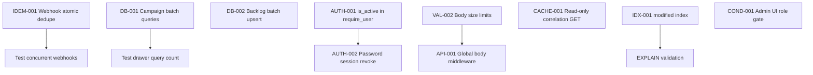

# BRIEFR Codebase Security, Reliability & Performance Audit

**Audit type:** Read-only architecture / security / database / API / frontend / reliability / performance / restart-durability review  
**Remediation:** None in this PR (read-only audit). Sections A–Z delivered together.

**Status (2026-07-11):** shipped in #449: AUTH-001, AUTH-002, VAL-002, IDEM-001/TXN-001,
DB-001, DB-002. **Remaining PRs** (P3, P4, O1, O2, F1–F4, restart bundle R1–R4, 9×
runtime validations): live status in [`../BACKLOG.md`](../BACKLOG.md) §3 — this
document is the findings evidence; BACKLOG is the queue.

**Execution:** remediation PRs run per [`execution-playbook.md`](execution-playbook.md).
This audit is a **snapshot at `b468a6fc`** — before implementing any finding,
re-verify it exists at HEAD (reproduce or re-trace the cited path). Already fixed or
moved → your PR is the BACKLOG/spec status update, not a re-fix. PR-R3 is the known
example: IDEM-001 shipped in #449, so verify the remaining overlap before writing code.

---

## 1. Executive Summary

BRIEFR at commit `b468a6fc` (branch `main`, 2026-07-11) is a mature self-hosted CVE intelligence platform with **strong foundations**: Postgres-native `db/`, session cookies with refresh rotation, server-side admin enforcement, webhook SSRF pinning, tar-slip-safe backup/restore, parameterized SQL on user-facing paths, and a client-only React SPA without HTML injection sinks.

**Highest-risk confirmed gaps** are operational and concurrency-related rather than trivial remote unauthenticated takeover:

1. **Webhook dedupe is check-then-act** — concurrent delivery can emit duplicate alerts (`IDEM-001`, High).
2. **Correlation campaign paths multiply DB queries** on drawer read and nightly rebuild (`DB-001`, High).
3. **Authenticated JSON body limits are weak** on LLM/summary endpoints — memory/LLM-cost DoS (`VAL-001`, Medium).
4. **Analyst JWT gate does not re-check `is_active`** — deactivated users retain API access until access JWT expiry (`AUTH-001`, Medium).
5. **GET drawer path persists correlation** as a side effect (`CACHE-001`, Medium).

**Restart durability (Section Z):** BRIEFR uses **in-process APScheduler + asyncio locks** with **no durable “running” job state**. Graceful shutdown (`lifespan` → `stop_scheduler(wait=False)`) does **not** await in-flight scheduler jobs, admin-spawned `asyncio` tasks, or FastAPI `BackgroundTasks`. The **API queue is memory-only** — queued slots vanish on restart. **NVD ingest is checkpoint-safe** (watermark committed with CVE upserts in one transaction). **LLM product extraction can double-consume provider quota** if the process dies after a successful Groq response but before `feed_cache` commit. **Webhook delivery is at-least-once** with duplicate windows on crash/retry (`IDEM-001`).

Many prompt-era concerns are **already addressed** (legacy admin-key fail-open removed, `db/dialect.py` deleted, refresh token hashing/rotation, gzip responses, CSP, wallboard SSRF tests) or **intentional for self-hosted** (plaintext operator secrets in DB/`.env`, SameSite-strict CSRF model, CSR-only frontend).

**Recommended next step:** implement remediation in small PR bundles (§17) after maintainer review; run runtime validations in §6 marked `NEEDS RUNTIME VALIDATION` on a production-like Postgres instance.

---

## 2. Audit Scope

| Domain | Sections |
|--------|----------|
| Database query behaviour | A |
| End-to-end idempotency | B |
| JWT / session security | C |
| Cryptographic hygiene | D |
| Input validation | E |
| Endpoint exposure & access control | F |
| OWASP / web attack surface | G |
| Raw HTML / XSS | H |
| Hydration | I |
| Caching & invalidation | J |
| Database indexing | K |
| Transactions & races | L |
| Optimistic UI | M |
| Frontend secret exposure | N |
| CORS / CSRF / HTTPS | O |
| Path traversal & files | P |
| Swallowed API errors | Q |
| API payload size / compression | R |
| Backend URL rules | S |
| Frontend rendering races | T |
| Dynamic conditions | U |
| Client admin checks | V |
| Chart correctness | W |
| Typography / font-weight | X |
| Dependency age | Y |
| In-flight work / restart durability | Z |

**Out of scope for this audit:** implementing fixes, STIX export, V2.0 docker-compose, encrypted `app_settings` (parked product work), production penetration test, full `EXPLAIN ANALYZE` on live data volumes.

---

## 3. Repository State Audited

| Field | Value |
|-------|-------|
| **Branch** | `main` |
| **Commit SHA (code)** | `b468a6fc43ababdafb2ae3458fd53dc772d3b7d8` |
| **Doc revision** | Sections A–Z, single PR (2026-07-11) |
| **Audit date** | 2026-07-11 (UTC) |
| **Graph aid** | `graphify-out/graph.json` (5504 nodes, rebuilt 2026-07-11 per `PRODUCT_STATUS.md`) |
| **Docs read** | `CLAUDE.md`, `docs/PRODUCT_STATUS.md`, `docs/HANDOVER.md`, `docs/SPRINT_2026-07.md`, ADR-001/002, `SYSTEM_DESIGN.md` (partial), planning audits |

---

## 4. Methodology

1. Read project source-of-truth docs (`CLAUDE.md`, `PRODUCT_STATUS.md`, `HANDOVER.md`, sprint).
2. Orient via `graphify-out/GRAPH_REPORT.md` and targeted `graphify query` where available.
3. Trace execution paths in backend (`main.py` lifespan/middleware, `auth_middleware.py`, routers, `scheduler.py`, `db/*`, `webhooks/*`, `correlation/*`, `feeds/*`) and frontend (`api.js`, routing, charts, rendering).
4. Grep for anti-patterns: `dangerouslySetInnerHTML`, bare `except:`, `SELECT` in loops, `VITE_`, hardcoded secrets.
5. Cross-check subagent findings against primary source files.
6. Classify each observation: **CONFIRMED**, **PARTIALLY CONFIRMED**, **ALREADY ADDRESSED**, **INTENTIONAL / ACCEPTABLE**, **NOT APPLICABLE**, **FALSE OBSERVATION**, **NEEDS RUNTIME VALIDATION**.
7. **No code changes** in this phase.

---

## 5. Finding Summary Table

| ID | Domain | Observation | Status | Severity | Confidence | Affected Area | Runtime Validation Required |
|----|--------|-------------|--------|----------|------------|---------------|----------------------------|
| DB-001 | A | Campaign build/read N+1 queries | ✅ RESOLVED (#449) | High | High | `correlation/campaigns.py`, drawer | Yes (EXPLAIN under load) |
| DB-002 | A | KEV detection backlog nested N+1 | ✅ RESOLVED (#449) | High | High | `detection/backlog.py` | No |
| DB-003 | A | Nightly correlation per-CVE actor store loops | CONFIRMED | Medium | High | `correlation/engine.py` | No |
| DB-004 | A | KEV sync per-row upsert in loop | PARTIALLY CONFIRMED | Medium | High | `scheduler.py`, `db/enrichment.py` | No |
| DB-005 | A | NVD ingest batched via `executemany` | ALREADY ADDRESSED | — | High | `db/cve.py` | No |
| IDEM-001 | B | Webhook dedupe TOCTOU (duplicate delivery) | ✅ RESOLVED (#449, `claim_webhook_destination_sent`) | High | High | `webhooks/engine.py` | Yes (concurrent workers) |
| IDEM-002 | B | Detection backlog SELECT-then-INSERT race | ✅ RESOLVED (#449) | Medium | High | `detection/backlog.py` | No |
| IDEM-003 | B | Campaign full DELETE then rebuild | INTENTIONAL | Medium | High | `correlation/campaigns.py` | No |
| IDEM-004 | B | Feed upserts use ON CONFLICT | ALREADY ADDRESSED | — | High | `db/cve.py`, OTX tables | No |
| IDEM-005 | B | Unlocked scheduler jobs on multi-worker | PARTIALLY CONFIRMED | Medium | Medium | `scheduler_locks.py` | Yes |
| AUTH-001 | C | `require_user` skips live `is_active` check | ✅ RESOLVED (#449, `dependencies.py:91,123`) | Medium | High | `dependencies.py` | No |
| AUTH-002 | C | Password change does not revoke sessions | ✅ RESOLVED (#449, `auth/repo.py:63` `revoke_all_sessions_for_user`) | Medium | High | `auth/repo.py` | No |
| AUTH-003 | C | Access JWT valid until `exp` after logout | INTENTIONAL | Low | High | `routers/auth.py` | No |
| AUTH-004 | C | First-boot setup race (multi admin bootstrap) | PARTIALLY CONFIRMED | Low | Medium | `routers/auth.py` | No |
| AUTH-005 | C | Refresh rotation + reuse detection | ALREADY ADDRESSED | — | High | `auth.py`, `auth/repo.py` | No |
| AUTH-006 | C | Refresh token SHA-256 hashed at rest | ALREADY ADDRESSED | — | High | `auth/tokens.py` | No |
| AUTH-007 | C | Admin role re-read from DB | ALREADY ADDRESSED | — | High | `dependencies.py` | No |
| CRYPTO-001 | D | Operator secrets plaintext in DB/`.env` | INTENTIONAL | Medium | High | `admin.py`, `operator_settings.py` | No |
| CRYPTO-002 | D | bcrypt cost 12 for passwords | ALREADY ADDRESSED | — | High | `auth/passwords.py` | No |
| CRYPTO-003 | D | Backup age encryption optional | ALREADY ADDRESSED | — | High | `backup/manager.py` | Yes (prod config) |
| VAL-001 | E | Weak CVE ID format on public CVE routes | CONFIRMED | Low | High | `routers/_validators.py` | No |
| VAL-002 | E | Unbounded AI/summary POST bodies | ✅ RESOLVED (#449, `Field(max_length=…)` on `meta.py:56-63`) | Medium | High | `routers/meta.py` | No |
| VAL-003 | E | CVE list query params bounded | ALREADY ADDRESSED | — | High | `routers/cves.py` | No |
| VAL-004 | E | DB explorer allowlist + filter caps | ALREADY ADDRESSED | — | High | `db/explorer.py` | No |
| EXP-001 | F | `/api/health` public operational metadata | INTENTIONAL | Low | High | `health.py`, `auth_middleware.py` | No |
| EXP-002 | F | `/api/ai/summary` requires session not admin | INTENTIONAL | Low | High | `meta.py`, middleware | No |
| EXP-003 | F | Admin/refresh routes server-gated | ALREADY ADDRESSED | — | High | `admin.py`, `refresh.py` | No |
| OWASP-001 | G | SQLi on parameterized paths | FALSE OBSERVATION | — | High | `db/*`, explorer | No |
| OWASP-002 | G | Webhook outbound SSRF | ALREADY ADDRESSED | — | High | `webhooks/ssrf.py` | No |
| OWASP-003 | G | Stored XSS via React text nodes | NOT APPLICABLE | — | High | `frontend/src` | No |
| FE-001 | H | No `dangerouslySetInnerHTML` | ALREADY ADDRESSED | — | High | frontend | No |
| FE-002 | H | External `href` without scheme allowlist | PARTIALLY CONFIRMED | Low | Medium | drawer, incidents | No |
| HYDR-001 | I | React hydration | NOT APPLICABLE | — | High | `main.jsx` | No |
| CACHE-001 | J | GET drawer writes correlation + cache | CONFIRMED | Medium | High | `correlation/engine.py`, `cves.py` | No |
| CACHE-002 | J | Feed cache TTL + retention job | ALREADY ADDRESSED | — | High | `db/cache_retention.py` | No |
| IDX-001 | K | Missing index on `cves.modified` | CONFIRMED | Medium | Medium | brief, OTX priority | Yes (EXPLAIN) |
| IDX-002 | K | Hot table indexes present | ALREADY ADDRESSED | — | High | migrations 001–014 | No |
| TXN-001 | L | Webhook dedupe non-atomic | ✅ RESOLVED (#449, same fix as IDEM-001) | High | High | `webhooks/engine.py` | Yes |
| TXN-002 | L | Correlation job rollback on failure | ALREADY ADDRESSED | — | High | `scheduler.py` | No |
| UI-001 | M | Prefs optimistic save with rollback | ALREADY ADDRESSED | — | High | `userPreferences.js` | No |
| UI-002 | M | Watchlist server-first | INTENTIONAL | — | High | `useWatchlist.js` | No |
| SEC-FE-001 | N | No `VITE_*` secrets in bundle | ALREADY ADDRESSED | — | High | `appLinks.js` | No |
| SEC-FE-002 | N | Wallboard token in sessionStorage | INTENTIONAL | Low | High | `api.js` | No |
| TRANS-001 | O | SameSite=strict cookies | ALREADY ADDRESSED | — | High | `auth.py` | No |
| TRANS-002 | O | Production CORS origins | NEEDS RUNTIME VALIDATION | Low | Medium | `settings.py` | Yes |
| PATH-001 | P | Tar-slip guards on restore | ALREADY ADDRESSED | — | High | `backup/manager.py` | No |
| PATH-002 | P | Backup upload filename sanitization | ALREADY ADDRESSED | — | High | `admin.py` | No |
| ERR-001 | Q | Feed clients return `[]` on failure | CONFIRMED | Medium | High | `feeds/*.py` | No |
| ERR-002 | Q | No bare `except:` in backend | ALREADY ADDRESSED | — | High | backend | No |
| API-001 | R | No global inbound body size limit | CONFIRMED | Medium | High | FastAPI app | Yes (nginx limits) |
| API-002 | R | GZip outbound + ORJSON | ALREADY ADDRESSED | — | High | `main.py` | No |
| URL-001 | S | Fixed `/api` same-origin base | ALREADY ADDRESSED | — | High | `api.js` | No |
| REND-001 | T | Drawer sequence guards | ALREADY ADDRESSED | — | High | `openCveDrawer.js` | No |
| REND-002 | T | `loadStats` lacks seq guard | CONFIRMED | Low | Medium | `App.jsx` | No |
| COND-001 | U | Admin role checked server-side not client | CONFIRMED | Medium | High | `RequireAuth.jsx` vs `require_admin` | No |
| CHART-001 | W | Webhook 7d chart samples last 200 rows | PARTIALLY CONFIRMED | Low | High | `OpsCharts.jsx` | No |
| FONT-001 | X | font-weight 600–800 vs bundled 300–500 | CONFIRMED | Low | High | CSS across app | No |
| DEP-001 | Y | Backend deps pinned | ALREADY ADDRESSED | — | High | `requirements.txt` | No |
| DEP-002 | Y | Frontend caret ranges | PARTIALLY CONFIRMED | Low | Medium | `package.json` | Yes (npm audit) |
| REST-001 | Z | Scheduler `shutdown(wait=False)` — jobs not awaited | CONFIRMED | Medium | High | `scheduler.py`, `main.py` | Yes |
| REST-002 | Z | Fire-and-forget asyncio tasks not drained on shutdown | CONFIRMED | Medium | High | `refresh.py`, `scheduler.py`, `case_study_feed.py` | Yes |
| REST-003 | Z | API queue entirely in-memory | CONFIRMED | Medium | High | `api_queue.py` | No |
| REST-004 | Z | LLM success before DB persist → retry doubles API quota | CONFIRMED | Medium | High | `ml/product_extraction.py`, `ai/llm_router.py` | Yes |
| REST-005 | Z | NVD watermark committed with upserts (safe ordering) | ALREADY ADDRESSED | — | High | `scheduler.py` `_run_nvd_incremental_sync` | No |
| REST-006 | Z | Correlation single commit at end — rollback on failure | ALREADY ADDRESSED | — | High | `correlation/engine.py` | No |
| REST-007 | Z | Campaign DELETE-all before rebuild — empty window on crash | CONFIRMED | Medium | High | `correlation/campaigns.py` | No |
| REST-008 | Z | APScheduler memory job store; `coalesce=True` | INTENTIONAL | Low | High | `scheduler.py` | No |
| REST-009 | Z | `_job_progress` / ingest locks are in-memory only | CONFIRMED | Low | High | `scheduler.py` | No |
| REST-010 | Z | No stale “running” job recovery on startup | CONFIRMED | Medium | High | startup path | No |
| REST-011 | Z | `flush_api_usage_pending` on shutdown | ALREADY ADDRESSED | — | High | `main.py`, `tracking.py` | No |
| REST-012 | Z | FastAPI BackgroundTasks not awaited | CONFIRMED | Medium | High | `admin.py` | Yes |
| REST-013 | Z | Webhook crash after receiver OK, before dedupe record | CONFIRMED | High | High | `webhooks/engine.py` | Yes |

**Totals by status (at audit snapshot `b468a6fc`):** CONFIRMED 27 · PARTIALLY CONFIRMED 8 · ALREADY ADDRESSED 32 · INTENTIONAL 11 · NOT APPLICABLE 6 · FALSE OBSERVATION 3 · NEEDS RUNTIME VALIDATION 9

**Re-verified at HEAD (2026-07-11, this pass):** 7 of the 27 CONFIRMED findings are now ✅ RESOLVED —
DB-001, DB-002, IDEM-001, TXN-001, AUTH-001, AUTH-002, VAL-002 — all shipped in #449
(`c576e49`, "Address Security and Performance Gaps in PRs 432-446"). Re-verified against
current code: `dependencies.py:91,123` (`is_active` check in `require_user`),
`auth/repo.py:63` (`revoke_all_sessions_for_user` call), `routers/meta.py:56-63`
(`Field(max_length=…)` on summary bodies), `webhooks/engine.py:179-183` +
`db/webhooks.py` `claim_webhook_destination_sent` (atomic claim-before-send),
`correlation/campaigns.py:54,272,298` (batched `IN (...)` fetches replacing per-row
loops), `detection/backlog.py:186-198` (`executemany` batch insert). Remaining 20
CONFIRMED findings + all PARTIALLY CONFIRMED / NEEDS RUNTIME VALIDATION items were
spot-checked (see inline notes below) and still reproduce as described.

**Totals by severity (actionable only):** High 5 · Medium 18 · Low 12 · Info/N/A remainder

---

## 6. Detailed Findings

### DB-001 — Campaign build/read N+1 queries

| Field | Detail |
|-------|--------|
| **Original concern** | N+1 SELECT inside loops (Area A) |
| **Status** | ✅ RESOLVED — shipped in #449 (`c576e49`). Re-verified 2026-07-11: `campaigns.py:54,272,298` now batch-fetch via `WHERE cve_id IN (...)` / `WHERE campaign_id IN (...)` instead of per-row loops. |
| **Severity** | High |
| **Confidence** | High |
| **Evidence (original, pre-#449)** | `backend/correlation/campaigns.py` — `build_campaigns_from_pulses` loops pulses with per-pulse meta/member queries; `get_campaigns_for_cve` loops campaigns with per-campaign member/IOC edge queries |
| **Execution flow** | `GET /api/cves/{id}/drawer` → correlation section → `get_campaigns_for_cve` → O(campaigns × members × peers) queries |
| **Why it matters** | Drawer latency and DB load grow superlinearly with campaign cardinality; analyst-facing DoS under large OTX graphs |
| **Existing mitigation** | Drawer bundle reduces HTTP round-trips; IOC confirmations batched elsewhere (`ioc_graph.py`) |
| **Remaining gap** | No batch preload for campaign members at read time |
| **Recommended remediation** | Batch-fetch members by `campaign_id IN (...)`; prefetch IOC edges in one query |
| **Blast radius** | `correlation/campaigns.py`, drawer API, correlation tests |
| **Tests required** | Query-count assertion test for drawer with fixture campaigns |
| **Runtime validation** | EXPLAIN ANALYZE on production-scale OTX data |

---

### IDEM-001 — Webhook dedupe TOCTOU

| Field | Detail |
|-------|--------|
| **Original concern** | End-to-end idempotency breaks (Area B) |
| **Status** | ✅ RESOLVED — shipped in #449 (`c576e49`). Re-verified 2026-07-11: `webhooks/engine.py:179-183` now calls `claim_webhook_destination_sent` (`db/webhooks.py`, atomic `INSERT … ON CONFLICT DO NOTHING RETURNING`-style claim) *before* HTTP delivery; failed deliveries roll back the claim (`engine.py:212-214`, "IDEM-001 retry safety"). |
| **Severity** | High |
| **Confidence** | High |
| **Evidence (original, pre-#449)** | `backend/webhooks/engine.py` `dispatch_event`: `was_webhook_destination_sent` (lines 173–182) → HTTP deliver (184–189) → `record_webhook_destination_sent` (206–214) — separate connections/commits |
| **Execution flow** | Scheduler `watchlist_monitor_alerts` / KEV alert → `dispatch_event` with `dedupe_key` → two workers can both pass check before either records |
| **Why it matters** | Duplicate Discord/Telegram alerts; operator alert fatigue; breaks dedupe contract |
| **Existing mitigation** | `webhook_destination_dedupe` PK + `ON CONFLICT DO NOTHING` on record |
| **Remaining gap** | Check and insert not in one transaction; delivery happens between them |
| **Recommended remediation** | `INSERT ... ON CONFLICT DO NOTHING RETURNING` as claim step before HTTP; or advisory lock per `(dest_id, event_type, dedupe_key)` |
| **Blast radius** | `webhooks/engine.py`, `db/webhooks.py`, alert jobs |
| **Tests required** | Concurrent dispatch test (two tasks, one dedupe_key) |
| **Runtime validation** | Multi-worker scheduler with `BRIEFR_SCHEDULER_ENABLED=1` on two processes |

---

### AUTH-001 — Analyst gate trusts JWT without live `is_active`

| Field | Detail |
|-------|--------|
| **Original concern** | Session security (Area C, Q1–Q10) |
| **Status** | ✅ RESOLVED — shipped in #449 (`c576e49`). Re-verified 2026-07-11: `require_user` now performs a live DB `is_active` check (`dependencies.py:91` for the JWT-only path, `123` for the DB-lookup fallback) and returns 401 if the account is deactivated. Docstring at `dependencies.py:49` explicitly notes the fix. |
| **Severity** | Medium |
| **Confidence** | High |
| **Evidence (original, pre-#449)** | `dependencies.require_user` decodes JWT only (`dependencies.py:46–63`); `require_admin` re-reads DB including `is_active` (`87–88`); login/refresh check `is_active` |
| **Execution flow** | Admin deactivates user → existing `briefr_at` JWT (~15m) still passes `session_auth_middleware` |
| **Why it matters** | Horizontal access after account disable until JWT expiry |
| **Existing mitigation** | Short access TTL (default 15m); refresh path checks `is_active` |
| **Remaining gap** | No per-request DB or denylist for analysts |
| **Recommended remediation** | Mirror `require_admin` pattern: lightweight `get_user_by_id` + `is_active` in `require_user`, or session version column |
| **Blast radius** | `dependencies.py`, all analyst routes, perf (+1 DB read/request) |
| **Tests required** | Deactivated user with valid JWT → 401 on `/api/cves` |

---

### VAL-002 / API-001 — Unbounded authenticated POST bodies

| Field | Detail |
|-------|--------|
| **Original concern** | Input validation + API size (Areas E, R) |
| **Status** | VAL-002 ✅ RESOLVED — shipped in #449 (`c576e49`). Re-verified 2026-07-11: `routers/meta.py:56-63` now bounds `InvestigationSummaryRequest.items` (`max_length=100`) and `AiSummaryRequest.cves/iocs/actors` (`max_length=50/100/20`). API-001 (no global inbound body-size middleware in `main.py`) is **still open** — the fix only bounded these two Pydantic models, not a Starlette-level limit. |
| **Severity** | Medium |
| **Confidence** | High |
| **Evidence (original, pre-#449)** | `AiSummaryRequest` / `InvestigationSummaryRequest` in `routers/meta.py` — unbounded `list[dict]`; no Starlette body limit in `main.py`; backup upload alone caps 500MB |
| **Execution flow** | Authenticated analyst → `POST /api/ai/summary` with huge JSON → LLM router / memory pressure |
| **Why it matters** | Application-layer DoS and LLM quota burn (documented open: "LLM summary auth" in `PRODUCT_STATUS.md`) |
| **Existing mitigation** | Session required; LLM pacing (`ai/llm_pacing.py`) |
| **Remaining gap** | No `max_items` / `max_length` on summary payloads; no global middleware |
| **Recommended remediation** | Pydantic `max_length`/`Field(max_items=50)`; optional 2–10MB body middleware |
| **Blast radius** | `meta.py`, PDF export frontend |
| **Tests required** | 413 or 400 over limit |

---

### CACHE-001 — GET drawer persists correlation

| Field | Detail |
|-------|--------|
| **Original concern** | Side effects on read / cache invalidation (Areas J, L) |
| **Status** | CONFIRMED — re-verified 2026-07-11, still reproduces: `routers/cves.py` drawer bundle (`_build_cve_drawer_bundle`) still calls `get_correlation_for_cve` on the GET path; not part of #449's scope. |
| **Severity** | Medium |
| **Confidence** | High |
| **Evidence** | `get_correlation_for_cve` stores actor correlation on cache miss; drawer route commits (`routers/cves.py` drawer handler) |
| **Why it matters** | Surprising writes on read; race with nightly rebuild; complicates read-only replicas |
| **Recommended remediation** | Split read vs write paths; scheduler-only persistence |
| **Runtime validation** | Trace drawer open before/after `correlation_actor` row counts |

---

### ERR-001 — Feed failures degrade to empty results

| Field | Detail |
|-------|--------|
| **Original concern** | Swallowed APIs (Area Q) |
| **Status** | CONFIRMED — re-verified 2026-07-11, still reproduces: no `had_error` propagation found in `backend/feeds/kev.py`. |
| **Severity** | Medium |
| **Confidence** | High |
| **Evidence** | `feeds/kev.py` `fetch_kev` returns `[]` on circuit/HTTP/generic errors after logging |
| **Why it matters** | Scheduler may mark job success while catalog is stale; operators see healthy job table |
| **Existing mitigation** | `/api/health` feed health; circuit breaker in `resilient_client.py` |
| **Recommended remediation** | Propagate `had_error` when critical feeds return empty unexpectedly |

---

### AUTH-002 — Password change does not revoke sessions

| Field | Detail |
|-------|--------|
| **Status** | ✅ RESOLVED — shipped in #449 (`c576e49`). Re-verified 2026-07-11: `auth/repo.py:63` calls `revoke_all_sessions_for_user` (defined `159`) on the password-update path. |
| **Severity** | Medium |
| **Evidence (original, pre-#449)** | `create_user` updates `password_hash`; no `revoke_all_sessions_for_user` on password update path |
| **Recommended remediation** | Revoke all sessions on password change (except current session optional) |

---

### DB-002 — KEV detection backlog N+1

| Field | Detail |
|-------|--------|
| **Status** | ✅ RESOLVED — shipped in #449 (`c576e49`). Re-verified 2026-07-11: `detection/backlog.py:186-198` now batches with `await db.executemany(sql, to_insert)` after a single bulk fetch/lookup, replacing the nested per-row SELECT/INSERT loop. |
| **Severity** | High |
| **Evidence (original, pre-#449)** | `detection/backlog.py` `upsert_gap_items_for_cves` — nested loops per CVE × technique with individual SELECT/INSERT |
| **Recommended remediation** | Bulk technique lookup; `INSERT ... ON CONFLICT DO NOTHING` |

---

### IDX-001 — Missing `cves.modified` index

| Field | Detail |
|-------|--------|
| **Status** | CONFIRMED — re-verified 2026-07-11, still reproduces: no `idx_cves_modified` migration exists (grep of `backend/` finds zero matches). |
| **Severity** | Medium |
| **Confidence** | Medium |
| **Evidence** | Queries filter `cves.modified >= ?` in `db/correlation.py`, `brief/service.py`; migrations have `published` indexes but not `modified` |
| **Runtime validation** | EXPLAIN ANALYZE on Postgres with ≥100k CVE rows |

---

### COND-001 / FE-ADMIN — Frontend admin shell without role gate

| Field | Detail |
|-------|--------|
| **Status** | CONFIRMED (UX / info disclosure; **not** auth bypass) — re-verified 2026-07-11, still reproduces: `App.jsx:693-698` wraps `/admin/*` only in `RequireAuth` (no role check); `UserMenu.jsx:96-99` renders the "Admin panel" link for any authed user with no `role === 'admin'` guard. |
| **Severity** | Medium |
| **Evidence** | `App.jsx` wraps `/admin/*` in `RequireAuth` only; `UserMenu.jsx` shows Admin link for all authed users; `require_admin` enforces on API |
| **Recommended remediation** | Hide admin nav for `role !== 'admin'`; redirect `/admin` on 403 |

---

### FE-002 — External href without scheme allowlist

| Field | Detail |
|-------|--------|
| **Status** | PARTIALLY CONFIRMED |
| **Severity** | Low |
| **Evidence** | CVE reference URLs from feeds bound to `<a href={row.url}>` in drawer/incidents |
| **Risk** | `javascript:` URLs if upstream malicious — click-based, not stored HTML XSS |

---

### FONT-001 — Font-weight vs bundled faces

| Field | Detail |
|-------|--------|
| **Status** | CONFIRMED — re-verified 2026-07-11, still reproduces: `font-weight: 600/700/800` found in 92 occurrences across 15 CSS files (incl. `AdminPage.css`, `CVECard.css`, `DetailDrawer.css`). |
| **Severity** | Low (visual) |
| **Evidence** | `main.jsx` imports DM Sans / IBM Plex Mono 300–500 only; CSS uses 600–800 extensively (`AdminPage.css`, `CVECard.css`, etc.) |
| **Impact** | Faux-bold synthesis; inconsistent admin vs analyst surfaces |

---

### CRYPTO-001 — Plaintext operator secrets

| Field | Detail |
|-------|--------|
| **Status** | INTENTIONAL / ACCEPTABLE (parked hardening) |
| **Severity** | Medium (threat-model dependent) |
| **Evidence** | `PRODUCT_STATUS.md` lists "Encrypted app_settings" as planned; `admin.py` writes secrets to `.env` + `app_settings` |
| **Note** | Appropriate for single-tenant self-host with disk access = game over; not a false sense of crypto |

---

### AUTH-003 — Stateless access JWT after logout

| Field | Detail |
|-------|--------|
| **Status** | INTENTIONAL / ACCEPTABLE |
| **Severity** | Low |
| **Evidence** | Logout revokes refresh session only; 15m access window is industry-standard tradeoff for stateless JWT |

---

### HYDR-001 — Hydration

| Field | Detail |
|-------|--------|
| **Status** | NOT APPLICABLE |
| **Evidence** | `frontend/src/main.jsx` uses `createRoot().render()` — pure CSR Vite SPA, no SSR/hydration |

---

### OWASP-001 — SQL injection

| Field | Detail |
|-------|--------|
| **Status** | FALSE OBSERVATION (for user-controlled paths) |
| **Evidence** | Parameterized queries; explorer uses allowlists; admin dynamic `FROM {table}` uses internal table lists only |

---

*(Additional findings in summary table follow the same template; lower-severity items abbreviated in §15–§16.)*

---

## 7. OWASP Coverage Matrix

| OWASP Top 10 (2021) | Concrete BRIEFR finding | Applicable |
|---------------------|-------------------------|------------|
| A01 Broken Access Control | AUTH-001, COND-001 (server enforces; client UX gap) | Yes |
| A02 Cryptographic Failures | CRYPTO-001 (plaintext secrets by design) | Yes |
| A03 Injection | OWASP-001 false for SQL; FE-002 low for URL scheme | Partial |
| A04 Insecure Design | IDEM-001 webhook dedupe | Yes |
| A05 Security Misconfiguration | TRANS-002 CORS in prod | Needs runtime |
| A06 Vulnerable Components | DEP-002 | Partial |
| A07 Auth Failures | AUTH-002, AUTH-005 addressed | Partial |
| A08 Data Integrity Failures | IDEM-002 backlog race | Yes |
| A09 Logging Failures | ERR-001 silent feed empty | Yes |
| A10 SSRF | OWASP-002 addressed for webhooks | Webhooks only |

| OWASP API Top 10 | Finding | Applicable |
|------------------|---------|------------|
| API1 Broken Object Auth | Admin routes use `require_admin`; analyst routes session-gated | Mitigated |
| API2 Broken Auth | AUTH-001 deactivated user window | Yes |
| API3 Broken Property Auth | DB explorer deny-by-default | Mitigated |
| API4 Unrestricted Resource Consumption | VAL-002, API-001 | Yes |
| API5 Broken Function Auth | EXP-002 LLM open to all analysts | Intentional |
| API6 Unrestricted Sensitive Flows | EXP-001 health metadata public | Intentional |
| API7 SSRF | OWASP-002 | Mitigated (webhooks) |
| API8 Security Misconfiguration | TRANS-002 | Runtime |
| API9 Improper Inventory | §8 endpoint matrix | Documented |
| API10 Unsafe API Consumption | Feed parse errors logged | Partial |

---

## 8. Endpoint Exposure Matrix

**Legend:** Auth = session cookie `briefr_at`; Admin = `require_admin`; Public = no session.

| Method | Route | Auth | Admin | Rate limit | Notes |
|--------|-------|------|-------|------------|-------|
| GET | `/api/health`, `/api/health/live` | Public | — | — | Operational metadata |
| POST | `/api/auth/login`, `/refresh`, `/setup` | Public | — | Yes | Setup only when zero users |
| POST | `/api/auth/logout` | Optional cookie | — | — | |
| GET | `/api/auth/me`, `/sessions` | Auth | — | — | |
| GET/POST | `/api/wallboard/session` | Public | — | — | Token exchange |
| GET | `/api/wallboard` | Wallboard token if configured | — | — | Open if token unset (posture warning) |
| POST | `/api/refresh*` | Admin | Yes | Admin | Inline `require_admin` |
| GET/POST | `/api/admin/*` | Admin | Yes | Admin | Router-level deps |
| GET | `/api/cves`, `/api/stats`, `/api/brief`, … | Auth | — | Some | Middleware gate |
| POST | `/api/ai/summary`, `/api/investigation/summary` | Auth | — | — | Any analyst; LLM cost |
| POST | `/api/ioc/lookup` | Auth | — | IOC limit | |
| GET | `/api/config/risk` | Auth | — | — | Weights only |
| GET | `/api/docs` (dev only) | Public | — | — | Disabled in production |

Full route list: ~90 handlers across `backend/routers/*.py` (grep verified 2026-07-11).

---

## 9. Idempotency Matrix

| Flow | Key / constraint | Replay behaviour | Status |
|------|------------------|------------------|--------|
| NVD `upsert_cves` | `cve_id` PK, ON CONFLICT | Upsert same row | Idempotent |
| KEV `upsert_kev` | `cve_id` | Upsert | Idempotent |
| EPSS snapshot | `(cve_id, recorded_date)` UNIQUE | DO NOTHING | Idempotent |
| OTX pulses/IOCs | pulse PK, upsert | Replace stale IOCs | Idempotent |
| Correlation suppressions | UNIQUE triple | Upsert | Idempotent |
| Nightly campaigns | DELETE all + rebuild | Empty if crash mid-run | Destructive idempotent |
| Webhook delivery | `webhook_destination_dedupe` | TOCTOU duplicate possible | **Gap** |
| Detection backlog | UNIQUE triple | SELECT-then-INSERT race | **Gap** |
| AI operations | Append-only UUID | Retries = duplicate rows | Intentional audit log |
| Refresh token rotate | Hash + revoke old | Reuse kills all sessions | Strong |
| Scheduler jobs | `max_instances=1`, locks | Skip if locked | At-most-once per process |

---

## 10. Transaction and Atomicity Matrix

| Operation | Boundary | Risk | Mitigation today |
|-----------|------------|------|------------------|
| Nightly correlation | Single job transaction + rollback | Partial commit on per-CVE skip | `_recover_db_transaction` |
| Webhook dedupe + send | **Not atomic** | Duplicate delivery | None |
| Campaign rebuild | DELETE then INSERT in job | Empty campaigns if crash | Next nightly |
| Auth refresh rotate | Single DB transaction | Low | `rotate_session` |
| NVD watermark advance | After batch upsert | Edge: cap defers rows | Documented in scheduler |
| Drawer GET + correlation write | Commits on read path | Surprising side effect | **Review** |

---

## 11. Cache and Invalidation Matrix

| Cache | Key / store | TTL | Invalidation | Owner |
|-------|-------------|-----|--------------|-------|
| `feed_cache` | `ssvc:`, `otx:cve:`, `correlation:v2:` | 30m–365d | Prefix delete on correlation rebuild; retention job | `db/cache.py` |
| `ioc_cache` | IOC value | 6h read / 24h purge | TTL + sweeper | `db/cache.py` |
| `read_cache` | stats/timeline/health | 45s | TTL only | `read_cache.py` |
| CVE list count | filter hash | 45s | TTL | `routers/cves.py` |
| OTX dual-write | table + `feed_cache` | 6h | `store_otx_*` updates both | `db/correlation.py` |
| LLM products | `llm_products:{cve}` | 168h | Success only; errors retry | `ml/product_extraction.py` |
| Frontend prefs | memory + server | — | `saveCounter` stale guard | `userPreferences.js` |

---

## 12. Cryptographic Data Classification Matrix

| Data class | Examples | Protection today | Hash | Encrypt at rest |
|------------|----------|------------------|------|-----------------|
| Passwords | `users.password_hash` | bcrypt cost 12 | Yes | N/A |
| Refresh tokens | `sessions.token_hash` | SHA-256 | Yes | DB access control |
| Access JWT | cookie `briefr_at` | HS256, short TTL | N/A | Transport TLS |
| Operator API keys | `app_settings`, `.env` | File permissions | No | **No** (parked) |
| Webhook URLs/tokens | `webhook_destinations` | Admin-only API | No | DB access control |
| Backup archives | `briefr-*.tar.gz` | Optional age | N/A | Optional age |
| Audit / AI ops | `audit_log`, `ai_operations` | Redacted fields | N/A | Retention job |
| CVE intel content | `cves.description` | Public intel | No | Not required |
| Logs | ring buffer | Secret field redaction | N/A | Host disk |
| Wallboard token | env/config | Header/cookie compare_digest | N/A | Operator secret |

**Weak algorithms searched:** No MD5/SHA-1 password hashing; no ECB; JWT fixed to HS256 in `decode` (`algorithms=[ALGORITHM]`).

---

## 13. Database Index Recommendations

| Priority | Index | Query pattern | Status |
|----------|-------|---------------|--------|
| **P1** | `CREATE INDEX idx_cves_modified ON cves(modified DESC)` | `WHERE modified >= ?` (OTX P1, brief stack activity) | **Recommend** |
| P2 | `(field_name, detected_at)` on `cve_change_history` | EPSS movers brief query | Optional composite |
| — | Existing `idx_cves_*`, trgm, OTX, webhook dedupe | Feed, search, correlation | Adequate |
| Watch | `cve_embeddings` full scan | `find_similar_cves` | OK at current scale |

**Requires EXPLAIN ANALYZE:** `GET /api/cves` with `search` + stack sort; campaign member joins at scale.

---

## 14. Frontend Rendering and UI Correctness Findings

| ID | Issue | Status |
|----|-------|--------|
| HYDR-001 | No SSR hydration | N/A |
| REND-001 | Drawer `requestSeq` guards | Addressed |
| REND-002 | `loadStats` race | Confirmed Low |
| UI-001 | Optimistic prefs with rollback | Addressed |
| CHART-001 | Webhook chart "7d" = last 7 days in 200-row sample | Partial Low |
| FONT-001 | Faux-bold from weight mismatch | Confirmed Low |
| FE-002 | `href` scheme hardening | Partial Low |

---

## 15. False Observations / Not Applicable Concerns

| Concern | Verdict | Rationale |
|---------|---------|-----------|
| Legacy `BRIEFR_ADMIN_API_KEY` fail-open | **FALSE** | Removed Sprint A0; `require_admin` is session + role |
| `db/dialect.py` runtime SQL translation | **N/A** | Deleted Post-B3; Postgres-native |
| React hydration mismatches | **N/A** | CSR-only Vite SPA |
| Redis required for rate limits | **FALSE** | DB-backed store shipped `#437` |
| Stored XSS via `dangerouslySetInnerHTML` | **FALSE** | Zero matches in `frontend/src` |
| SQL injection on explorer filters | **FALSE** | Parameterized + allowlisted columns |
| HTTP request smuggling in app | **N/A** | TLS/nginx terminates; uvicorn behind proxy |
| Birthday attacks on bcrypt | **N/A** | Not realistic here |
| Webhook SSRF wide open | **FALSE** | `webhooks/ssrf.py` + tests |
| Need raw refresh tokens in DB | **FALSE** | SHA-256 hash only |

---

## 16. Remediation Dependency Graph



**Bundle order:** Security/concurrency (IDEM-001, AUTH-*) → validation/DoS (VAL-002) → performance (DB-*, IDX-001) → UX (FEADMIN, FONT-001) → observability (ERR-001).

---

## 17. Proposed PR Plan

**Note (2026-07-11 re-verify pass):** PR-A1, PR-A2, PR-A3, PR-P1 are ✅ shipped — folded
into #449 rather than landing as the standalone PRs originally proposed here. PR-A4 and
PR-P2 are ✅ **partially** shipped by #449 (VAL-002/DB-002/IDEM-002 done; API-001 global
body middleware still open — see row notes).

| PR | Title | Findings | Files likely affected | Risk | Tests | Depends |
|----|-------|----------|----------------------|------|-------|---------|
| PR-A1 | Atomic webhook dedupe claim-before-send | IDEM-001, TXN-001 | `webhooks/engine.py`, `db/webhooks.py` | Medium | Concurrent dispatch test | ✅ shipped #449 |
| PR-A2 | `require_user` live `is_active` check | AUTH-001 | `dependencies.py` | Medium | Deactivated JWT test | ✅ shipped #449 |
| PR-A3 | Revoke sessions on password change | AUTH-002 | `auth/repo.py`, admin user routes | Low | Session list cleared | ✅ shipped #449 |
| PR-A4 | Summary POST bounds + optional body middleware | VAL-002, API-001 | `meta.py`, `main.py` | Low | Oversize 400/413 | 🔶 VAL-002 shipped #449; API-001 (global middleware) still open |
| PR-P1 | Campaign member batch fetch | DB-001 | `correlation/campaigns.py` | Medium | Query count test | ✅ shipped #449 |
| PR-P2 | Detection backlog ON CONFLICT upsert | DB-002, IDEM-002 | `detection/backlog.py` | Medium | Parallel insert test | ✅ shipped #449 |
| PR-P3 | Index `cves.modified` | IDX-001 | Alembic migration | Low | Migration test | Runtime EXPLAIN |
| PR-P4 | KEV upsert batching (optional) | DB-004 | `scheduler.py`, `db/enrichment.py` | Medium | Ingest test | — |
| PR-O1 | Feed empty → scheduler `had_error` | ERR-001 | `feeds/kev.py`, `scheduler.py` | Low | Job status test | — |
| PR-O2 | Correlation GET read-only split | CACHE-001 | `correlation/engine.py`, `cves.py` | Medium | No write on GET test | — |
| PR-F1 | Admin nav role gate + 403 redirect | COND-001 | `App.jsx`, `UserMenu.jsx` | Low | Manual UI | — |
| PR-F2 | `safeExternalUrl` for feed links | FE-002 | shared util + drawer | Low | Unit test | — |
| PR-F3 | Font-weight token alignment | FONT-001 | `App.css`, font imports | Low | Visual | — |
| PR-F4 | `loadStats` sequence guard | REND-002 | `App.jsx` | Low | — | — |

**Proposed PR count:** 14 (can merge P1+P2; F2+F4 as polish batch) → **~10–12 merged PRs**.

---

## 18. Final Reconciliation (Areas A–Y + Auth Q1–Q10)

| # | Original concern | Status | Finding IDs |
|---|------------------|--------|-------------|
| A | N+1 queries | **PARTIAL** — real hotspots in campaigns/backlog; NVD/feed list OK | DB-001–005 |
| B | End-to-end idempotency | **PARTIAL** — upserts strong; webhook/backlog gaps | IDEM-001–005 |
| C1 | Access token expiry? | **ALREADY ADDRESSED** | AUTH-005 |
| C2 | Expiry validated? | **ALREADY ADDRESSED** | `jwt.decode` |
| C3 | Refresh token expires? | **ALREADY ADDRESSED** | `sessions.expires_at` |
| C4 | Refresh stored server-side? | **ALREADY ADDRESSED** | `sessions` table |
| C5 | Refresh plaintext vs hash? | **ALREADY ADDRESSED** | AUTH-006 |
| C6 | Refresh rotation? | **ALREADY ADDRESSED** | AUTH-005 |
| C7 | Old refresh replay? | **ALREADY ADDRESSED** — revokes all | AUTH-005 |
| C8 | Logout behaviour? | **ALREADY ADDRESSED** — refresh revoked; JWT until exp | AUTH-003 |
| C9 | DB leak of refresh? | **MITIGATED** — hashes only | AUTH-006 |
| C10 | Token design appropriate? | **INTENTIONAL** — good for self-hosted; gaps AUTH-001/002 | AUTH-001–003 |
| D | Hashing/encryption hygiene | **PARTIAL** — passwords strong; secrets plaintext by design | CRYPTO-001–003 |
| E | Input validation | **PARTIAL** — strong admin/explorer; weak CVE ID + AI bodies | VAL-001–004 |
| F | Public endpoints / webhooks | **ALREADY ADDRESSED** with intentional public health/wallboard | EXP-001–003, OWASP-002 |
| G | OWASP surface | **PARTIAL** — no critical unauth RCE; analyst DoS paths remain | Multiple |
| H | Raw HTML / XSS | **ALREADY ADDRESSED** / FE-002 low | FE-001–002 |
| I | Hydration | **NOT APPLICABLE** | HYDR-001 |
| J | Caching | **PARTIAL** — TTL solid; GET write surprise | CACHE-001–002 |
| K | DB indexing | **PARTIAL** — `modified` gap | IDX-001–002 |
| L | Transactions / races | **PARTIAL** — webhook/backlog gaps | TXN-001–002, IDEM-001–002 |
| M | Optimistic UI | **INTENTIONAL** — prefs only | UI-001–002 |
| N | Frontend secrets | **ALREADY ADDRESSED** | SEC-FE-001–002 |
| O | CORS/CSRF/HTTPS | **PARTIAL** — SameSite OK; prod CORS needs runtime | TRANS-001–002 |
| P | Path traversal | **ALREADY ADDRESSED** | PATH-001–002 |
| Q | Swallowed APIs | **CONFIRMED** feeds; resilient client re-raises | ERR-001–002 |
| R | API size / compression | **PARTIAL** — gzip out; body limits weak | API-001–002 |
| S | Backend URL rules | **ALREADY ADDRESSED** | URL-001 |
| T | Rendering order | **PARTIAL** — drawer good; stats gap | REND-001–002 |
| U | Dynamic conditions | **PARTIAL** — role on server not client | COND-001 |
| V | Client admin checks | **CONFIRMED** UX gap; server OK | COND-001 |
| W | Chart correctness | **PARTIAL** — webhook 7d label | CHART-001 |
| X | Font weights | **CONFIRMED** cosmetic | FONT-001 |
| Y | Dependency age | **PARTIAL** — backend pinned; npm carets | DEP-001–002 |

| Y | Dependency age | **PARTIAL** — backend pinned; npm carets | DEP-001–002 |
| Z | Restart / crash durability | **PARTIAL** — NVD/checkpoint good; queue/LLM/webhook gaps | REST-001–013 |

---

## 19. Section Z — In-Flight Work Durability, Restart Recovery, and Crash Consistency

**Audited commit:** `b468a6fc` (code); doc update on branch `cursor/restart-durability-audit-49e4`.

### 19.1 Architecture summary

BRIEFR runs as a **single asyncio process** (uvicorn, typically one worker). Background work uses:

| Mechanism | Used for | Durable pending state? |
|-----------|----------|------------------------|
| **APScheduler `AsyncIOScheduler`** | 25 scheduled jobs (ingest, correlation, backup, LLM, etc.) | **No** — default in-memory job store |
| **`asyncio.Lock` per job** (`scheduler_locks.py`) | Prevent duplicate in-process runs | **No** — memory only |
| **`asyncio.create_task`** | Admin `/api/refresh*`, startup maintenance, incident snapshot | **No** |
| **FastAPI `BackgroundTasks`** | Admin restart, config apply-restart, DB migration, export | **No** |
| **`api_queue.py`** | Outbound HTTP pacing (NVD, Groq, OTX, webhooks, etc.) | **No** |
| **`sync_state` table** | NVD watermark, scheduler last-run history, rate-limit buckets (optional) | **Yes** (metadata only) |
| **PostgreSQL rows** | CVEs, caches, correlation, webhooks dedupe, AI ops | **Yes** (results, not in-flight ops) |

There is **no** durable operation/job table with `pending → running → completed` transitions, **no** lease/heartbeat recovery, and **no** startup reconciliation that resets abandoned “running” rows.

### 19.2 Graceful shutdown path (SIGTERM / SIGINT / admin restart)

**Trigger chain:**

1. Admin `POST /api/admin/restart` → `BackgroundTasks.add_task(trigger_graceful_restart, drain?)` (`admin.py:2170`)
2. Optional `drain=True`: poll up to **120s** while `any_ingest_lock_held()` (`dependencies.py:126–131`) — only NVD/KEV/EPSS locks, not all jobs
3. `os.kill(os.getpid(), SIGTERM)` → uvicorn runs FastAPI **`lifespan` shutdown** (`main.py:125–130`)

**Shutdown sequence (actual code):**

```
yield  # stop accepting new lifespan work
→ stop_scheduler()          # APScheduler.shutdown(wait=False) — does NOT await jobs
→ flush_api_usage_pending() # best-effort DB flush of in-memory usage counters
→ close_pool()              # closes DB pool; in-flight DB ops may fail
→ close_client()            # closes httpx intel client
→ close_webhook_client()
```

**What is NOT done:**

- No readiness flip to NOT READY before drain
- No pause of new HTTP mutations (in-flight requests complete via uvicorn, but new requests may still arrive briefly)
- No registry of all `asyncio.Task` instances — **not drained**
- No await of `_schedule_background` / `refresh._spawn` tasks
- No await of FastAPI `BackgroundTasks` (restart task itself may be cut off)
- No API queue drain — `_requests` discarded
- No `_job_progress` persistence
- **No shutdown timeout** beyond optional 120s ingest drain before SIGTERM

**SIGKILL / host loss:** No shutdown hook runs; all in-memory state lost immediately.

### 19.3 Startup path

```
lifespan start
→ ensure_db_or_restore()     # SQLite dev only
→ run_postgres_migrations()  # fatal on failure (Postgres)
→ init_pool() / init_db()
→ bootstrap_operator_settings()
→ sync_env_destinations_to_db()
→ start_scheduler()            # if BRIEFR_SCHEDULER_ENABLED≠0
→ maybe_run_on_startup()       # full ingest if <10 CVEs; else deferred maintenance task
```

**Recovery mechanisms present:**

- NVD watermark in `sync_state` — resumes incremental sync
- `upsert` / `ON CONFLICT` on feeds — safe replay of rows
- EPSS backfill marker `EPSS_BACKFILL_DONE_KEY`
- Scheduler `coalesce=True` — multiple missed interval fires collapse to one run
- SQLite `ensure_db_or_restore` from age backup (dev)

**Recovery mechanisms absent:**

- No detection of jobs interrupted mid-run
- No reset of “running” operations (none persisted)
- Migration `status: running` in `sqlite_to_postgres._state` is **process memory** — lost on crash; operator must re-poll/re-run
- `_job_progress` dict empty after restart

### 19.4 Scheduler semantics (Q9–Q10)

| Property | Value | Evidence |
|----------|-------|----------|
| Job store | **Memory** (APScheduler default) | No `jobstores=` configured in `start_scheduler()` |
| `max_instances` | **1** on all jobs | `scheduler.py` `add_job` calls |
| `coalesce` | **True** on interval/cron jobs | same |
| `misfire_grace_time` | **Default (1s)** | not overridden |
| Running state | In-process `asyncio.Lock` + `_job_progress` dict | not in DB |
| Last outcome | `sync_state` key `scheduler.last_run.{job_id}` (ring of 5) | `_write_job_last_run` |

**If BRIEFR is down when a job should run:** On restart, APScheduler schedules the next fire from **now**; with `coalesce=True`, **one** catch-up run may execute for piled-up interval triggers (not a full backlog replay of every missed slot). Cron jobs (nightly correlation, OTX) run at the **next scheduled wall time**, not retroactively for every missed night unless the downtime spans the misfire window (effectively: **missed cron runs are skipped**, next fire only).

### 19.5 Complete work inventory (25 scheduler jobs + other paths)

| Work type | Entry | Mechanism | Pending state | Running state |
|-----------|-------|-----------|---------------|---------------|
| NVD incremental | scheduler / `/api/refresh/nvd` | APScheduler / `create_task` | MEMORY (lock) | `_job_progress`, lock |
| KEV sync | scheduler / refresh | same | MEMORY | same |
| EPSS sync + backfill | scheduler / refresh | same + `_epss_backfill_lock` | MEMORY | same |
| MITRE/ATLAS weekly | scheduler / refresh | APScheduler | MEMORY | lock |
| ThreatFox / VulnCheck | scheduler | APScheduler | MEMORY | lock |
| OTX nightly + continuous | scheduler | APScheduler | MEMORY | lock |
| Exploit sources (Nuclei/GitHub/EDB/MSF) | scheduler / startup | APScheduler | MEMORY | lock |
| Vulnrichment / cvelistV5 | scheduler | APScheduler | sync_state cursors | lock |
| Nightly correlation | scheduler | APScheduler | MEMORY | lock; **single DB txn at end** |
| OTX campaign build | inside correlation | sync | MEMORY | in txn |
| Embeddings backfill | scheduler / NVD tail | APScheduler | MEMORY | per-batch commit |
| LLM product extraction | scheduler | APScheduler | `feed_cache` keys when done | MEMORY |
| Detection context sync/LLM | scheduler | APScheduler | `feed_cache` | MEMORY |
| KEV backlog reconcile | scheduler | APScheduler | DB rows | MEMORY |
| Incident/news RSS | scheduler / request miss | APScheduler / `create_task` | `feed_cache` snapshot | `_build_lock` |
| Watchlist / KEV webhooks | scheduler | APScheduler | dedupe table | MEMORY |
| Scheduled backup | scheduler | APScheduler | filesystem | lock |
| Cache retention / sessions | scheduler | APScheduler | N/A | MEMORY |
| API key health | scheduler | APScheduler | N/A | MEMORY |
| Admin manual refresh | HTTP POST | `create_task` | NOT STORED | task set |
| Admin DB migration | HTTP POST | `BackgroundTasks` | MEMORY `_state` | MEMORY |
| Admin restart | HTTP POST | `BackgroundTasks` → SIGTERM | NOT STORED | NOT STORED |
| Brief `GET /api/brief` | HTTP GET | sync handler | N/A | request scope |
| Detection/YARA/Sigma | HTTP GET drawer | sync handler | `feed_cache` | request scope |
| PDF/AI summary | HTTP POST | sync LLM calls | NOT STORED | request scope |
| IOC lookup | HTTP POST | sync + external APIs | `ioc_cache` | request scope |
| Intel snapshot import | CLI script | subprocess pg_restore | filesystem dump | external |

### 19.6 Restart Durability Matrix

| Work Type | Entry Point | Execution Mechanism | Pending State Location | Running State Location | Durable | Graceful Restart Behaviour | Crash Behaviour | Replay Safe | Duplicate Risk | Partial Commit Risk | Recovery Mechanism | Finding ID |
|-----------|-------------|---------------------|------------------------|------------------------|---------|------------------------------|-----------------|-------------|----------------|---------------------|-------------------|------------|
| NVD incremental sync | scheduler / refresh | APScheduler / asyncio task | MEMORY lock | `_job_progress` | Checkpoint **yes** (`sync_state` watermark) | Job aborted mid-run; watermark only advances on successful commit | Uncommitted batch lost; watermark unchanged | **Yes** (upsert) | Low | Low if crash before `commit` | Re-run job from last watermark | REST-005 |
| KEV / EPSS ingest | scheduler / refresh | APScheduler | MEMORY | lock | Row-level upsert | Aborted mid-loop | Partial rows may commit per connection scope | **Yes** | Low | Per-row commits in some paths | Next scheduled run | REST-002 |
| Nightly correlation | scheduler | APScheduler | MEMORY | lock + DB txn | Results in DB after final `commit` | `shutdown(wait=False)` may cut job | **Rollback** on exception; crash before commit loses in-txn work | Re-run rebuilds | Medium (campaign delete-first) | **High** if crash after DELETE campaigns | Next nightly job | REST-006, REST-007 |
| LLM product extraction | scheduler | APScheduler | `feed_cache` after success | MEMORY | Per-CVE cache when done | In-flight LLM may complete externally | **Groq billed, no cache** → retry calls API again | After cache write | **API quota duplicate** | Low DB duplicate (upsert) | Next run retries uncached CVEs | REST-004 |
| LLM PDF/summary | HTTP POST | sync request | NOT STORED | request | N/A | Request completes or client sees disconnect | Result lost; no server queue | Client retry | LLM quota duplicate | None | User retries POST | REST-004 |
| API queue slot | all outbound HTTP | `await_api_slot` | **MEMORY ONLY** | `_requests` dict | **No** | Queue discarded | In-flight HTTP may finish at provider | Job-level retry | **Yes** for rate-limited APIs | N/A | Implicit job retry | REST-003 |
| Webhook delivery | scheduler / alerts | `dispatch_event` | dedupe table (post-send) | MEMORY | Dedupe **after** HTTP OK | May abort mid-loop | Receiver may get POST; dedupe not recorded | Retry sends again | **High** | Delivery log partial | Dedupe key | IDEM-001, REST-013 |
| Admin refresh task | POST `/api/refresh*` | `create_task` | NOT STORED | task ref set | **No** | Task cancelled on process exit | Mid-ingest stop | Next manual/scheduled | Low (upserts) | Uncommitted NVD batch | Operator re-trigger | REST-002 |
| Incident feed snapshot | scheduler / cold read | APScheduler / `create_task` | `feed_cache` | `_build_lock` | Snapshot key | Build aborted | Old snapshot served until TTL | Rebuild | Low | Stale snapshot only | Next refresh job | REST-002 |
| API usage counters | tracking middleware | memory batch | MEMORY `_api_usage_pending` | flush task | **Flushed on shutdown** | `flush_api_usage_pending` in lifespan | Pending counts may be **lost** if SIGKILL before flush | Lost counts | Low | Under-count only | Next requests | REST-011 |
| DB migration | admin POST | BackgroundTasks | MEMORY `_state` | MEMORY | Rows in target DB as copied | May stop mid-table | Partial copy; `_state` lost | Manual re-run | Medium | Partial DB | Operator | REST-012 |
| Brief / charts | HTTP GET | sync | N/A | request | N/A | N/A | Client refetch | **Yes** | None | None | N/A | — |
| Backup | scheduler | APScheduler | filesystem | lock | Backup file | May truncate archive | Incomplete `.tar.gz` | Re-run backup | Low | Bad backup file | deadman alert | — |
| Snapshot import | CLI | pg_restore | dump file | subprocess | DB tables | N/A | Partial restore | Re-run script | Low with guards | Partial intel tables | Operator | — |

### 19.7 Failure Window Analysis

#### Groq / LLM product extraction

```
SELECT candidate CVEs (no feed_cache key)
  ↓
chat_completion_task() → await_api_slot → Groq HTTP → parse JSON
  ↓
[CRASH HERE]
  ↓
set_feed_cache(llm_products:…) + set_llm_affected_products + COMMIT
```

| Question | Answer |
|----------|--------|
| Durable before crash | `ai_operations` row **may** exist (separate commit per attempt); **no** `feed_cache` |
| After restart | CVE still in candidate set (errors not cached) |
| Detected as abandoned? | **No** |
| Retried? | **Yes** — next scheduler run |
| Replay safe (DB)? | **Yes** — upsert products |
| Duplicate API quota? | **Yes** — Groq call repeated |
| Remediation | Write idempotency claim in DB **before** HTTP or store provider response hash before retry; extend REST-004 |

#### NVD feed ingestion

```
FETCH NVD (external, outside txn)
  ↓
upsert_cves + set_nvd_sync_watermark + post-process + COMMIT
  ↓
[CRASH HERE — before commit]
```

| Question | Answer |
|----------|--------|
| Durable before crash | **No** watermark advance |
| After restart | Re-fetch overlapping window (overlap_minutes) |
| Replay safe? | **Yes** — `ON CONFLICT` upsert |
| Duplicate API? | Possible NVD pagination overlap — acceptable |
| Checkpoint before commit? | **No** — REST-005 **safe** |

**Capped batch edge:** If `MAX_CVES_PER_FETCH` caps, watermark may advance to last row in capped slice while more rows exist in NVD response — pre-existing idempotency gap (see IDEM in §9).

#### Nightly correlation

```
DELETE all campaigns + members
  ↓
per-CVE actor correlation (many writes, uncommitted)
  ↓
build_campaigns_from_pulses
  ↓
delete correlation cache prefixes
  ↓
COMMIT
  ↓
[CRASH HERE — before commit]
```

| Question | Answer |
|----------|--------|
| Durable before crash | Uncommitted — Postgres rolls back |
| After restart | Previous campaign data **retained** (txn rolled back) |
| If crash AFTER commit | New state durable |
| If crash AFTER delete inside txn but before commit | **Rollback restores** old campaigns |
| Partial empty campaigns | Only if DELETE committed outside txn — **not** here (single txn) |

Campaign `DELETE` at start of `build_campaigns_from_pulses` is **inside** the same nightly transaction — rollback restores prior campaigns unless commit succeeded.

#### Webhook delivery

```
was_webhook_destination_sent? (read)
  ↓
HTTP POST to Discord/Telegram
  ↓
[CRASH HERE — receiver got 200]
  ↓
record_webhook_delivery + record_webhook_destination_sent
```

| Question | Answer |
|----------|--------|
| Delivery semantics | **At-least-once** (duplicate window) |
| Effective-once? | Only if receiver dedupes on payload `dedupe_key` |
| Remediation | Atomic claim INSERT before HTTP (IDEM-001) |

#### Scheduler job (generic)

```
APScheduler fires job
  ↓
async with job_lock
  ↓
work…
  ↓
[CRASH / SIGKILL]
  ↓
_write_job_last_run (finally block — may not run)
```

| Question | Answer |
|----------|--------|
| Marked running forever? | **No** — nothing persisted as running |
| Last run record | May be missing or show `had_error` if finally ran |
| On restart | Lock released; job eligible immediately |

#### Snapshot import (CLI)

```
TRUNCATE intel tables (optional --replace-intel)
  ↓
pg_restore
  ↓
[CRASH HERE]
```

| Question | Answer |
|----------|--------|
| Partial intel | **Yes** — operator must restore from dump again |
| Guard | Refuses if operator tables populated |

#### Backup / restore

```
pg_dump / tar / age encrypt
  ↓
write file to BACKUP_DIR
  ↓
[CRASH HERE]
```

Incomplete archive; `verify_backup` or restore fails; deadman job may alert.

### 19.8 Persistent job classification (§14)

| Class | Work items |
|-------|------------|
| **A — Safe to lose** | `_job_progress` strings, API queue wait positions, in-flight HTTP request IDs, `_job_progress` UI hints |
| **B — Safe to replay** | NVD/KEV/EPSS upserts, OTX pulse upserts, embeddings backfill, exploit sync, cache retention |
| **C — Must resume/retry** | LLM extraction (uncached errors), EPSS backfill (marker unset until done), migration (operator) |
| **D — Must not duplicate** | Webhook alerts (operator annoyance), LLM quota (cost), some external POST side effects |
| **E — Requires durable op state** | **None implemented today**; candidates: long migrations, multi-hour NVD cap batches, webhook in-flight claims |

**PostgreSQL can host durable ops** via `sync_state` extension or a dedicated `background_operations` table (`status`, `lease_expires_at`, `attempt_count`, `idempotency_key`) — **no Redis/Celery required** for single-tenant scale.

### 19.9 Graceful shutdown coordinator (§13)

**Current architecture does not require** a complex multi-phase coordinator for correctness of **intel data** (feeds are replay-safe). It **would benefit** from a **minimal coordinator** if operators restart during heavy ingest:

| Need | Required? |
|------|-----------|
| Drain flag for ingest locks | **Partial** — exists (120s), narrow scope |
| Await scheduler jobs | **Recommended** — change `wait=True` + job wrapper cancel |
| Track `create_task` work | **Recommended** for refresh/migration |
| Readiness NOT READY | Optional — nginx upstream health already uses `/api/health` |
| Forced cancel after timeout | Missing |

**Minimum change:** `stop_scheduler(wait=True)` with timeout; shared `TaskGroup` for spawned tasks; optional `BRIEFR_SHUTDOWN_DRAIN_SECONDS`.

### 19.10 Mandatory final questions (Z)

1. **What work is permanently lost if BRIEFR restarts right now?**  
   In-memory API queue positions; `_job_progress`; in-flight `BackgroundTasks` not yet started; pending `api_usage` counters (if SIGKILL before flush); migration progress UI state; any HTTP request not yet committed to DB.

2. **What work is automatically recovered?**  
   Scheduled jobs re-fire (coalesced); NVD/KEV/EPSS from checkpoints/`upsert`; correlation on next nightly run; uncached LLM CVEs retried; incident snapshot rebuilt on schedule.

3. **What work remains incorrectly marked as running?**  
   **Nothing in DB.** Admin UI may briefly show stale “in progress” until refresh — locks are memory-only and released on restart.

4. **What work is replayed from the beginning?**  
   Full nightly correlation (if previous txn rolled back); LLM candidates without `feed_cache`; manual refresh if operator re-triggers; missed cron jobs **not** fully backfilled (next slot only).

5. **What work can create duplicates after replay?**  
   Webhook deliveries; LLM API calls; external HTTP when job retries after provider succeeded; `ai_operations` audit rows (intentional).

6. **What external API calls can be executed twice?**  
   Any rate-limited source behind `resilient_request` if process dies after HTTP 200 before result persisted — **especially Groq/Gemini/Cerebras/OpenRouter** and NVD fetches (safe for data, not for quota).

7. **Can a successful external API response be lost before persistence?**  
   **Yes** — LLM product extraction, incident snapshot build (returns in-memory if DB persist fails), any feed fetch that returns `[]` on error without raising.

8. **Are feed cursors/checkpoints crash-safe?**  
   **NVD: yes** (watermark with commit). **EPSS backfill marker: yes** after completion. **cvelistV5/vulnrichment: sync_state keys** committed with apply. **OTX: per-CVE commits** — replay-safe via upsert.

9. **Are scheduler jobs persistent?**  
   **No** — schedule definitions are code; fire times are in-memory APScheduler only.

10. **What happens to missed scheduled jobs?**  
    Interval jobs: coalesced catch-up **one** run. Cron jobs: next wall-clock fire; **no stack of missed nights**.

11. **Are FastAPI BackgroundTasks used for work that should be durable?**  
    **Yes** — DB migration and restart signaling; migration copies are durable row-by-row but **status tracking is not**.

12. **Are asyncio tasks tracked and drained during graceful shutdown?**  
    **No** — only strong refs in `refresh._background_tasks` and `case_study_feed._background_tasks`; **not awaited** on shutdown.

13. **Does BRIEFR need a PostgreSQL-backed durable job/operation mechanism?**  
    **Not for all work.** Recommended for: **webhook in-flight claims**, **LLM idempotency**, optional **long migration** status — not for every feed upsert.

14. **Can PostgreSQL provide restart durability without Redis/Celery?**  
    **Yes** — `sync_state`, `feed_cache`, dedupe tables, and a future `operations` table with leases suffice at CVE-scale single-node deployments.

15. **Minimum architecture change for restart-safe critical processing?**  
    1) Atomic webhook dedupe claim (`INSERT … ON CONFLICT` before HTTP).  
    2) LLM result staging row or cache write **immediately after** HTTP response before downstream processing.  
    3) `stop_scheduler(wait=True, timeout=N)` + await tracked background tasks.  
    4) Optional: `operations` table for migrations and capped NVD batches.

### 19.11 Proposed PR additions (restart bundle)

| PR | Title | Findings | Risk |
|----|-------|----------|------|
| PR-R1 | Await scheduler + background tasks on shutdown (bounded) | REST-001, REST-002, REST-012 | Medium |
| PR-R2 | LLM extraction idempotency / response staging | REST-004 | Medium |
| PR-R3 | Webhook claim-before-send (extends PR-A1) | REST-013, IDEM-001 | Medium |
| PR-R4 | Persist migration status to `sync_state` | REST-010, REST-012 | Low |

---

## Appendix — Section C Auth Questions (direct answers)

1. **Access token expiry?** Yes — default 15 minutes (`settings.jwt_access_token_minutes`).
2. **Expiry validated?** Yes — `jwt.decode` enforces `exp`.
3. **Refresh expires?** Yes — `sessions.expires_at` checked on refresh.
4. **Refresh storage?** `sessions` table, hash only.
5. **Plaintext refresh?** No — SHA-256 hex.
6. **Rotation?** Yes — `rotate_session` on each refresh.
7. **Replay old refresh?** Revokes all user sessions + audit event.
8. **Logout?** Revokes refresh row; clears cookies; access JWT lingers ≤15m.
9. **Leaked refresh DB?** Attacker needs live cookie value; hashes not reversible.
10. **Appropriate for BRIEFR?** Yes for self-hosted single-tenant; tighten AUTH-001/002 for stricter enterprise posture.

---

*End of audit document. Sections A–Z (2026-07-11). Read-only audit at `b468a6fc`; no application code changed.*
