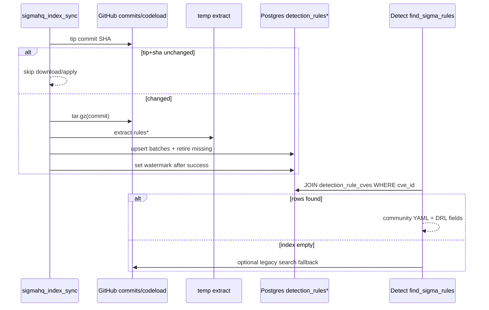

# feat: SigmaHQ local Postgres rule index

**Origin:** `docs/planning/specs/sigmahq-local-index-design.md` (SH-1…SH-5)  
**Product Contract preservation:** Product Contract carried from origin design; no silent scope rewrite. Session-settled locks annotated on KTDs.

---

## Goal Capsule

**Objective:** Mirror SigmaHQ into BRIEFR Postgres via one watermarked tarball sync per tip commit, map CVE-exact rules, serve them on Detect (then Forge) without live GitHub search on the request path, with DRL-1.1 attribution and full Admin multi-surface controls.

**Authority hierarchy:** Origin design → session-settled KTDs below → existing EPSS / PoC / Admin job patterns → this plan’s units.

**Stop when:** Definition of Done is met (index syncs, Detect reads DB, Admin Run/Force work, DRL fields present, Postgres-only tests green under `--full`).

**Out of scope this program:** YARA index, Elastic local index, pySigma compile gate, SIEM push, SQLite dual dialect for new tables.

---

## Product Contract

### Problem frame

Detect today depends on live GitHub code search for SigmaHQ (rate-limited, token-gated, weak mapping). Operators need a durable, attributed local copy of community Sigma, populated like other bulk feeds (EPSS/PoC), with Admin control in the same places as other jobs.

### Actors

- A1. Operator — enables sync, Run now / Force re-sync, monitors Feed Health / Scheduler.
- A2. Analyst — opens Detect; expects real SigmaHQ YAML with author/license when CVE-tagged rules exist.
- A3. Scheduler — weekly (configurable) `sigmahq_index_sync` job.

### Requirements

- R1. Ingest SigmaHQ tip via commit resolve + single codeload tarball; store `commit_sha` + archive `sha256` watermark; skip work when unchanged.
- R2. Upsert rules into Postgres by `(source, repo_path)`; soft-retire missing paths; never advance watermark on partial failure.
- R3. Map only CVE-exact links (tags / references / path); Detect primary list uses CVE links only (no technique dump).
- R4. Persist and return DRL-1.1 fields: unmodified `content_yaml`, `author`, `license_id`, `license_url`, `html_url`, `attribution`.
- R5. Detect `find_sigma_rules` prefers local index; GitHub search only when index empty.
- R6. Admin parity: Scheduler Run now, config enable/interval, `_JOB_RUN_MAP`, locks, force-resync, Feed Health Run+Force, `JOB_CATALOG`, disabled-gate (see origin §7).
- R7. Forge (follow-up unit) attaches index CVE-exact Sigma without GitHub on request path.
- R8. No LLM on sync or Detect read. Sigma only — no YARA/Elastic index.

### Acceptance examples

- AE1. First sync downloads tarball, upserts ~thousands of rules, sets watermark; second sync with same tip skips apply.
- AE2. CVE with tagged SigmaHQ rule shows community card with author, DRL link, Show YAML from DB; no BRIEFR generic template when community present.
- AE3. Operator Force re-sync clears watermark and re-applies; Scheduler Run now respects watermark.
- AE4. Job disabled in config → Scheduler Run now returns clear 400; enable restores Run now.
- AE5. Mid-apply failure leaves previous watermark and prior active rules intact.

### Scope boundaries

**In:** SigmaHQ mirror, Postgres schema, scheduler+Admin, Detect index read, Forge index attach, docs.

**Deferred to follow-up:** pySigma validation; technique-related Detect list; YARA-Rules mirror; Elastic local index; hard-delete of retired rows; PDF export attribution gate beyond Detect.

**Outside product identity:** Claiming SigmaHQ content as BRIEFR IP; stripping authors; SQLite support for `detection_rules*`.

---

## Planning Contract

### Key Technical Decisions

- KTD1. Tarball + dual watermark (`commit_sha` + archive `sha256`), reuse `feeds/file_identity.py` style key `sigmahq_archive_identity` (extend payload with `commit_sha` / `synced_at` as needed). (session-settled: user-directed — chosen over per-file GitHub API: one download like EPSS/PoC)
- KTD2. Postgres-native Alembic only for `detection_rules` / `detection_rule_cves` / `detection_rule_techniques`; no SQLite dual dialect. (session-settled: user-directed — chosen over SQL-friendly dual path: production is Postgres; user does not want SQLite compatibility for this feature)
- KTD3. Upsert + soft-retire; watermark only after full successful apply. (session-settled: user-approved — chosen over wipe-replace)
- KTD4. Detect maps CVE-exact only from index in v1. (session-settled: user-approved — reduces noisy technique false relevance)
- KTD5. Sigma only this program. (session-settled: user-directed — chosen over also building YARA index now)
- KTD6. Full Admin multi-surface wiring in SH-2 / U2 — not a lone endpoint. (session-settled: user-directed — chosen over API-only manual trigger)
- KTD7. Force-resync: clear identity **and** spawn `run_sigmahq_index_sync` once (stronger than EPSS clear-only) so operators do not need a second click — document divergence from EPSS in OPERATIONS.
- KTD8. Store full YAML in Postgres (origin default) for backup/restore simplicity.
- KTD9. Job id `sigmahq_index_sync` must stay in sync across `scheduler.py`, `scheduler_locks.py`, `_JOB_RUN_MAP`, `JOB_CATALOG` (danger zone).

### High-Level Technical Design

### Assumptions

- Codeload of `SigmaHQ/sigma` at commit SHA remains publicly downloadable (token optional for commits API rate limit).
- ~4k YAML files / tens of MB fit in Postgres TEXT + weekly job window with batch commits.
- PR #736 community-first Detect framing is merged or landable before/with U3 UX expectations.
- Default SQLite pytest suite will skip PG-only SigmaHQ tests; `--full` / CI Postgres covers them.

### Sequencing

U1 → U2 → U3 → U4 → U5. U3 depends on U1 data; U2 can start after U1 sync function exists; U4 after U3 read API shape stable; U5 anytime after U2–U4 behaviors land.

---

## Implementation Units

### U1. Schema, parser, sync core, watermark

**Goal:** Create Postgres tables and a pure sync pipeline that downloads, parses, upserts, retires, and watermarks without Admin UI yet.

**Requirements:** R1, R2, R3, R4, R8; KTD1–5, KTD8

**Dependencies:** none

**Files:**
- create: `backend/alembic/versions/035_detection_rules_sigmahq.py` (next after `034_ai_operation_payloads`)
- create: `backend/detection/sigmahq_index.py` (or `backend/feeds/sigmahq_index.py` — prefer `detection/` next to `rule_sources.py`)
- modify: `backend/feeds/file_identity.py` (generic identity helpers or SigmaHQ-specific key constant)
- create: `backend/tests/fixtures/sigmahq_mini/` (2–3 YAML fixtures)
- create: `backend/tests/test_sigmahq_index.py` (Postgres-gated)

**Approach:**
- Alembic: tables per origin §4 (`detection_rules`, `detection_rule_cves`, `detection_rule_techniques`); indexes; DRL defaults on columns.
- Sync steps: resolve tip → compare stored commit → download tar.gz → hash → extract → walk rule trees → parse → batch upsert → retire unseen → `set_file_identity` / sync_state only on full success.
- CVE/technique extraction and `html_url` construction per origin §3.5.
- Progress hooks optional stubs for U2 (`progress_callback` or module-level progress dict writer).

**Patterns to follow:** `backend/feeds/file_identity.py`, `backend/feeds/poc_github.py` tip skip, `backend/scheduler.py` EPSS identity apply-after-success, `backend/tests/test_epss_identity_q5.py`, `backend/tests/test_embeddings_pgvector_e1.py` (PG skipif).

**Execution note:** Characterization-style fixture sync first; prove watermark no-op and retire before wiring scheduler.

**Test scenarios:**
- Happy: mini fixture tree upserts 2 rules; one CVE link `cve_exact`; technique link when tagged.
- Watermark: second apply with same sha → 0 content updates; identity unchanged except optional `synced_at`.
- Upsert: change one YAML content → `content_sha256` updates; remove path from tree → `retired_at` set; re-add → cleared.
- Parse error: corrupt YAML skipped; other files still applied; watermark not set if apply marked failed.
- License: every active row has `license_id=DRL-1.1`, non-empty `license_url`, stored YAML contains original `author` line when present.
- PG gate: test module skips without `DATABASE_URL` postgresql.

**Verification:** Migration upgrades on Postgres; fixture sync tests pass under PG.

---

### U2. Scheduler job + full Admin multi-surface

**Goal:** Operators can enable, schedule, Run now, Force re-sync, and see status in the same Admin places as other feeds.

**Requirements:** R6; KTD6, KTD7, KTD9

**Dependencies:** U1 (`run`/sync callable)

**Files:**
- modify: `backend/scheduler.py`
- modify: `backend/scheduler_locks.py`
- modify: `backend/routers/admin/jobs.py` (`_JOB_RUN_MAP`)
- modify: `backend/routers/admin/helpers.py` (`_OPT_IN_DISABLED_JOBS`)
- modify: `backend/routers/admin/feeds.py` (force-resync)
- modify: `backend/config_schema.py`
- modify: `frontend/src/pages/admin/catalog.js`
- modify: `frontend/src/pages/admin/FeedHealthPage.jsx` (and/or System health / intel status helpers)
- modify: `frontend/src/pages/admin/formatters.js`
- modify: `frontend/src/pages/admin/constants.js` (if refresh presets list jobs)
- modify: `backend/onboarding/checklist.py`
- modify: `backend/tests/test_router_split.py`
- create/modify: `backend/tests/test_sigmahq_admin.py` (or extend index tests)
- modify: `frontend/src/pages/admin/toastCopy.test.js` (if catalog labels asserted)

**Approach:**
- Register `sigmahq_index_sync` with enable `SIGMAHQ_INDEX_SYNC_ENABLED` (default 1) and interval hours (default 168).
- Wire lock, `_JOB_RUN_MAP`, disabled-gate, `_job_progress` + last_run.
- `POST /api/admin/feeds/sigmahq/force-resync`: clear identity, audit, spawn sync once (KTD7).
- `JOB_CATALOG` entry with `refreshButton: 'Sync SigmaHQ index'`.
- Feed Health/System card: commit, sha256 short, counts, age, Run + Force actions.
- Onboarding: “SigmaHQ detection index synced” when `rules_active > 0` or successful last_run.
- Config help mentions DRL mirror + weekly default.

**Patterns to follow:** `epss_score_sync` / `detection_context_sync` / `exploit_sources_sync` wiring; `POST /feeds/epss/force-resync`; Admin Scheduler LOCKED + progress_message pattern.

**Test scenarios:**
- `_JOB_RUN_MAP` contains `sigmahq_index_sync` → coroutine name exists on scheduler module.
- Disabled env → `/scheduler/run` returns 400 with enable guidance.
- Force-resync clears identity key and audits; subsequent sync re-applies.
- Catalog unit: `JOB_CATALOG.sigmahq_index_sync` defined with refresh label.
- Route allowlist includes new force-resync path.

**Verification:** Admin can trigger sync from Scheduler and Force from Feed Health in a local Postgres stack; disabled gate works.

---

### U3. Detect read path prefers index

**Goal:** `find_sigma_rules` serves CVE-exact rows from Postgres with DRL fields; GitHub search only if index empty.

**Requirements:** R3, R4, R5; KTD4

**Dependencies:** U1

**Files:**
- modify: `backend/detection/rule_sources.py`
- modify: `backend/detection/composer.py` (only if needed for shape)
- modify: `backend/tests/test_rule_sources.py`
- create/modify: `backend/tests/test_sigmahq_index_read.py` (PG)
- modify: `frontend/src/components/DetailDrawer/DetectTab.jsx` only if API field names need alignment (prefer keep existing community card fields)

**Approach:**
- If any non-retired `sigmahq` rules exist (or successful watermark present): SQL join on `detection_rule_cves` for CVE; return API shape compatible with Detect (`title`, `status`, `source`, `path`, `content`, `author`, `license`, `license_url`, `attribution`, `match_basis=cve_exact`, `html_url`).
- Do not add technique-related index hits to Detect primary list in v1.
- If index empty: keep existing GitHub search behavior (token gate).
- Cache: shorten or keep TTL; document choice (1h OK).

**Patterns to follow:** Current `find_sigma_rules` return dict; composer community packing; Detect `SigmaRuleCard` attribution UI from community-first work.

**Execution note:** Start with failing PG test that inserts a rule+CVE link and asserts `find_sigma_rules` returns it without calling GitHub.

**Test scenarios:**
- Index hit: returns rule content from DB; no `resilient_get` to GitHub.
- Index empty: falls back to search path (mocked).
- Retired rule excluded.
- Attribution/license fields present on every returned rule.
- Composer `has_community_rules` true when index returns rows; template suppression still holds.

**Verification:** Detect on a seeded CVE shows community YAML from DB; network to GitHub search not required when index populated.

---

### U4. Forge uses local index

**Goal:** Hunt-pack generate can attach CVE-exact Sigma from DB without GitHub on request path.

**Requirements:** R7

**Dependencies:** U1, U3

**Files:**
- modify: `backend/routers/forge.py`
- modify: `backend/detection/composer.py` (`include_community` path)
- modify: `backend/tests/test_forge.py`

**Approach:**
- When generating packs, compose evidence with community from **index** (DB), not GitHub code search — either `include_community=True` with index-backed `find_sigma_rules`, or a dedicated `include_sigmahq_index=True` flag that never hits GitHub.
- Persist `sigma_yaml` from first CVE-exact community rule when present; else `""` (already coerced).
- Do not call GitHub from Forge request path.

**Patterns to follow:** Existing DC-4 composer emit; forge NOT NULL `sigma_yaml` coercion.

**Test scenarios:**
- Seeded index rule for CVE → pack `sigma_yaml` contains that content / title marker.
- No index rule → `sigma_yaml == ""` or class template per existing emit rules (no community → may still emit class template if not generic).
- Monkeypatch asserts GitHub search not called on generate.

**Verification:** Forge generate with local index data attaches community Sigma.

---

### U5. Docs, PRODUCT_STATUS, API, OPERATIONS, HANDOVER

**Goal:** Runtime truth and operator docs match shipped behavior including DRL and Admin surfaces.

**Requirements:** R4, R6

**Dependencies:** U2–U4 behaviors landed (can draft earlier; finalize last)

**Files:**
- modify: `docs/PRODUCT_STATUS.md`
- modify: `docs/API_REFERENCE.md`
- modify: `docs/OPERATIONS.md`
- modify: `docs/HANDOVER.md`
- modify: `docs/SYSTEM_DESIGN.md` (Detect/community boundary)
- modify: `docs/planning/BACKLOG.md` (mark SH progress when shipping)
- modify: `docs/planning/specs/sigmahq-local-index-design.md` status → Shipped when done

**Approach:** Document watermark keys, job id, force endpoint, DRL obligations, Admin locations, Postgres-only note, first-boot empty index behavior.

**Test expectation:** none — documentation only.

**Verification:** Docs agree with PRODUCT_STATUS; no claim of YARA index or SQLite schema for this feature.

---

## Verification Contract

| Gate | How |
|------|-----|
| Unit / integration | `backend` pytest: `tests/test_sigmahq_index.py`, `test_sigmahq_admin.py` / read tests, `test_rule_sources.py`, `test_forge.py` relevant cases |
| Postgres | `./scripts/verify-local.sh --full` or `DATABASE_URL=postgresql://… pytest` for PG-gated modules |
| Frontend | `npm run build`; catalog/toast unit tests if touched |
| Merge | `./scripts/verify-local.sh` green; PG pieces under `--full` when available |
| Manual | Admin Run + Force; Detect CVE with seeded/index rule; confirm no GitHub search when index warm |

---

## Definition of Done

- [ ] U1–U5 complete per unit verification
- [ ] Watermark skip and force-resync proven
- [ ] Detect serves CVE-exact Sigma from DB with DRL attribution
- [ ] Admin multi-surface checklist from origin §7 satisfied
- [ ] Forge can attach index Sigma without GitHub
- [ ] PRODUCT_STATUS / API_REFERENCE / OPERATIONS / HANDOVER updated
- [ ] No YARA/Elastic index shipped; no SQLite dialect for new tables

---

## Risks & Dependencies

| Risk | Mitigation |
|------|------------|
| Codeload/GitHub outage | Keep last index; Detect still serves stale rules |
| Large apply / timeout | Batch commits; job-specific timeout; progress messages |
| Job id drift | Single checklist in U2; tests assert `_JOB_RUN_MAP` ↔ lock ↔ catalog |
| EPSS force UX divergence (KTD7) | Document in OPERATIONS |
| PR #736 not merged | U3 UI already tolerant; community-first framing preferred but not blocking DB serve |

**Depends on:** Postgres in deploy/CI for real sync tests; optional `GITHUB_TOKEN` for tip resolve rate limits.

---

## Open Questions

| ID | Question | Blocking? | Default if unresolved |
|----|----------|-----------|------------------------|
| Q1 | Put module under `detection/` vs `feeds/`? | Deferred | `detection/sigmahq_index.py` |
| Q2 | Invalidate `feed_cache` sigma keys on sync success? | Deferred | Rely on short TTL (1h) in U3 |
| Q3 | Include needs-attention Overview chip in U2 or later? | Deferred | Include if cheap; else onboarding only |

---

## Sources & Research

- Origin: `docs/planning/specs/sigmahq-local-index-design.md`
- Patterns: `backend/feeds/file_identity.py`, `backend/feeds/poc_github.py`, `backend/scheduler.py` (EPSS), `backend/routers/admin/feeds.py`, `backend/routers/admin/jobs.py`, `frontend/src/pages/admin/catalog.js`
- STRATEGY Pillar 1 (detection content quality ladder)
- Session-settled: Sigma-only, Postgres-only, tarball+upsert+watermark, Admin multi-surface, DRL attribution
