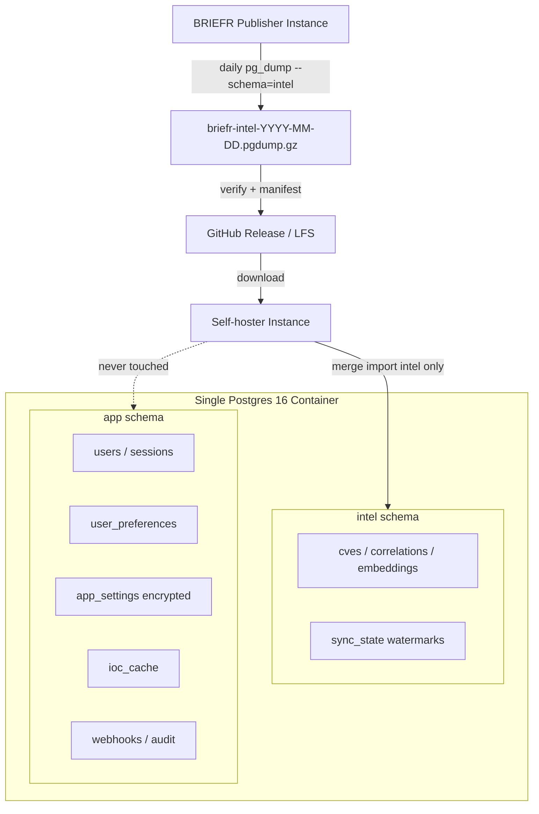

# Intel vs App Schema Split + Public Snapshot Pipeline — Plan

## POV (ce-pov)

**Grade: Adopt — phased, with one hard prerequisite**

Two Postgres schemas in one container (`intel` + `app`) is the right architecture for your goal. It matches ADR-001, makes `pg_dump --schema=intel` the natural publish boundary, and guarantees operator data (secrets, PII, IOC cache, My Stack, UI prefs) never rides along in a schema-scoped dump.

**Caveats that change the shape of the work:**

1. **Schemas are policy, not crypto.** Postgres cannot make a schema “undumpable.” Safety comes from exporting only `intel`, preflight guards, and never publishing full-DB backups.
2. **“Fill gaps, don’t replace” is the hard part.** Today’s import (`scripts/import_intel_snapshot.py`) is greenfield or `TRUNCATE` + restore. Your desired catch-up behavior needs a **merge/upsert** import mode — a separate workstream from the schema move.
3. **Daily GitHub publish needs a size strategy.** At current production scale (~115 MB full `pg_dump` / `.7z` backup today), **intel-only** bundles are likely **~60–90 MB compressed** (not multi-GB). Use **GitHub Releases + Git LFS** when a single artifact exceeds ~50 MB; manifest + `latest.json` always in git.
4. **Table inventory was incomplete — now ratified below.** `export_intel_snapshot.py` omits 5 intel tables present in Alembic (`correlation_cve_snapshot`, `pulse_families`, `ioc_degree`, `embeddings`, `software_catalog`). Phase 0 adds them before any publish.
5. **Production must migrate in place.** First `alembic upgrade` on your live DB uses `ALTER TABLE … SET SCHEMA` (metadata move only — **no row copy**). Mandatory encrypted backup before upgrade; row-count parity script is a merge gate.
6. **SQLite removal (PR #752) is out of scope and lower priority.** Schema split **must not depend on #752**. Keep SQLite dev fallback until schema split is stable; rebase #752 **after** Phase 1 lands (see §SQLite sequencing).

**Reversibility:** Tier 2 — one-way but bounded. Schema migration is forward-only in production; rollback = restore encrypted full backup (your existing `.7z` workflow).

---

## Repository audit (2026-07-26)

Validated against `main` before implementation:

| Check | Result |
|-------|--------|
| Alembic tables | **58** in `public` (+ Procrastinate objects in `public`, not in Alembic table list) |
| Cross-schema FK blockers | **None** — all 9 declared FKs are intel→intel or app→app |
| `INTEL_TABLES` in export script | **25 tables** — missing 5 intel tables (see Appendix A) |
| `FORBIDDEN_TABLES` in export script | **13 names** — missing ~20 app tables (export uses allowlist, but verify must tighten) |
| `correlation_infrastructure` | Dropped in migration `016` — **exclude** |
| Procrastinate (`028`) | Stays in **`public`** (tables, enums, functions) — not `intel` or `app` |
| Production DB size (operator) | ~**115 MB** compressed backup today — plan sizing uses this, not theoretical GB |

**No open PR named “escalator”.** The related Postgres draft is **#752 (SQLite removal)** — sequenced **after** this workstream, not in parallel.

---

## Production first-run migration (existing database)

Your production instance already has data (~115 MB backup). Phase 1 is **not** greenfield.

### What happens on `alembic upgrade head` (migration `036`)

1. `CREATE SCHEMA intel; CREATE SCHEMA app;`
2. For each classified table: `ALTER TABLE public.<name> SET SCHEMA intel|app;`
3. **All rows move with the table** — same OIDs, no `INSERT … SELECT` copy.
4. Pool sets `search_path TO app, intel, public` on connect.
5. Optional: split `sync_state` → migrate operator keys to `app.sync_state` (see K8).

### Operator runbook (production)

```text
1. Stop BRIEFR (backend + scheduler) — brief downtime window
2. Encrypted full backup (pg_dump or existing backup.manager → .7z) — KEEP until smoke passes
3. alembic upgrade head   # from new release with 036
4. python scripts/verify_schema_split.py   # NEW — per-table row counts vs pre-migration manifest
5. Start backend; hit /api/health; login; open CVE feed + IOC + admin DB page
6. Optional: export intel snapshot smoke on publisher profile
```

### Rollback

- **Only supported path:** restore pre-migration encrypted backup into Postgres, redeploy previous BRIEFR version.
- Alembic downgrade for `036` is **not** supported on production (forward-only DDL).

### New gate script (Phase 1)

`scripts/verify_schema_split.py` — run immediately after migration:

- Assert every table in Appendix A is in `intel` or `app` (not `public`, except Procrastinate + extensions).
- Compare `SELECT COUNT(*)` per table to a pre-migration manifest (operator runs `scripts/schema_row_counts.py --output pre-036.json` **before** upgrade).
- Fail non-zero if any table missing or count mismatch.

---

## SQLite removal PR #752 — sequencing (do not merge before schema split)

| Order | PR / work | Rationale |
|-------|-----------|-----------|
| 1 | **Merge plan PR #760** (this document) | Locked inventory + production runbook |
| 2 | **Phase 0–1** schema split on `main` | Physical boundary + in-place prod migration |
| 3 | **Phase 2–4** export/merge/publish | Intel pipeline on `intel` schema |
| 4 | **Rebase #752** onto post-split `main` | Remove `_SQLITE` pairs **after** Postgres schema paths are stable |
| 5 | Merge #752 (optional, later) | Lowest priority per operator |

**While #752 is open:** do not merge it. When rebasing for future merge:

- Preserve `search_path` + schema-qualified Postgres SQL from Phase 1.
- Delete SQLite paths only where Phase 1 already uses `is_postgres()` gates.
- Re-run full Postgres pytest + `verify-local.sh --full` on rebased branch.

Schema split and SQLite removal touch the same `backend/db/*` surface — **parallel merges will conflict**.

---

## Documentation update matrix (briefr + briefr-docs)

Docs updates are **merge gates** for the implementation PR series, not optional follow-up.

### briefr (`docs/`)

| Priority | File |
|----------|------|
| Must | `DATA_SNAPSHOT.md`, `ADR-001`, `OPERATIONS.md`, `PRODUCT_STATUS.md`, `POSTGRES.md`, ADR-001 SVG |
| New | `INTEL_PUBLISH.md` |
| Should | `SYSTEM_DESIGN.md`, `CONTRIBUTOR_RULES.md`, `index.md` |

### briefr-docs (separate repo — sync after briefr)

| Priority | File |
|----------|------|
| Must | `docs/admin-guide/intel-snapshot.md`, `operations.md`, `developer-guide/decisions.md`, ADR SVGs |
| Should | `how-its-built/storage.mdx`, `system-design/04-storage.mdx`, `admin-guide/postgres.md` |

**Workflow:** land doc changes in **the same PR** as the code phase they describe (Phase 0 = classification docs; Phase 1 = POSTGRES + migration runbook; Phase 2+ = import/export).

---

## CI / merge gate (implementation must pass before any schema PR merges)

| Gate | Command / test |
|------|----------------|
| Default suite | `./scripts/verify-local.sh` green |
| Postgres full | `./scripts/verify-local.sh --full` (schema migration + intel snapshot tests) |
| Schema split | `backend/tests/test_schema_split_migration.py` — empty DB + **fixture DB with representative rows** |
| Row parity | `verify_schema_split.py` in CI against migrated fixture |
| Export | `backend/tests/test_intel_snapshot_export.py` — schema-scoped dump, zero `app.*` |
| Merge import | `backend/tests/test_intel_snapshot_merge.py` — app rows untouched |
| Alembic | `backend/tests/test_alembic_revisions.py` — no reserved-word DDL regressions |
| Playwright smoke | Optional `--full` — login + feed after migration fixture |

**Production merge policy:** implementation PR series merges only when local + CI Postgres jobs are green; operator runs pre-migration backup + `verify_schema_split.py` on their box before deploying.

---

## Automated execution workflow (post plan merge)

After **PR #760 merges**, execute with parallel subagents per phase:

```text
Wave 1 (parallel):  Phase 0 docs + export allowlist fix
Wave 2 (serial):    Phase 1 alembic 036 + search_path + verify_schema_split.py
Wave 3 (parallel):  Phase 2 export/import v2 + Phase 0 briefr-docs sync
Wave 4 (serial):    Phase 3 merge engine (largest risk — dedicated agent + Postgres tests)
Wave 5:             Phase 4 publish pipeline
Wave 6:             Phase 5 admin UX + OPERATIONS
Post:               Rebase PR #752 (no merge unless requested)
```

Each wave ends with: commit → push → PR → `verify-local.sh --full` → operator review.

---

## Goal Capsule

| Field | Value |
|-------|-------|
| **Objective** | Split BRIEFR Postgres into `intel` (sharable, daily-publishable) and `app` (per-instance operator data), with safe export/import so self-hosters bootstrap from your snapshot and catch up without losing secrets, PII, IOC cache, or preferences. |
| **Authority** | ADR-001, `docs/DATA_SNAPSHOT.md`, operator privacy posture |
| **Blockers** | Merge-import semantics undefined per table; several tables unclassified; `feed_cache` may contain operator keys |

---

## Product Contract

### Problem

Production BRIEFR holds two incompatible data classes in one `public` schema:

- **Intel** — derived public CVE/correlation/embedding data you want to redistribute daily.
- **App** — credentials, encrypted API keys, analyst IOC lookups, My Stack, font/UI prefs, webhooks, audit logs — must never leak.

Today the boundary is an export **allowlist** (`scripts/export_intel_snapshot.py`). That works but is fragile: new tables can be missed, full `pg_dump` still captures everything, and import cannot merge intel into an existing operator instance.

### Primary actor

- **Publisher (you):** runs BRIEFR, produces daily public intel bundles, pushes to GitHub.
- **Consumer (self-hoster):** downloads bundle, imports intel, keeps local `app` data intact.

### Desired outcomes

1. **Schema split:** `intel.*` and `app.*` in one Postgres DB/container.
2. **Safe publish:** daily job dumps **only** `intel` schema → verified bundle → pushed to public repo.
3. **Safe consume:**
   - **Bootstrap:** empty/new install loads intel snapshot, then operator configures `app`.
   - **Catch-up:** existing install merges newer intel rows without touching `app`.
4. **Operator isolation:** secrets (encrypted `app_settings`), users/sessions, `ioc_cache`, `user_preferences` (stack, `font_scale`, timezone), watchlists, webhooks — all in `app` only.

### Non-goals (v1)

- Per-user Postgres schemas (multi-user stays `app.users` + `user_id` FKs).
- Cross-instance sync of operator data.
- JSONL portable export (deferred in DATA_SNAPSHOT v2).
- Encrypting entire `app` schema at rest (row-level encryption for secrets per ADR-006 is sufficient).

### Success criteria

| # | Criterion |
|---|-----------|
| S1 | `pg_dump --schema=intel` produces a bundle with **zero** `app` tables (verified by `verify_intel_snapshot.py`). |
| S2 | Import on a DB with populated `app.users` / `ioc_cache` / `user_preferences` **succeeds** without modifying those rows. |
| S3 | Catch-up import adds new CVEs and updates changed intel rows; row counts monotonically increase or match publisher manifest. |
| S4 | Publisher daily pipeline: export → verify → publish artifact; failure blocks push. |
| S5 | Alembic migrations create and maintain both schemas; app code uses `search_path` or qualified names consistently. |
| S6 | `docs/DATA_SNAPSHOT.md` and ADR-001 updated to schema-qualified table lists. |
| S7 | Production upgrade on existing DB: **zero row loss** — per-table counts match pre-`036` manifest (`verify_schema_split.py`). |
| S8 | `briefr-docs` intel-snapshot and storage pages synced in same release train. |

### Key decisions

| ID | Decision | Rationale |
|----|----------|-----------|
| K1 | Schemas: `intel` + `app`; retire `public` for app tables | Clean dump boundary; `public` keeps extensions only |
| K2 | Connection `search_path = app, intel, public` | Minimize query churn during migration |
| K3 | Publish: `pg_dump --schema=intel` + filtered `intel.sync_state` export | Simpler than per-table `--table` list once schemas exist |
| K4 | Import modes: `bootstrap` (empty app) + `merge` (catch-up) | Matches user’s two scenarios |
| K5 | Merge = upsert on natural keys, not blind `pg_restore` | `pg_restore` cannot “fill gaps only”; custom merge required |
| K6 | GitHub: Releases + manifest; LFS or external blob for `.pgdump.gz` | Avoid bloating git history |
| K7 | Classify every table before migration | Prevents accidental intel publish of operator data |
| K8 | `sync_state` split: **`app.sync_state`** for operator/scheduler keys; **`intel.sync_state`** for ingest watermarks only | Export dumps `intel.sync_state` with allowlist; operator keys never in publish path |
| K9 | Procrastinate + `vector` extension remain in **`public`** | Library DDL + `search_path` compatibility |
| K10 | SQLite dev: **no schema split** until #752 (optional later) | Phase 1 gates qualified names behind `is_postgres()`; `_SQLITE` constants unchanged |

---

## Table classification (ratified 2026-07-26 — Appendix A is authoritative)

### `public` schema (never publish — infrastructure only)

| Object | Notes |
|--------|-------|
| `procrastinate_*` tables, enums, functions | Durable job queue (migration `028`) — **do not move** |
| `pgvector` / extension objects | Stay in `public` |
| `alembic_version` | **Move to `app`** (preferred) or keep in `public` — pick in Phase 1, document in `alembic/env.py` |

### `intel` schema (publishable) — 30 tables

| Table | Notes |
|-------|-------|
| `cves` | Core feed |
| `kev_deadlines` | |
| `epss_history` | Append-heavy; merge = insert new `(cve_id, date)` |
| `cve_change_history` | |
| `mitre_techniques`, `cve_technique_map` | |
| `atlas_techniques`, `atlas_case_studies`, `cve_atlas_map` | |
| `cve_exploits` | |
| `otx_pulses`, `otx_cve_pulses`, `otx_pulse_iocs` | Public pulse mirror |
| `detection_rules`, `detection_rule_cves`, `detection_rule_techniques` | |
| `correlation_actor`, `correlation_temporal`, `correlation_campaigns`, `correlation_campaign_members` | |
| `correlation_cve_snapshot` | Precomputed correlation payload |
| `cve_embeddings` | |
| `embeddings` | Campaign/entity embeddings (E8) — publishable |
| `mitre_groups`, `group_technique_map` | |
| `pulse_families` | Derived correlation |
| `ioc_degree` | Derived graph metric (public aggregate) |
| `software_catalog` | NVD CPE dictionary — public reference |
| `feed_cache` | **Phase 0:** audit `cache_key` values; export allowlist for public keys only (see Q1) |
| `sync_state` | **Ingest watermarks only** — operator keys live in `app.sync_state` (K8) |

**Add to `INTEL_TABLES` in Phase 0** (currently missing from export script):  
`correlation_cve_snapshot`, `pulse_families`, `ioc_degree`, `embeddings`, `software_catalog`.

### `app` schema (never publish) — 28 tables

| Table | Why |
|-------|-----|
| `users`, `sessions` | Auth / PII |
| `user_preferences` | Stack, `font_scale`, timezone, profile |
| `app_settings` | Operator config; secrets encrypted (ADR-006) |
| `ioc_cache` | Queried indicators — privacy |
| `ioc_watchlist`, `threatfox_iocs` | Analyst workflow |
| `watchlist` | Analyst pins |
| `audit_log` | Admin actions |
| `api_usage`, `api_call_events` | Usage telemetry |
| `webhook_destinations`, `webhook_delivery_log`, `webhook_alert_log`, `webhook_destination_dedupe` | URLs + secrets |
| `correlation_suppressions` | Operator overrides |
| `correlation_feedback` | Operator input |
| `hunt_packs` | Operator content |
| `detection_backlog` | Stack-specific gaps |
| `user_notifications` | Per-user |
| `search_api_tokens` | Secrets |
| `ai_operations`, `ai_operation_payloads` | May contain prompts/PII |
| `stack_backfill_runs`, `stack_backfill_checkpoints` | Operator stack jobs |
| `correlation_metrics`, `resource_metrics` | Ops telemetry |
| `alembic_version` | Instance migration pointer (if not kept in `public`) |
| `sync_state` | **Operator keys only** — scheduler, backup dead-man, stack overrides (K8) |

### `sync_state` split strategy (decided: K8)

1. Create **`app.sync_state`** with same `(key, value)` shape.
2. Migration `036` copies rows **not** in `SYNC_STATE_ALLOWLIST` from `public.sync_state` → `app.sync_state`.
3. Remaining ingest watermarks stay in **`intel.sync_state`**.
4. Export: `pg_dump --schema=intel` + preflight allowlist on `intel.sync_state` keys only.
5. Application code: `get_sync_state` / `set_sync_state` in `backend/db/` route by key prefix or allowlist.

~~Option B (single table + export filter)~~ — rejected; too easy to leak operator keys.

---

## Architecture



### Import modes

| Mode | When | Behavior |
|------|------|----------|
| `bootstrap` | Fresh install, empty `app` | `pg_restore --schema=intel` into empty DB; run `alembic upgrade head` |
| `merge` | Existing instance catching up | Staging restore to temp schema **or** table-by-table `INSERT … ON CONFLICT DO UPDATE` from dump extract |
| `replace-intel` | Dev/CI only | `TRUNCATE intel.*` then restore — **not** for production catch-up |

### Merge semantics (per table pattern)

| Pattern | Tables | Merge rule |
|---------|--------|------------|
| Upsert by PK | `cves`, `mitre_techniques`, … | `ON CONFLICT (id) DO UPDATE` where `updated_at` or `last_modified` is newer |
| Append-only | `epss_history`, `cve_change_history` | `ON CONFLICT DO NOTHING` |
| Full replace per key | `sync_state` allowlist | Upsert key; never delete operator keys |
| Snapshot replace | `correlation_cve_snapshot` | Upsert by `cve_id` |

**Deleted CVEs on publisher:** v1 accepts publisher as source of truth for intel; tombstone/soft-delete is a v2 concern.

---

## Implementation phases

### Phase 0 — Inventory & docs (1 PR)

**Goal:** Ratify table classification; extend export allowlist; no schema move yet.

- Update `docs/DATA_SNAPSHOT.md` with `intel.` / `app.` qualified names (Appendix A).
- Update `docs/decisions/ADR-001-intel-app-schema-split.md` — status → implementation in progress.
- Add `docs/INTEL_PUBLISH.md` — publisher runbook.
- Add **`INTEL_TABLES` missing five tables** to `scripts/export_intel_snapshot.py`.
- Extend `FORBIDDEN_TABLES` / verify to all `app` tables in Appendix A.
- Add `scripts/schema_row_counts.py` (pre-migration manifest for production).
- Audit `feed_cache` keys in production; document allowlist in `DATA_SNAPSHOT.md`.
- **briefr-docs:** open tracking PR or branch for intel-snapshot page refresh (merge with Phase 2).

**Files:** `docs/*`, `scripts/export_intel_snapshot.py`, `scripts/schema_row_counts.py`, `backend/tests/test_intel_snapshot_export.py`

---

### Phase 1 — Schema creation + in-place table move (1–2 PRs)

**Goal:** Physical split on **existing production data**; app works via `search_path`.

1. **Alembic migration `036_intel_app_schema_split.py`:**
   - `CREATE SCHEMA intel; CREATE SCHEMA app;`
   - `ALTER TABLE public.<t> SET SCHEMA intel|app` for all Appendix A tables (order: FK parents before children within each schema).
   - Split `sync_state` per K8.
   - **No `DROP` / `TRUNCATE`** — metadata-only move.
2. **Connection pool:** `SET search_path TO app, intel, public` on connect (`backend/db/config.py` or pool init).
3. **`alembic_version`:** move to `app` schema; set `version_table_schema = 'app'` in `alembic/env.py`.
4. Grep `backend/db/**/*.py` for hardcoded `public.` — fix or rely on `search_path`.
5. **SQLite:** no-op in `036` for SQLite; `search_path` skipped; tables stay unqualified.
6. Ship **`scripts/verify_schema_split.py`** + **`scripts/schema_row_counts.py`**.

**Tests:**
- `backend/tests/test_schema_split_migration.py` — fresh Postgres + **populated fixture** (CVEs, users, ioc_cache, sync_state keys)
- Row-count parity before/after migration
- `pytest` green SQLite + Postgres (`verify-local.sh`)

**Operator:** run `schema_row_counts.py` → backup → `alembic upgrade` → `verify_schema_split.py` → smoke.

**Risk:** Large `backend/db` touch surface. Mitigate: `search_path` first; qualify names incrementally in follow-up if needed.

---

### Phase 2 — Export/import v2 (schema-scoped) (1 PR)

**Goal:** Publisher dumps `intel` schema only.

1. `export_intel_snapshot.py`:
   - Replace per-table `--table` with `--schema=intel`.
   - Pre-flight: assert no tables exist in `public` except extensions.
   - Dump filtered `sync_state` via custom query export if split to key filter.
2. `verify_intel_snapshot.py`: assert dump catalog contains only `intel.*`.
3. `import_intel_snapshot.py`:
   - Remove “refuse if operator rows exist” for **merge mode**.
   - Add `--mode bootstrap|merge`.
   - `bootstrap`: current behavior.
   - `merge`: implement upsert driver (see Phase 3).

**Files:** `scripts/export_intel_snapshot.py`, `scripts/import_intel_snapshot.py`, `scripts/verify_intel_snapshot.py`

**Tests:** `backend/tests/test_intel_snapshot_export.py`, new `backend/tests/test_intel_snapshot_merge.py`

---

### Phase 3 — Merge import engine (1–2 PRs)

**Goal:** Catch-up without touching `app`.

1. New module `backend/intel_snapshot/merge.py`:
   - `pg_restore --schema=intel` to temp schema `intel_staging` OR parse custom format via `pg_restore -a -f -`.
   - For each intel table, run generated upsert from staging → `intel`.
   - Transaction per table; log row counts.
2. CLI: `import_intel_snapshot.py --mode merge`.
3. Manifest `format_version: 2` — adds `schema_names`, `merge_compatible: true`.

**Files:** `backend/intel_snapshot/merge.py`, `scripts/import_intel_snapshot.py`

**Test scenarios:**
- DB with `app.users` + `app.ioc_cache` populated → merge succeeds, app row counts unchanged.
- Publisher adds 100 CVEs → consumer merge increases `intel.cves` by 100.
- Publisher updates CVSS on existing CVE → consumer row updated, not duplicated.
- Re-run same bundle → idempotent (no duplicate history rows).

---

### Phase 4 — Daily publish pipeline (1 PR)

**Goal:** Automated export → verify → publish.

1. `scripts/publish_intel_snapshot.py`:
   - Calls export → verify → writes to `INTEL_PUBLISH_DIR` (e.g. `/var/lib/briefr/intel-publish/`).
   - Optional: `gh release upload` or `git lfs push` to configured repo.
   - Writes `latest.json` pointer (URL, sha256, `exported_at`, `format_version`).
2. Scheduler hook or cron doc in `docs/INTEL_PUBLISH.md`.
3. **Guard:** never publish if pre-flight detects rows in `app.users` on publisher DB **unless** `--publisher-instance` flag (your prod has no real users).

**Files:** `scripts/publish_intel_snapshot.py`, `docs/INTEL_PUBLISH.md`, optional `deploy/intel-publish.cron.example`

**Tests:** mock `gh`/filesystem; integration test with temp dir.

---

### Phase 5 — Consumer UX (follow-on)

- Admin UI: “Import intel snapshot” with merge vs bootstrap warning.
- `GET /api/admin/intel-snapshot/status` — last import, lag vs publisher manifest.
- `docs/OPERATIONS.md` — self-hoster catch-up runbook.

---

## Publisher DB hygiene

Your publisher instance should be an **intel-only seed**:

- No real `app.users` (or only `--allow-operator-seed` dev fixtures).
- No IOC lookups against production indicators you cannot share.
- API keys in `.env` / `app.app_settings` (encrypted) — never exported.

Consider a dedicated `briefr-publisher` compose profile that runs ingest jobs but disables auth/UI features that write operator data.

---

## Security checklist

- [ ] Export script fails if dump contains `app.*` or `public.*` user tables.
- [ ] Full `backup.manager` archives remain **encrypted** and **never** pushed to GitHub.
- [ ] Manifest includes sha256; consumers verify before import.
- [ ] `ioc_cache` classified `app` only.
- [ ] `search_api_tokens`, `webhook_destinations` classified `app` only.
- [ ] Publisher repo contains **artifacts only**, not `.env` or age keys.

---

## Open questions

| # | Question | Default if unanswered |
|---|----------|----------------------|
| Q1 | `feed_cache`: split table or key allowlist? | **Key allowlist** in export Phase 0; table split deferred |
| Q2 | GitHub Releases vs LFS vs S3? | Releases; **LFS if artifact >50 MB** (~115 MB full DB → expect ~60–90 MB intel gzip) |
| Q3 | Merge deletes stale CVEs from consumer? | No in v1 (publisher wins on upsert only) |
| Q4 | Publisher frequency: daily vs weekly? | Daily export; GitHub Release tag weekly optional |
| Q5 | Operator production has real `app.users` — can it publish? | **No** — use dedicated publisher instance or `--allow-operator-seed` fixtures only; your prod publishes **merge consumer**, not daily intel bundle |

---

## Appendix A — Full table inventory (58 Alembic tables)

| Table | Schema | In export today? |
|-------|--------|------------------|
| `cves` | intel | yes |
| `kev_deadlines` | intel | yes |
| `epss_history` | intel | yes |
| `cve_change_history` | intel | yes |
| `mitre_techniques` | intel | yes |
| `cve_technique_map` | intel | yes |
| `atlas_techniques` | intel | yes |
| `atlas_case_studies` | intel | yes |
| `cve_atlas_map` | intel | yes |
| `cve_exploits` | intel | yes |
| `otx_pulses` | intel | yes |
| `otx_cve_pulses` | intel | yes |
| `otx_pulse_iocs` | intel | yes |
| `detection_rules` | intel | yes |
| `detection_rule_cves` | intel | yes |
| `detection_rule_techniques` | intel | yes |
| `correlation_actor` | intel | yes |
| `correlation_temporal` | intel | yes |
| `correlation_campaigns` | intel | yes |
| `correlation_campaign_members` | intel | yes |
| `correlation_cve_snapshot` | intel | **no — add Phase 0** |
| `cve_embeddings` | intel | yes |
| `embeddings` | intel | **no — add Phase 0** |
| `mitre_groups` | intel | yes |
| `group_technique_map` | intel | yes |
| `pulse_families` | intel | **no — add Phase 0** |
| `ioc_degree` | intel | **no — add Phase 0** |
| `software_catalog` | intel | **no — add Phase 0** |
| `feed_cache` | intel | yes (key-filtered export) |
| `sync_state` | intel | yes (ingest keys only; operator keys → `app.sync_state`) |
| `users` | app | forbidden |
| `sessions` | app | forbidden |
| `user_preferences` | app | forbidden |
| `app_settings` | app | forbidden |
| `ioc_cache` | app | forbidden |
| `ioc_watchlist` | app | forbidden |
| `threatfox_iocs` | app | forbidden |
| `watchlist` | app | forbidden |
| `audit_log` | app | forbidden |
| `api_usage` | app | forbidden |
| `api_call_events` | app | forbidden |
| `webhook_destinations` | app | forbidden |
| `webhook_delivery_log` | app | forbidden |
| `webhook_alert_log` | app | forbidden |
| `webhook_destination_dedupe` | app | forbidden |
| `correlation_suppressions` | app | forbidden |
| `correlation_feedback` | app | forbidden |
| `hunt_packs` | app | forbidden |
| `detection_backlog` | app | forbidden |
| `user_notifications` | app | forbidden |
| `search_api_tokens` | app | forbidden |
| `ai_operations` | app | forbidden |
| `ai_operation_payloads` | app | forbidden |
| `stack_backfill_runs` | app | forbidden |
| `stack_backfill_checkpoints` | app | forbidden |
| `correlation_metrics` | app | forbidden |
| `resource_metrics` | app | forbidden |
| `sync_state` (operator rows) | app | forbidden |
| `alembic_version` | app (or public) | forbidden |

**Excluded:** `correlation_infrastructure` (dropped `016`).

---

## Suggested PR sequence

```
PR0  (this)  docs: intel/app schema split plan — merge #760 first
PR1  docs+export: ratify Appendix A, fix INTEL_TABLES, schema_row_counts.py, DATA_SNAPSHOT, INTEL_PUBLISH.md
PR2  alembic 036: SET SCHEMA in-place + search_path + verify_schema_split.py + tests
PR3  export/import v2: pg_dump --schema=intel, format_version 2 manifest
PR4  merge import engine + test_intel_snapshot_merge.py
PR5  publish_intel_snapshot.py + cron + briefr-docs sync
PR6  admin UI + OPERATIONS consumer runbook
Later: rebase #752 SQLite removal (do not merge until operator approves)
```

---

## References

- `docs/decisions/ADR-001-intel-app-schema-split.md`
- `docs/decisions/ADR-006-encrypted-app-settings-secrets.md`
- `docs/DATA_SNAPSHOT.md`
- `scripts/export_intel_snapshot.py`
- `scripts/import_intel_snapshot.py`
- `backend/backup/postgres_util.py`
