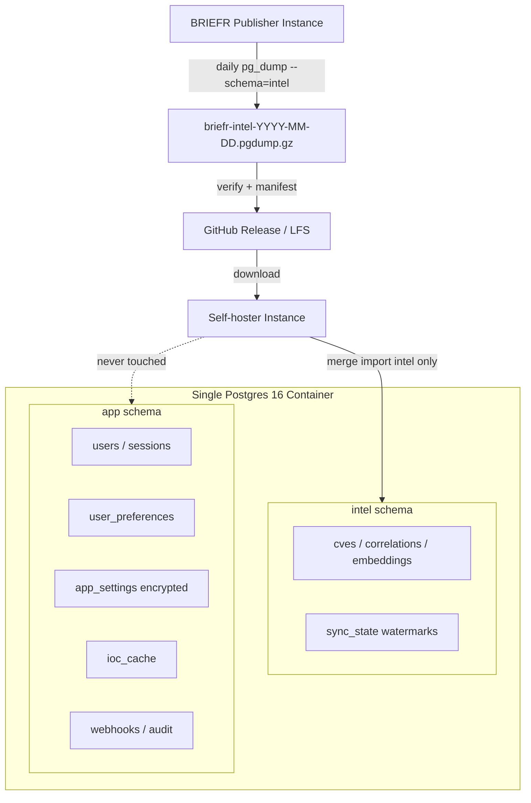

# Intel vs App Schema Split + Public Snapshot Pipeline — Plan

## POV (ce-pov)

**Grade: Adopt — phased, with one hard prerequisite**

Two Postgres schemas in one container (`intel` + `app`) is the right architecture for your goal. It matches ADR-001, makes `pg_dump --schema=intel` the natural publish boundary, and guarantees operator data (secrets, PII, IOC cache, My Stack, UI prefs) never rides along in a schema-scoped dump.

**Caveats that change the shape of the work:**

1. **Schemas are policy, not crypto.** Postgres cannot make a schema “undumpable.” Safety comes from exporting only `intel`, preflight guards, and never publishing full-DB backups.
2. **“Fill gaps, don’t replace” is the hard part.** Today’s import (`scripts/import_intel_snapshot.py`) is greenfield or `TRUNCATE` + restore. Your desired catch-up behavior needs a **merge/upsert** import mode — a separate workstream from the schema move.
3. **Daily GitHub publish needs a size strategy.** Intel bundles (CVEs + embeddings + correlations) will be hundreds of MB to GB. Use **GitHub Releases + Git LFS** or an object store with the repo holding manifests only — not raw multi-GB commits to `main`.
4. **Table inventory is incomplete.** `DATA_SNAPSHOT.md` predates ~15 newer tables (`software_catalog`, `embeddings`, `search_api_tokens`, etc.). Classification must be finalized before migration.

**Reversibility:** Tier 2 — one-way but bounded. Schema migration is forward-only in production; rollback = restore encrypted full backup.

---

## Goal Capsule

| Field | Value |
|-------|-------|
| **Objective** | Split BRIEFR Postgres into `intel` (sharable, daily-publishable) and `app` (per-instance operator data), with safe export/import so self-hosters bootstrap from your snapshot and catch up without losing secrets, PII, IOC cache, or preferences. |
| **Authority** | ADR-001, `docs/DATA_SNAPSHOT.md`, operator privacy posture |
| **Blockers** | Merge-import semantics undefined per table; several tables unclassified; `feed_cache` may contain operator keys |

---

## Product Contract

### Problem

Production BRIEFR holds two incompatible data classes in one `public` schema:

- **Intel** — derived public CVE/correlation/embedding data you want to redistribute daily.
- **App** — credentials, encrypted API keys, analyst IOC lookups, My Stack, font/UI prefs, webhooks, audit logs — must never leak.

Today the boundary is an export **allowlist** (`scripts/export_intel_snapshot.py`). That works but is fragile: new tables can be missed, full `pg_dump` still captures everything, and import cannot merge intel into an existing operator instance.

### Primary actor

- **Publisher (you):** runs BRIEFR, produces daily public intel bundles, pushes to GitHub.
- **Consumer (self-hoster):** downloads bundle, imports intel, keeps local `app` data intact.

### Desired outcomes

1. **Schema split:** `intel.*` and `app.*` in one Postgres DB/container.
2. **Safe publish:** daily job dumps **only** `intel` schema → verified bundle → pushed to public repo.
3. **Safe consume:**
   - **Bootstrap:** empty/new install loads intel snapshot, then operator configures `app`.
   - **Catch-up:** existing install merges newer intel rows without touching `app`.
4. **Operator isolation:** secrets (encrypted `app_settings`), users/sessions, `ioc_cache`, `user_preferences` (stack, `font_scale`, timezone), watchlists, webhooks — all in `app` only.

### Non-goals (v1)

- Per-user Postgres schemas (multi-user stays `app.users` + `user_id` FKs).
- Cross-instance sync of operator data.
- JSONL portable export (deferred in DATA_SNAPSHOT v2).
- Encrypting entire `app` schema at rest (row-level encryption for secrets per ADR-006 is sufficient).

### Success criteria

| # | Criterion |
|---|-----------|
| S1 | `pg_dump --schema=intel` produces a bundle with **zero** `app` tables (verified by `verify_intel_snapshot.py`). |
| S2 | Import on a DB with populated `app.users` / `ioc_cache` / `user_preferences` **succeeds** without modifying those rows. |
| S3 | Catch-up import adds new CVEs and updates changed intel rows; row counts monotonically increase or match publisher manifest. |
| S4 | Publisher daily pipeline: export → verify → publish artifact; failure blocks push. |
| S5 | Alembic migrations create and maintain both schemas; app code uses `search_path` or qualified names consistently. |
| S6 | `docs/DATA_SNAPSHOT.md` and ADR-001 updated to schema-qualified table lists. |

### Key decisions

| ID | Decision | Rationale |
|----|----------|-----------|
| K1 | Schemas: `intel` + `app`; retire `public` for app tables | Clean dump boundary; `public` keeps extensions only |
| K2 | Connection `search_path = app, intel, public` | Minimize query churn during migration |
| K3 | Publish: `pg_dump --schema=intel` + filtered `intel.sync_state` export | Simpler than per-table `--table` list once schemas exist |
| K4 | Import modes: `bootstrap` (empty app) + `merge` (catch-up) | Matches user’s two scenarios |
| K5 | Merge = upsert on natural keys, not blind `pg_restore` | `pg_restore` cannot “fill gaps only”; custom merge required |
| K6 | GitHub: Releases + manifest; LFS or external blob for `.pgdump.gz` | Avoid bloating git history |
| K7 | Classify every table before migration | Prevents accidental intel publish of operator data |

---

## Table classification (draft — must be ratified in PR)

### `intel` schema (publishable)

| Table | Notes |
|-------|-------|
| `cves` | Core feed |
| `kev_deadlines` | |
| `epss_history` | Append-heavy; merge = insert new `(cve_id, date)` |
| `cve_change_history` | |
| `mitre_techniques`, `cve_technique_map` | |
| `atlas_techniques`, `atlas_case_studies`, `cve_atlas_map` | |
| `cve_exploits` | |
| `otx_pulses`, `otx_cve_pulses`, `otx_pulse_iocs` | Public pulse mirror |
| `detection_rules`, `detection_rule_cves`, `detection_rule_techniques` | |
| `correlation_actor`, `correlation_temporal`, `correlation_campaigns`, `correlation_campaign_members` | |
| `correlation_cve_snapshot` | Precomputed correlation payload |
| `cve_embeddings` | |
| `embeddings` | If still used alongside `cve_embeddings` — confirm; else deprecate |
| `mitre_groups`, `group_technique_map` | |
| `pulse_families` | Derived correlation |
| `ioc_degree` | Derived graph metric (public aggregate) |
| `software_catalog` | NVD CPE dictionary — public reference |
| `feed_cache` | **Audit keys** — include only rows with known public cache keys; or split to `intel_feed_cache` / `app_feed_cache` |
| `sync_state` | **Subset only** — ingest watermarks per DATA_SNAPSHOT allowlist |

### `app` schema (never publish)

| Table | Why |
|-------|-----|
| `users`, `sessions` | Auth / PII |
| `user_preferences` | Stack, `font_scale`, timezone, profile |
| `app_settings` | Operator config; secrets encrypted (ADR-006) |
| `ioc_cache` | Queried indicators — privacy |
| `ioc_watchlist`, `threatfox_iocs` | Analyst workflow |
| `watchlist` | Analyst pins |
| `audit_log` | Admin actions |
| `api_usage`, `api_call_events` | Usage telemetry |
| `webhook_destinations`, `webhook_delivery_log`, `webhook_alert_log`, `webhook_destination_dedupe` | URLs + secrets |
| `correlation_suppressions` | Operator overrides |
| `correlation_feedback` | Operator input |
| `hunt_packs` | Operator content |
| `detection_backlog` | Stack-specific gaps |
| `user_notifications` | Per-user |
| `search_api_tokens` | Secrets |
| `ai_operations`, `ai_operation_payloads` | May contain prompts/PII |
| `stack_backfill_runs`, `stack_backfill_checkpoints` | Operator stack jobs |
| `correlation_metrics`, `resource_metrics` | Ops telemetry |
| `alembic_version` | Instance migration pointer |

### `sync_state` split strategy

- Move table to `intel.sync_state`.
- Export script dumps only allowlisted keys (existing `SYNC_STATE_ALLOWLIST`).
- Scheduler/backup keys (`scheduler.*`, `backup_deadman_*`) remain in DB but are **operator rows** — either:
  - **Option A (recommended):** prefix `app.` keys stored in `app.sync_state` table (new), or
  - **Option B:** keep one table in `intel` but export filters rows (status quo, weaker).

---

## Architecture



### Import modes

| Mode | When | Behavior |
|------|------|----------|
| `bootstrap` | Fresh install, empty `app` | `pg_restore --schema=intel` into empty DB; run `alembic upgrade head` |
| `merge` | Existing instance catching up | Staging restore to temp schema **or** table-by-table `INSERT … ON CONFLICT DO UPDATE` from dump extract |
| `replace-intel` | Dev/CI only | `TRUNCATE intel.*` then restore — **not** for production catch-up |

### Merge semantics (per table pattern)

| Pattern | Tables | Merge rule |
|---------|--------|------------|
| Upsert by PK | `cves`, `mitre_techniques`, … | `ON CONFLICT (id) DO UPDATE` where `updated_at` or `last_modified` is newer |
| Append-only | `epss_history`, `cve_change_history` | `ON CONFLICT DO NOTHING` |
| Full replace per key | `sync_state` allowlist | Upsert key; never delete operator keys |
| Snapshot replace | `correlation_cve_snapshot` | Upsert by `cve_id` |

**Deleted CVEs on publisher:** v1 accepts publisher as source of truth for intel; tombstone/soft-delete is a v2 concern.

---

## Implementation phases

### Phase 0 — Inventory & docs (1 PR)

**Goal:** Ratify table classification; no runtime change.

- Update `docs/DATA_SNAPSHOT.md` with `intel.` / `app.` qualified names.
- Audit `feed_cache` keys; document which are intel-safe.
- Add `docs/INTEL_PUBLISH.md` — publisher runbook (daily export, GitHub push, failure handling).
- Extend `scripts/export_intel_snapshot.py` forbidden-table check to scan `information_schema` for any table outside `intel` accidentally included.

**Files:** `docs/DATA_SNAPSHOT.md`, `docs/decisions/ADR-001-intel-app-schema-split.md`, new `docs/INTEL_PUBLISH.md`, `scripts/export_intel_snapshot.py`

**Tests:** extend `backend/tests/test_intel_snapshot_export.py`

---

### Phase 1 — Schema creation + table move (1–2 PRs)

**Goal:** Physical split; app still works via `search_path`.

1. **Alembic migration `036_intel_app_schema_split.py`:**
   ```sql
   CREATE SCHEMA IF NOT EXISTS intel;
   CREATE SCHEMA IF NOT EXISTS app;
   -- ALTER TABLE public.<t> SET SCHEMA intel|app for each classified table
   ```
2. **Connection init** (`backend/db/config.py` or pool setup): `SET search_path TO app, intel, public`.
3. **Alembic** `version_table_schema = 'app'` (or keep in `public` — pick one, document).
4. Update all raw SQL that assumes `public` — grep `_PG` constants in `backend/db/`.
5. SQLite dev fallback: **no schema split** (SQLite single namespace); gate schema-qualified SQL behind `is_postgres()` or use views.

**Files:** new alembic migration, `backend/db/config.py`, `backend/db/**/*.py`, `backend/alembic/env.py`

**Tests:**
- `backend/tests/test_schema_split_migration.py` — tables in correct schema
- `backend/tests/test_db_pg_adapt.py` — queries resolve via search_path
- Full `pytest` green on SQLite + Postgres

**Risk:** Large diff touching every `_PG` SQL module. Mitigate with search_path first, qualify names incrementally.

---

### Phase 2 — Export/import v2 (schema-scoped) (1 PR)

**Goal:** Publisher dumps `intel` schema only.

1. `export_intel_snapshot.py`:
   - Replace per-table `--table` with `--schema=intel`.
   - Pre-flight: assert no tables exist in `public` except extensions.
   - Dump filtered `sync_state` via custom query export if split to key filter.
2. `verify_intel_snapshot.py`: assert dump catalog contains only `intel.*`.
3. `import_intel_snapshot.py`:
   - Remove “refuse if operator rows exist” for **merge mode**.
   - Add `--mode bootstrap|merge`.
   - `bootstrap`: current behavior.
   - `merge`: implement upsert driver (see Phase 3).

**Files:** `scripts/export_intel_snapshot.py`, `scripts/import_intel_snapshot.py`, `scripts/verify_intel_snapshot.py`

**Tests:** `backend/tests/test_intel_snapshot_export.py`, new `backend/tests/test_intel_snapshot_merge.py`

---

### Phase 3 — Merge import engine (1–2 PRs)

**Goal:** Catch-up without touching `app`.

1. New module `backend/intel_snapshot/merge.py`:
   - `pg_restore --schema=intel` to temp schema `intel_staging` OR parse custom format via `pg_restore -a -f -`.
   - For each intel table, run generated upsert from staging → `intel`.
   - Transaction per table; log row counts.
2. CLI: `import_intel_snapshot.py --mode merge`.
3. Manifest `format_version: 2` — adds `schema_names`, `merge_compatible: true`.

**Files:** `backend/intel_snapshot/merge.py`, `scripts/import_intel_snapshot.py`

**Test scenarios:**
- DB with `app.users` + `app.ioc_cache` populated → merge succeeds, app row counts unchanged.
- Publisher adds 100 CVEs → consumer merge increases `intel.cves` by 100.
- Publisher updates CVSS on existing CVE → consumer row updated, not duplicated.
- Re-run same bundle → idempotent (no duplicate history rows).

---

### Phase 4 — Daily publish pipeline (1 PR)

**Goal:** Automated export → verify → publish.

1. `scripts/publish_intel_snapshot.py`:
   - Calls export → verify → writes to `INTEL_PUBLISH_DIR` (e.g. `/var/lib/briefr/intel-publish/`).
   - Optional: `gh release upload` or `git lfs push` to configured repo.
   - Writes `latest.json` pointer (URL, sha256, `exported_at`, `format_version`).
2. Scheduler hook or cron doc in `docs/INTEL_PUBLISH.md`.
3. **Guard:** never publish if pre-flight detects rows in `app.users` on publisher DB **unless** `--publisher-instance` flag (your prod has no real users).

**Files:** `scripts/publish_intel_snapshot.py`, `docs/INTEL_PUBLISH.md`, optional `deploy/intel-publish.cron.example`

**Tests:** mock `gh`/filesystem; integration test with temp dir.

---

### Phase 5 — Consumer UX (follow-on)

- Admin UI: “Import intel snapshot” with merge vs bootstrap warning.
- `GET /api/admin/intel-snapshot/status` — last import, lag vs publisher manifest.
- `docs/OPERATIONS.md` — self-hoster catch-up runbook.

---

## Publisher DB hygiene

Your publisher instance should be an **intel-only seed**:

- No real `app.users` (or only `--allow-operator-seed` dev fixtures).
- No IOC lookups against production indicators you cannot share.
- API keys in `.env` / `app.app_settings` (encrypted) — never exported.

Consider a dedicated `briefr-publisher` compose profile that runs ingest jobs but disables auth/UI features that write operator data.

---

## Security checklist

- [ ] Export script fails if dump contains `app.*` or `public.*` user tables.
- [ ] Full `backup.manager` archives remain **encrypted** and **never** pushed to GitHub.
- [ ] Manifest includes sha256; consumers verify before import.
- [ ] `ioc_cache` classified `app` only.
- [ ] `search_api_tokens`, `webhook_destinations` classified `app` only.
- [ ] Publisher repo contains **artifacts only**, not `.env` or age keys.

---

## Open questions

| # | Question | Default if unanswered |
|---|----------|----------------------|
| Q1 | `feed_cache`: split table or key allowlist? | Key allowlist in export (faster); split table (cleaner) in Phase 1.5 |
| Q2 | GitHub Releases vs LFS vs S3? | Releases + LFS for files >50MB |
| Q3 | Merge deletes stale CVEs from consumer? | No in v1 (publisher wins on upsert only) |
| Q4 | Publisher frequency: daily vs weekly? | Daily export; weekly GitHub release tag |

---

## Suggested PR sequence

```
PR1  docs: ratify intel/app table classification + INTEL_PUBLISH.md
PR2  alembic: CREATE SCHEMA + MOVE tables + search_path
PR3  export/import: schema-scoped dump + verify v2
PR4  merge import engine + tests
PR5  publish_intel_snapshot.py + scheduler/cron wiring
PR6  admin UI + OPERATIONS.md consumer runbook
```

---

## References

- `docs/decisions/ADR-001-intel-app-schema-split.md`
- `docs/decisions/ADR-006-encrypted-app-settings-secrets.md`
- `docs/DATA_SNAPSHOT.md`
- `scripts/export_intel_snapshot.py`
- `scripts/import_intel_snapshot.py`
- `backend/backup/postgres_util.py`
